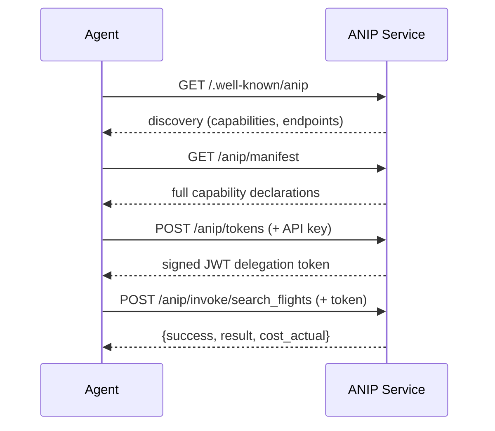
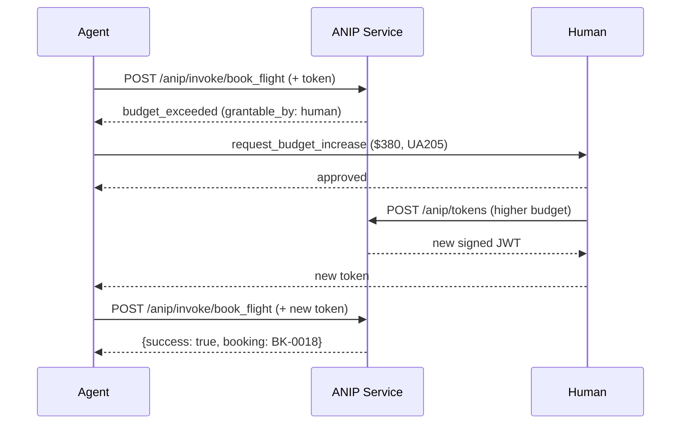

# ANIP — Agent-Native Interface Protocol

> REST APIs are simple. ANIP gives agents confidence.

The value is not "agents can call APIs better." The value is "agents can reason before acting."

Read the [Manifesto](MANIFESTO.md) | Read the [Spec](SPEC.md) | Read the [Guide](GUIDE.md) | [Contribute](CONTRIBUTING.md)

---

## Why "ANIP"?

**Agent-Native Interface Protocol.** Two words do different work:

- **Interface** — the surface agents interact with. What capabilities exist, what they cost, what authority they require, what they do. ANIP defines the shape of that surface.
- **Protocol** — the rules both parties agree to follow. How discovery works, how delegation chains are validated, how failures are structured. ANIP standardizes those rules.

This follows a well-established naming pattern in networked systems: **HTTP** (HyperText Transfer *Protocol*), **SMTP** (Simple Mail Transfer *Protocol*), **IP** (*Internet Protocol*). In each case, "protocol" describes the standardized rules, while the preceding words describe what flows through them. ANIP is no different — it's the protocol for agent-native interfaces.

## The Shift

Every major interface paradigm emerged when the dominant consumer changed:

| Interface | Consumer | Era |
|-----------|----------|-----|
| CLI | Humans at terminals | 1970s–80s |
| GUI | Humans with screens and mice | 1980s–2000s |
| API | Programs written by humans | 2000s–2020s |
| **ANIP** | **AI agents** | **Now** |

Each shift wasn't a new format — it was a new set of assumptions about who is on the other end. That shift is happening again. The primary consumer of digital services is becoming an AI agent.

## The Problem

Today's interfaces were designed for humans. When agents interact with them, they do it in one of two ways — both wrong:

**Computer-use agents** (OpenClaw, Anthropic Computer Use, Operator) teach AI to operate a mouse and keyboard against GUIs built for human eyes. Brilliant engineering. Fundamentally a workaround.

**REST APIs** assume a human developer reads docs, writes deterministic code, and ships a program. When an agent uses an API directly, it discovers auth requirements by getting a 401, learns permissions by getting a 403, finds out costs after being charged, and can't undo what it doesn't know is irreversible.

**MCP** (Model Context Protocol) improves discovery and standardizes tool access, but it still does not make execution boundaries first-class. Authority, scope,
  side effects, reversibility, cost, and failure posture are not protocol-level primitives. An agent may still complete the task, but it is doing so without the
  system defining upfront what it is allowed to do, what risks it is taking, and whether a mistaken call can be rolled back at all.

## What It Looks Like

**Without ANIP — what agents deal with today:**

```
Agent wants to book a flight
→ Reads OpenAPI spec (designed for human developers)
→ Guesses that POST /bookings is the right endpoint
→ Discovers auth requirements by getting a 401
→ Discovers insufficient permissions by getting a 403
→ Books the flight
→ Discovers the charge was $800 not $420 (undeclared currency conversion)
→ Cannot undo (no rollback information was available)
→ Audit log exists but agent didn't know to check it
```

**With ANIP:**

```
Agent queries manifest → profile handshake
→ Sees book_flight: irreversible, financial, cost: ~$420±10%
→ Checks delegation chain has travel.book scope + $500 budget authority
→ Confirms rollback_window: none (knows upfront it's permanent)
→ Confirms observability: logged, 90-day retention
→ Decides to proceed, executes with full context
```



Every assumption that was implicit becomes explicit, typed, and queryable.

**Five things an agent doesn't know with REST but does with ANIP:**

1. **This action is irreversible** — `side_effect: irreversible`, `rollback_window: none`
2. **This costs $280–500** — `cost.financial: { range_min: 280, range_max: 500 }`
3. **Search before booking** — `requires: [{ capability: "search_flights" }]`
4. **Budget will be enforced** — `scope: ["travel.book:max_$500"]` in the delegation chain
5. **Who can fix a permission problem** — `resolution: { grantable_by: "human:samir@anip.dev" }`

That last one is the killer feature. When a budget-exceeded failure comes back, it doesn't just say "denied" — it tells the agent exactly who can increase the budget. The agent can autonomously escalate to the right person. That's a capability that doesn't exist in REST, MCP, or OpenAPI.



**See it in action.** This is real output from an autonomous agent consuming the ANIP [reference server](examples/anip/). No scripting — the agent discovers its authority, searches flights, hits the budget wall, escalates, books, and verifies the audit trail, all from ANIP metadata.

```
ANIP Agent Mode | Server: http://127.0.0.1:8000 | Human delegation: simulated

SETUP: Fetching ANIP manifest and requesting tokens
Generated 5 tools from manifest: search_flights, book_flight,
  check_permissions, request_budget_increase, query_audit
Issued tokens:
  demo-b0995ff9: search_flights (travel.search)
  demo-f72e58e6: book_flight (travel.book:max_$300, budget: max $300)

AGENT LOOP

Agent: Let me start by checking my permissions and searching for flights.

[1/15] check_permissions → available=['search_flights']
[2/15] check_permissions → available=['book_flight']

Agent: I have search and book permissions. Budget is $300. Searching flights...

[3/15] search_flights(origin=SEA, destination=SFO, date=2026-03-10) → SUCCESS
  AA100 (nonstop) 08:00→10:15  $420  ← exceeds budget
  UA205 (nonstop) 11:30→13:45  $380  ← exceeds budget
  DL310 (1 stop)  14:00→18:30  $280  ← within budget

Agent: Nonstop flights exceed my $300 budget. Trying UA205 anyway...

[4/15] book_flight(UA205) → BLOCKED
  budget_exceeded: costs $380 but authority is max $300

Agent: Requesting budget increase for the nonstop flight.

[5/15] request_budget_increase(token=demo-f72e58e6, budget=$380,
         flight=UA205, date=2026-03-10)
  [Simulated human grants $380 for book_flight — UA205 on 2026-03-10]
  → approved, new token: demo-c5da6ccd

[6/15] book_flight(UA205, token=demo-c5da6ccd) → SUCCESS
  Booking confirmed: BK-0018

[7/15] query_audit(token=demo-c5da6ccd) → 2 audit entries

Agent: Done. UA205 nonstop SEA→SFO, March 10, $380. 7 tool calls.
```

The agent was never told the steps. It discovered its authority from `check_permissions`, learned prices from `search_flights`, hit the budget wall from ANIP's structured failure (not an HTTP 403), escalated through `request_budget_increase` with the exact failed flight/date, and verified its work through the audit trail. Every decision came from ANIP metadata. ([Run it yourself](examples/agent/))

## When to Use ANIP

ANIP is the right interface when the consumer is an AI agent. The distinction isn't complexity — it's consumer.

- **Consumer is a human developer** writing deterministic code → REST/API is correct
- **Consumer is an AI agent** reasoning and acting autonomously → ANIP is correct

A simple read-only `get_weather` capability still benefits from ANIP when an agent consumes it: the agent knows it's safe to call repeatedly (`side_effect: read`), can discover it without reading docs, can verify its delegation scope before calling, and gets structured failures instead of HTTP codes.

ANIP scales down gracefully. A read-only service with no auth needs only the 5 core primitives and the ceremony is minimal. The value is in the consistency: agents that speak ANIP can interact with any ANIP service without reading documentation, regardless of complexity.

HTTP isn't overkill for serving a single static HTML file. The protocol is the same — GET, 200, content. The simplicity of the content doesn't make the protocol unnecessary. What makes HTTP unnecessary is when you're not on the web at all. Same with ANIP — what makes it unnecessary is when there's no agent in the picture.

## Why Implement ANIP First

An ANIP manifest is not just a description of a service — it is enough to derive the service's tool surface for an agent. An agent runner can fetch the manifest, generate tool definitions programmatically (with side effects, costs, prerequisites, and scope requirements embedded in each tool description), and hand them to the model. No per-service hand-wiring. No hand-authored tool descriptions. The [demo agent](examples/agent/) proves this: `generate_tools(manifest)` produces the agent's entire actionable interface from live ANIP metadata.

And there's a second adoption argument we didn't expect: implement ANIP once and you get every surface for free.

ANIP ships with library packages for REST/OpenAPI, GraphQL, and MCP that mount directly on your service — one `ANIPService`, multiple interfaces, zero proxying.

```
                                ┌─→ REST/OpenAPI (auto-generated spec + Swagger UI)
                                │
ANIP service ──→ mount packages ┼─→ GraphQL (auto-generated schema + directives)
                                │
                                └─→ MCP (auto-generated tools for Claude, Cursor, etc.)
```

```typescript
await mountAnip(app, service);           // ANIP protocol routes
await mountAnipRest(app, service);       // REST at /api/*
await mountAnipGraphQL(app, service);    // GraphQL at /graphql
await mountAnipMcpHono(app, service);    // MCP Streamable HTTP at /mcp
```

This inverts the usual calculus. The conventional path — build a REST API, then layer MCP on top for agents — gives you two surfaces that each need maintenance and neither speaks the agent's language natively. ANIP gives you the native agent interface *and* REST, GraphQL, and MCP as byproducts. You're actually better off implementing ANIP than building REST first.

Standard REST and GraphQL clients work normally — they ignore the ANIP metadata (`x-anip-*` OpenAPI extensions, `@anip*` GraphQL directives). ANIP-aware agents use the metadata for delegation, cost awareness, and side-effect reasoning. Graceful degradation by design.

**One honest caveat.** The REST and GraphQL packages translate the protocol surface but lose visibility into the delegation chain, cost signaling, and capability graph. For read and write capabilities, that's fine. For irreversible financial operations, native ANIP is strongly recommended — purpose-bound authority and multi-hop delegation don't survive the translation.

## Core Principles

ANIP defines 9 primitives in two tiers:

**Core (ANIP-compliant) — every implementation MUST support:**

1. **Capability Declaration** — intent-based ("I can book flights"), not endpoint-based (`POST /bookings`)
2. **Side-effect Typing** — read, write, irreversible, transactional — with rollback windows
3. **Delegation Chain** — structured identity as a DAG: who's asking, on whose behalf, with what scoped authority
4. **Permission Discovery** — query what you're allowed to do *before* attempting it
5. **Failure Semantics** — errors that reference the delegation chain, budget, and scope — not HTTP status codes

**Contextual (ANIP-complete) — standardized shape, SHOULD support:**

6. **Cost & Resource Signaling** — bidirectional: service declares cost, agent declares budget, service offers alternatives
7. **Capability Graph** — capabilities know their prerequisites and what they compose with, so agents can navigate without reading docs
8. **State & Session Semantics** — stateless vs. continuation vs. multi-step workflow, explicitly declared
9. **Observability Contract** — what's logged, how long it's retained, who can audit it

## Quick Start

ANIP ships a **service runtime** that handles all protocol plumbing — delegation, audit, signing, checkpoints — so you only write business logic.

**Python** (`anip-service` + `anip-fastapi`):

```python
from anip_service import ANIPService, Capability
from anip_fastapi import mount_anip
from fastapi import FastAPI

service = ANIPService(
    service_id="my-service",
    capabilities=[search_flights, book_flight],
    storage="sqlite:///anip.db",
    trust="signed",
    authenticate=lambda bearer: API_KEYS.get(bearer),
)

app = FastAPI()
mount_anip(app, service)
```

**TypeScript** (`@anip/service` + `@anip/hono`):

```typescript
import { createANIPService } from "@anip/service";
import { mountAnip } from "@anip/hono";
import { Hono } from "hono";

const service = createANIPService({
  serviceId: "my-service",
  capabilities: [searchFlights, bookFlight],
  storage: { type: "sqlite", path: "anip.db" },
  trust: "signed",
  authenticate: (bearer) => API_KEYS[bearer] ?? null,
});

const app = new Hono();
const { shutdown, stop } = mountAnip(app, service);
```

Capabilities are plain functions — declare what they do, handle the request, return data:

```python
from anip_service import Capability
from anip_core import CapabilityDeclaration, CapabilityInput, CapabilityOutput, SideEffect, SideEffectType

search_flights = Capability(
    declaration=CapabilityDeclaration(
        name="search_flights",
        description="Search available flights",
        contract_version="1.0",
        inputs=[CapabilityInput(name="origin", type="airport_code", description="Departure airport")],
        output=CapabilityOutput(type="flight_list", fields=["flight_number", "price"]),
        side_effect=SideEffect(type=SideEffectType.READ, rollback_window="not_applicable"),
        minimum_scope=["travel.search"],
    ),
    handler=lambda ctx, params: {"flights": do_search(params["origin"], params["destination"], params["date"])},
)
```

The runtime handles discovery, JWT tokens, signed manifests, delegation validation, audit logging, and Merkle checkpoints. See the [Python example](examples/anip/), [TypeScript example](examples/anip-ts/), [Go example](packages/go/examples/flights/), [Java example](packages/java/anip-example-flights/), and [C# example](packages/csharp/src/Anip.Example.Flights/) for complete working services.

For advanced use cases that need direct access to the SDK primitives (KeyManager, DelegationEngine, AuditLog, MerkleTree), the underlying packages (`anip-core`/`anip-crypto`/`anip-server` and `@anip/core`/`@anip/crypto`/`@anip/server`) remain available.

## Status

ANIP is under active development. The spec is at v0.11 with runtime observability — callback-based hooks for logging, metrics, tracing, and diagnostics, plus a `getHealth()` snapshot and optional health endpoint — building on v0.10's horizontal scaling, v0.9's audit aggregation, v0.8's security hardening, v0.7's discovery posture, v0.6's streaming invocations, and earlier foundations. Multi-agent coordination and federated trust remain open. See [SPEC.md § Roadmap](SPEC.md#13-roadmap-v01--v1) for the full breakdown.

> **v0.11 adds runtime observability.** Callback-based hooks for logging (8 hooks), metrics (10 hooks), tracing (2 hooks, 8 stable span names), and diagnostics (1 hook) — all optional, zero-overhead when absent (§6.12). `getHealth()` returns a cached runtime snapshot covering storage, checkpoint, retention, and aggregation state. Optional `GET /-/health` endpoint in all framework bindings. Hook callbacks are isolated from correctness paths — throwing hooks never affect requests or background workers. Building on v0.10's horizontal scaling, v0.9's audit aggregation, v0.8's security hardening, v0.7's discovery posture, v0.6's streaming invocations, and earlier foundations.

This is a community effort. We'd rather define this standard thoughtfully and in the open than let it emerge ad-hoc.

**What exists today:**
- [Manifesto](MANIFESTO.md) — why this moment matters
- [Spec](SPEC.md) — the technical design (v0.11)
- [Guide](GUIDE.md) — walkthrough of the reference implementation with design rationale
- [Reference implementation — Python](examples/anip/) — `anip-service` + FastAPI, ~150 lines of business logic
- [Reference implementation — TypeScript](examples/anip-ts/) — `@anip/service` + Hono, same capabilities and endpoints
- [Reference implementation — Go](packages/go/examples/flights/) — `anip-service` + net/http, same capabilities and endpoints
- [Reference implementation — Java (Spring Boot)](packages/java/anip-example-flights/) — `anip-service` + Spring Boot, same capabilities and endpoints
- [Reference implementation — Java (Quarkus)](packages/java/anip-example-flights-quarkus/) — `anip-service` + Quarkus, same capabilities and endpoints
- [Reference implementation — C#](packages/csharp/src/Anip.Example.Flights/) — `Anip.Service` + ASP.NET Core, same capabilities and endpoints
- Python SDK packages: `anip-core`, `anip-crypto`, `anip-server`, `anip-service`, `anip-fastapi`, `anip-postgres`
- TypeScript SDK packages: `@anip/core`, `@anip/crypto`, `@anip/server`, `@anip/service`, `@anip/hono`, `@anip/express`, `@anip/fastify`, `@anip/postgres`
- Go SDK packages: `core`, `crypto`, `server`, `service`, `httpapi`, `ginapi`, `restapi`, `graphqlapi`, `mcpapi`
- Java SDK packages: `anip-core`, `anip-crypto`, `anip-server`, `anip-service`, `anip-spring-boot`, `anip-quarkus`, `anip-rest` (shared), `anip-rest-spring`, `anip-rest-quarkus`, `anip-graphql` (shared), `anip-graphql-spring`, `anip-graphql-quarkus`, `anip-mcp` (shared), `anip-mcp-spring`, `anip-mcp-quarkus`
- C# SDK packages: `Anip.Core`, `Anip.Crypto`, `Anip.Server`, `Anip.Service`, `Anip.AspNetCore`, `Anip.Rest`, `Anip.Rest.AspNetCore`, `Anip.GraphQL`, `Anip.GraphQL.AspNetCore`, `Anip.Mcp`, `Anip.Mcp.AspNetCore`
- Interface packages — mount alongside ANIP on the same service:
  - MCP: `@anip/mcp` / `anip-mcp` (shared), framework adapters for Streamable HTTP
  - REST: `@anip/rest` / `anip-rest` (shared, auto-generated OpenAPI + Swagger UI)
  - GraphQL: `@anip/graphql` / `anip-graphql` (shared, auto-generated SDL + directives)
- [Conformance suite](conformance/) — language-agnostic HTTP-based protocol compliance tests
- [Demo agent](examples/agent/) — an AI agent that consumes ANIP to reason before acting, handle budget failures, and verify audit trails
- [JSON Schema](schema/) — validate any ANIP implementation against the spec
- [Security policy](SECURITY.md) — vulnerability reporting, trust model summary, deployment guidance
- [Trust model](docs/trust-model.md) — deep dive on cryptographic architecture and anchored trust
- [Agent skills](skills/) — machine-optimized guides for consuming and building ANIP services
- [Deployment guide](docs/deployment-guide.md) — horizontal scaling, PostgreSQL storage, and multi-replica production deployment
- [Open questions](SPEC.md#open-questions) — where we need input

**Agent skills** are themselves an example of ANIP's philosophy applied to documentation. Instead of prose docs written for humans that agents have to interpret, ANIP ships structured skill files that agents can consume directly. The protocol eats its own cooking. These skill files were generated by an agent working directly from the spec, demonstrating the principle that ANIP documentation should be agent-consumable from day one.

**What's next:**
- Federated trust — cross-service delegation chains and token exchange
- Side-effect contract testing — sandbox infrastructure for verifying behavioral declarations
- Streaming backpressure — flow control signaling between agents and services
- Posture-aware agent behavior — agents adapting interaction strategies based on service posture

If this resonates, star the repo, open an issue, or [contribute](CONTRIBUTING.md). If you think we're wrong, tell us why — that's equally valuable.

## How This Was Built

ANIP was designed through parallel sessions with Claude Opus and Claude Code as co-authors, with OpenAI Codex serving as adversarial reviewer — probing the delegation model, finding real security bypasses, and pushing the implementation until no serious findings remained. The commit history reflects that collaboration — every commit is co-authored, and we kept it that way deliberately. A protocol for agent-native interfaces, co-created with agents.

## License

Specification documents (SPEC.md, MANIFESTO.md, GUIDE.md, skills/, docs/): [CC-BY 4.0](LICENSE-SPEC)
Reference implementations and tooling (examples/, packages/, conformance/, schema/): [Apache 2.0](LICENSE-CODE)

## Attribution

When implementing or referencing ANIP, please cite:
"Agent-Native Interface Protocol (ANIP) — [anip-protocol/anip](https://github.com/anip-protocol/anip)"
