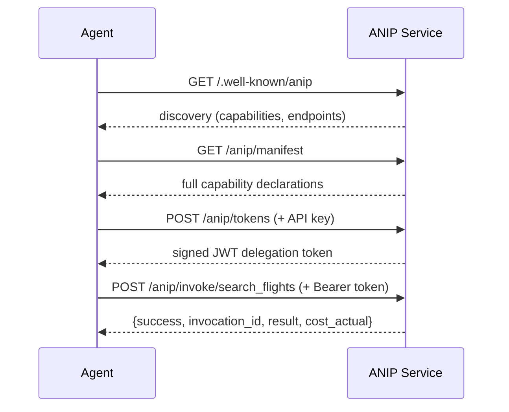
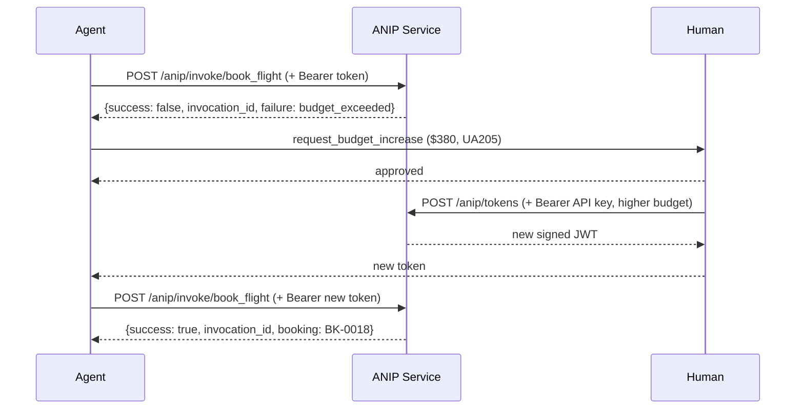

# ANIP Specification v0.11

> Agent-Native Interface Protocol — Draft

---

## 1. Motivation

An agent wants to book a flight.

Today, it reads an OpenAPI spec written for human developers. It guesses that `POST /bookings` is the right endpoint. It discovers auth requirements by getting a 401. It discovers insufficient permissions by getting a 403. It books the flight. It discovers the charge was $800, not the expected $420, because of an undeclared currency conversion. It cannot undo the booking because no rollback information was available. An audit log exists, but the agent didn't know to check it.

With ANIP, the agent queries a manifest and receives a profile handshake. It sees `book_flight` declared as irreversible, financial, with a cost of ~$420±10%. It checks that its delegation chain carries `travel.book` scope with $500 budget authority. It confirms there is no rollback window. It confirms the interaction is logged with 90-day retention. It decides to proceed and executes with full context.

The difference is not sophistication — it's design intent. ANIP interfaces are designed for agents from the ground up.

## 2. Design Philosophy

> *Make implicit assumptions explicit, typed, and negotiable.*

Every component of ANIP passes one test: does this take something agents currently have to guess, infer, or discover through failure, and make it declared, typed, and queryable?

ANIP is not a patch on REST. It is not a wrapper around existing APIs. It is a new interface paradigm for a new kind of consumer: AI agents that reason, plan, and act with delegated authority.

## 3. Compliance Levels

**ANIP-compliant** — An interface that implements the 5 core primitives (Section 4). An agent interacting with an ANIP-compliant service can operate safely: it knows what it can do, what will happen, who it's acting for, what it's allowed to do, and what went wrong if something fails.

**ANIP-complete** — An interface that implements all 9 primitives (Sections 4 and 5). An agent interacting with an ANIP-complete service can operate optimally: it additionally knows what things cost, how capabilities relate to each other, whether interactions are stateful, and what's being observed.

Services MUST implement all 5 core primitives to claim ANIP compliance. Services SHOULD implement contextual primitives using the standardized schemas defined in Section 5. Partial implementation of contextual primitives is permitted — a service MAY implement cost signaling without implementing observability contracts, for example — but each implemented primitive MUST conform to its standardized schema.

## 4. Core Primitives

The 5 core primitives are co-designed as a system. They reference each other by design:

- Permission Discovery is a function of Delegation Chain
- Failure Semantics references Delegation Chain scopes and cost constraints
- Capability Declaration includes Side-effect Typing
- Side-effect Typing informs Permission Discovery (irreversible actions may require higher authority)

Designing or implementing any one in isolation will produce seams.

### 4.1 Capability Declaration

A service declares what it can do as intent, not as endpoints. The unit of interaction is a **capability**, not a URL.

A capability declaration tells an agent: what this capability does, what inputs it requires, what side effects it has, and what outputs it produces. It does not expose implementation details like HTTP methods, URL paths, or serialization formats.

```yaml
capability:
  name: book_flight
  description: "Book a confirmed flight reservation"
  inputs:
    - name: origin
      type: airport_code
      required: true
    - name: destination
      type: airport_code
      required: true
    - name: date
      type: date
      required: true
    - name: passengers
      type: integer
      required: true
      default: 1
  output:
    type: booking_confirmation
    fields: [booking_id, flight_number, departure_time, total_cost]
  side_effect:
    type: irreversible
    rollback_window: none
  response_modes: [unary]             # default; streaming-capable: [unary, streaming]
```

A service MUST declare all capabilities in its manifest. Each capability MUST include a name, description, inputs with types, output shape, and side-effect type. Capabilities MAY declare `response_modes` (default: `["unary"]`) to indicate support for streaming invocations (see §6.6).

ANIP uses JSON Schema (draft 2020-12) for capability declarations. Canonical schemas are defined in Section 9 and validated across the Python/Pydantic and TypeScript/Zod reference implementations. The Go and Java runtimes validate protocol conformance via the HTTP conformance suite.

### 4.2 Side-effect Typing

Every capability MUST declare its side-effect type. This tells the agent what will happen to the world when the capability is invoked.

**Side-effect types:**

| Type | Meaning |
|------|---------|
| `read` | No state change. Safe to call repeatedly. |
| `write` | State change, reversible within the rollback window. |
| `irreversible` | State change that cannot be undone. |
| `transactional` | State change with atomic guarantees — fully succeeds or fully rolls back. |

Each side-effect declaration MUST include a `rollback_window`:

```yaml
side_effect:
  type: write
  rollback_window: "PT24H"    # ISO 8601 duration — reversible for 24 hours
```

```yaml
side_effect:
  type: irreversible
  rollback_window: none
```

```yaml
side_effect:
  type: read
  rollback_window: not_applicable
```

The rollback window tells the agent: if you invoke this capability and want to undo it, you have this much time. After the window closes, the action becomes irreversible regardless of its declared type.

For `transactional` capabilities, the rollback window indicates how long the transaction can be held open before the service auto-rolls back.

### 4.3 Delegation Chain

Identity in ANIP is not a header. It is a first-class primitive that represents the full chain of authority from a root principal (typically a human) through one or more agents to the current request.

The delegation chain is structured as a **directed acyclic graph (DAG)**, not a linked list. This supports scenarios where an orchestrator delegates to multiple agents in parallel, all acting on behalf of the same root principal.

A delegation token carries:

```yaml
delegation_token:
  issuer: "human:samir@example.com"
  subject: "agent:orchestrator-7x"
  scope: ["travel.search", "travel.book:max_$500"]
  purpose:
    capability: "book_flight"
    parameters: { from: "SEA", to: "SFO", date: "2026-03-10" }
    task_id: "task_abc789"
  parent: "token_abc123"
  expires: "2026-03-07T18:00:00Z"
  constraints:
    max_delegation_depth: 3
    concurrent_branches: allowed
```

**Fields:**

- **issuer** — who created this token (the delegating entity)
- **subject** — who this token is for (the delegated entity)
- **scope** — what the subject is authorized to do, as a list of capability scopes with optional constraints
- **purpose** — machine-parseable binding to a specific task and capability. Enforces principle of least authority: even a validly scoped token can only be used for its stated purpose.
- **parent** — reference to the parent token in the DAG. The root token (issued by a human) has no parent.
- **expires** — when this delegation expires
- **constraints**:
  - `max_delegation_depth` — how many times this token can be further delegated
  - `concurrent_branches` — whether multiple agents can act under this token simultaneously (`allowed` or `exclusive`). When `exclusive`, a service receiving two concurrent requests from the same root principal MUST reject one.

**Design decisions:**

- **DAG, not list.** An orchestrator delegating to Agent A and Agent B in parallel creates two tokens with the same parent. The service can detect concurrent agents sharing a root principal.
- **Purpose-bound.** Prevents token reuse beyond the intended task. Agent B cannot use a token delegated for flight booking to access expense reports, even if the scope strings overlap.
- **JWT/ES256 (since v0.2).** ANIP defines JWT (JSON Web Token) with ES256 (ECDSA P-256) as the standard token format. The service is the sole token issuer — agents request tokens via `POST /anip/tokens` with Bearer authentication, and the service returns signed JWTs. The semantic model is inspired by W3C Verifiable Credentials. See [docs/trust-model.md](docs/trust-model.md) for the full cryptographic trust model.

Every request to an ANIP service MUST include a delegation token. The service MUST validate the token's scope, purpose, expiry, and constraints before processing the request.

### 4.4 Permission Discovery

An agent MUST be able to query its permission scope before attempting any action. The service responds with the agent's effective permissions given its delegation chain.

```yaml
# Agent queries: "What can I do here?"

permission_response:
  available:
    - capability: search_flights
      scope_match: "travel.search"
    - capability: book_flight
      scope_match: "travel.book:max_$500"
      constraints:
        budget_remaining: 500
        currency: "USD"
  restricted:
    - capability: cancel_booking
      reason: "delegation chain lacks scope: travel.cancel"
      grantable_by: "human:samir@example.com"
  denied:
    - capability: admin_override
      reason: "requires admin principal, current chain root is standard user"
```

The permission response MUST include three categories:

- **available** — capabilities the agent can invoke right now, with any relevant constraints
- **restricted** — capabilities the agent can see but cannot invoke, with the reason and who could grant the missing authority
- **denied** — capabilities that exist but are inaccessible to the agent's entire delegation chain

This eliminates trial-and-error permission discovery. The agent knows its full scope before making any decisions.

Permission Discovery is coupled to Delegation Chain by design: the permission surface is a function of the delegation token. Different tokens from the same root principal may have different effective permissions based on their scope and purpose.

### 4.5 Failure Semantics

When something goes wrong, the service MUST return a failure object that an agent can reason about and recover from. Failures reference other ANIP primitives — delegation chain, scope, cost — rather than using opaque codes.

```yaml
failure:
  type: insufficient_authority
  detail: "delegation chain lacks scope: travel.book"
  resolution:
    action: "request_scope_grant"
    requires: "delegation.scope += travel.book"
    grantable_by: "human:samir@example.com"
  retry: true
```

```yaml
failure:
  type: budget_exceeded
  detail: "principal samir@example.com has $200 remaining authority"
  resolution:
    action: "request_budget_increase"
    requires: "delegation.scope travel.book:max raised to $420"
    grantable_by: "human:samir@example.com"
  retry: true
```

```yaml
failure:
  type: capability_unavailable
  detail: "book_flight is temporarily unavailable"
  resolution:
    action: "wait_and_retry"
    estimated_availability: "2026-03-07T15:00:00Z"
  retry: true
```

```yaml
failure:
  type: purpose_mismatch
  detail: "delegation token purpose is book_flight:SEA-SFO but request is for book_flight:SEA-LAX"
  resolution:
    action: "request_new_delegation"
    grantable_by: "agent:orchestrator-7x"
  retry: true
```

**Failure object fields:**

- **type** — machine-readable failure category
- **detail** — human-readable explanation (for debugging and logging)
- **resolution** — what needs to happen to fix this, who can do it, and what action to take
- **retry** — whether the same request could succeed after the resolution is applied

Failure semantics are only meaningful because Delegation Chain is core. Without structured identity, failures collapse to "access denied." With it, failures become "here's exactly what's missing in the chain and who needs to grant it."

A service MUST return failure objects conforming to this schema. A service MUST NOT return failures that lack a `type` and `resolution` field.

---

## 5. Contextual Primitives

Contextual primitives have standardized schemas. A service MAY implement any combination of contextual primitives, but each implemented primitive MUST conform to the schema defined here.

### 5.1 Cost & Resource Signaling

Cost signaling is bidirectional. The service declares what a capability costs. The agent may declare budget constraints. The service responds with the feasible space.

#### Cost Certainty Levels

Not all costs are known upfront. A capability MUST declare how certain its cost information is using one of three certainty levels:

| Certainty | Meaning | Example |
|-----------|---------|---------|
| `fixed` | Exact cost, known before invocation. The manifest cost IS the actual cost. | API calls priced per-request ($0.01/call) |
| `estimated` | Cost falls within a known range. Actual cost is determined by a preceding read operation. | Flights — search returns actual prices, manifest gives a typical range |
| `dynamic` | Cost is unknown until invocation. May vary based on demand, timing, or availability. | Auction bids, market orders, surge-priced services |

```yaml
# Fixed — exact cost, known upfront
cost:
  certainty: fixed
  financial: { amount: 0.01, currency: "USD" }
  compute: { latency_p50: "200ms", tokens: 500 }
```

```yaml
# Estimated — range known, exact cost determined by another capability
cost:
  certainty: estimated
  financial:
    range_min: 280
    range_max: 500
    typical: 420
    currency: "USD"
  determined_by: "search_flights"    # which capability resolves the actual cost
  compute: { latency_p50: "2s", tokens: 1500 }
```

```yaml
# Dynamic — unknown until execution
cost:
  certainty: dynamic
  financial:
    currency: "USD"
    upper_bound: 10000               # worst-case for budget checking
  factors: ["demand", "time_of_day", "availability"]
  compute: { latency_p50: "5s", tokens: 3000 }
```

**Design rationale:**

- **`fixed`** lets the agent make immediate go/no-go decisions from the manifest alone.
- **`estimated`** with `determined_by` connects cost signaling to the capability graph — the agent knows which read operation will resolve the actual price before committing to a write.
- **`dynamic`** with `upper_bound` gives the agent a worst-case for delegation chain budget checking. Even when the exact cost is unknowable, the agent can verify "my authority covers the maximum possible cost."

#### Actual Cost in Responses

For `estimated` and `dynamic` capabilities, the invocation response MUST include the actual cost incurred:

```yaml
result:
  booking_id: "BK-0001"
  flight_number: "UA205"
  total_cost: 380.00
  cost_actual:
    financial: { amount: 380.00, currency: "USD" }
    variance_from_estimate: "-9.5%"
```

The `variance_from_estimate` field tracks how far the actual cost deviated from the manifest's typical estimate. Over time, consistent variance is a trust signal — services whose estimates are systematically inaccurate surface through the trust model (Section 7).

#### Budget Negotiation

Cost signaling is bidirectional. The agent may declare budget constraints in the invocation request:

```yaml
# Agent constrains (part of invocation request)
budget:
  financial: { max: 300, currency: "USD" }
```

```yaml
# Service responds with alternatives
alternatives:
  - cost: { amount: 280, currency: "USD" }
    tradeoffs: ["1 stop", "+3hrs travel time"]
  - cost: { amount: 310, currency: "USD" }
    tradeoffs: ["flexible date: -1 day"]
  - unavailable_within_budget: true
    closest: { amount: 350, currency: "USD" }
```

This subsumes negotiation as an emergent behavior. The agent doesn't negotiate through a special verb — it declares constraints, and the service responds with what's feasible. If nothing fits, the service explains why.

#### Rate Limits

Rate and resource constraints are declared alongside financial cost:

```yaml
rate_limit:
  requests_per_minute: 60
  remaining: 42
  reset_at: "2026-03-07T15:00:00Z"
```

Rate limits SHOULD be included in the manifest for each capability. The `remaining` field is dynamic and is most useful in invocation responses rather than the static manifest.

### 5.2 Capability Graph

Capabilities know their prerequisites and what they compose with. Agents can discover the relationships between capabilities without reading documentation.

```yaml
capability: book_flight
requires:
  - capability: search_flights
    reason: "must select from available flights before booking"
composes_with:
  - capability: add_seat_selection
    optional: true
  - capability: add_travel_insurance
    optional: true
depends_on:
  - capability: validate_passenger_info
    auto_invoked: true    # service handles this internally
```

The capability graph is the ANIP equivalent of hyperlinks in HTML — a navigable capability space. An agent landing on an unfamiliar service can traverse the graph to understand what's possible and in what order, without external documentation.

### 5.3 State & Session Semantics

Interactions may be stateless or stateful. ANIP requires this to be declared explicitly rather than inferred.

```yaml
# Stateless capability
session:
  type: stateless
```

```yaml
# Multi-step workflow
session:
  type: workflow
  steps: 4
  current_step: 2
  continuation_token: "wf_xyz789"
  resumable: true
  timeout: "PT30M"    # workflow expires if not continued within 30 minutes
```

```yaml
# Continuation (two-phase)
session:
  type: continuation
  continuation_token: "cont_abc123"
  resumable: true
```

A service implementing state & session semantics MUST declare the session type for every capability. If a capability is part of a workflow, the response MUST include the continuation token and current step.

### 5.4 Observability Contract

A service declares what it observes, logs, and retains about interactions. This is structured metadata, not a privacy policy written for humans.

```yaml
observability:
  logged: true
  retention: "P90D"                  # ISO 8601 duration
  fields_logged:
    - "capability"
    - "delegation_chain"
    - "parameters"
    - "result"
    - "cost_actual"
  audit_accessible_by:
    - "delegation.root_principal"    # the human at the top of the chain
  real_time_observable: false         # no live streaming of logs
```

A service implementing observability contracts MUST declare what fields are logged and for how long. The agent (or its orchestrator) can use this information to decide whether the service meets its compliance requirements before invoking any capability.

---

## 6. Discovery & Standard Endpoints

ANIP defines a standard set of endpoints that every implementation MUST or SHOULD expose. This ensures that any agent can interact with any ANIP service without out-of-band configuration — the protocol is self-describing from a single, predictable entry point.

This is analogous to OAuth2's `/.well-known/openid-configuration`, which made OpenID Connect discoverable without prior knowledge of a service's URL structure.

### 6.1 Discovery Document

Every ANIP service MUST expose a discovery document at:

```
GET /.well-known/anip
```

This is the **single entry point** to the entire protocol. An agent encountering any domain can check this URL and immediately determine whether the service speaks ANIP, what it supports, and where to find each endpoint.

The discovery document MUST conform to this schema:

```yaml
# GET /.well-known/anip
anip_discovery:
  protocol: "anip/1.0"
  compliance: "anip-compliant"              # or "anip-complete" — see §3
  base_url: "https://flights.example.com"  # injected by HTTP binding layer at request time, not hardcoded
  profile:
    core: "1.0"
    cost: "1.0"
    capability_graph: "1.0"
    state_session: "1.0"
    observability: "1.0"
  auth:
    delegation_token_required: true
    supported_formats: ["anip-v1"]
    minimum_scope_for_discovery: "none"    # no token needed for discovery/manifest
  capabilities:
    search_flights:
      description: "Search available flights between two airports"
      side_effect: "read"
      minimum_scope: ["travel.search"]
      financial: false
      contract: "1.0"
    book_flight:
      description: "Book and confirm a flight reservation"
      side_effect: "irreversible"
      minimum_scope: ["travel.book"]
      financial: true
      contract: "1.0"
  endpoints:
    manifest: "/anip/manifest"
    permissions: "/anip/permissions"
    invoke: "/anip/invoke/{capability}"
    tokens: "/anip/tokens"
    graph: "/anip/graph/{capability}"
    audit: "/anip/audit"
    test: "/anip/test/{capability}"
    checkpoints: "/anip/checkpoints"           # v0.3: MAY for signed, MUST for anchored/attested
  trust_level: "anchored"                    # one of: signed, anchored, attested (see Section 7.1)
  posture:                                    # OPTIONAL (v0.7) — governance posture summary
    audit:
      enabled: true
      signed: true
      queryable: true
      retention: "P90D"
    lineage:
      invocation_id: true
      client_reference_id:
        supported: true
        max_length: 256
        opaque: true
        propagation: "bounded"
    metadata_policy:
      bounded_lineage: true
      freeform_context: false
      downstream_propagation: "minimal"
    failure_disclosure:
      detail_level: "redacted"              # or "policy" for caller-class-aware redaction (v0.9)
      # caller_classes: ["internal", "partner", "default"]  # optional, when detail_level is "policy"
    anchoring:
      enabled: true
      cadence: "PT30S"
      max_lag: 120
      proofs_available: true
  metadata:
    service_name: "Flight Booking Service"
    service_description: "ANIP-compliant flight search and booking"
    service_category: "travel.booking"
    service_tags: ["flights", "booking", "irreversible-financial"]
    capability_side_effect_types_present: ["read", "irreversible"]  # informational, derivable from capabilities
    max_delegation_depth: 5
    concurrent_branches_supported: true
    test_mode_available: false
    test_mode_unavailable_policy: "require_explicit_authorization_for_irreversible"
    generated_at: "2026-03-07T10:00:00Z"
    ttl: "PT1H"
```

**Fields:**

- **protocol** (REQUIRED) — the ANIP protocol version this service implements
- **compliance** (REQUIRED) — indicates whether the service implements the 5 core primitives defined in §4 (`"anip-compliant"`) or all 9 primitives from §4 and §5 (`"anip-complete"`). See Section 3 for full definitions. A service MUST NOT claim `"anip-complete"` unless it implements all 9 primitives. Compliance is defined in terms of primitives — abstract capabilities — not HTTP endpoints. Agents MUST NOT infer compliance level from counting profile keys or endpoints; this field is the source of truth.
- **base_url** (REQUIRED) — the absolute base URL for resolving endpoint paths. This field MUST be derived from the incoming HTTP request by the binding layer, not hardcoded or constructor-injected. It MAY be absent in service-layer output and populated at the HTTP boundary. Agents MUST NOT infer this from the request URL. Explicit over inferred.
- **profile** (REQUIRED) — which profile extensions are implemented, each independently versioned
- **auth** (REQUIRED) — what authentication the service requires, whether tokens are needed for discovery, and which token formats are supported. An agent MUST be able to determine from this field alone whether it can proceed without a delegation token.
- **capabilities** (REQUIRED) — map of capability names to lightweight metadata. Not full declarations — those live at the manifest endpoint. Each entry includes:
  - `description` — what this capability does (one sentence)
  - `side_effect` — the side-effect type (`read`, `write`, `irreversible`, `transactional`). Lets agents identify dangerous capabilities without fetching the manifest.
  - `minimum_scope` — array of delegation scopes REQUIRED to invoke this capability. ALL scopes in the array are required (AND semantics). This is a guarantee, not a hint: an agent whose delegation token lacks any of these scopes MUST NOT attempt invocation. Using an array from day one avoids a breaking change when compound authorization is needed (e.g., `["travel.book", "payments.authorize"]`).
  - `financial` — whether this capability involves financial cost. The `financial` flag MUST be `true` for any capability whose `cost.financial` field is non-null in the manifest, regardless of cost certainty level (`fixed`, `estimated`, or `dynamic`). Implementations MUST NOT use the presence or value of an `amount` key to determine this flag. Capabilities with no financial cost MUST set `cost.financial` to `null` (not a zero-amount object). Lets agents distinguish "irreversible and costs money" from "irreversible but free" — a distinction that matters for authorization handling. When `true`, agents should check cost signaling and budget authority before attempting invocation.
  - `contract` — the current contract version. An agent with a cached manifest can check whether contracts have changed without refetching.
- **trust_level** (REQUIRED, v0.3) — the trust level this service claims: `"signed"`, `"anchored"`, or `"attested"` (see Section 7.1). Agents use this to determine what verification guarantees the service provides. A service claiming `"anchored"` or `"attested"` MUST implement the checkpoint endpoints (Section 6.5).
- **posture** (OPTIONAL, v0.7) — governance posture summary. Exposes trust-relevant service characteristics that agents can inspect before invocation. Contains five sub-objects: `audit`, `lineage`, `metadata_policy`, `failure_disclosure`, and `anchoring`. See Section 6.7 for full field definitions. Services MUST NOT expose internal infrastructure details (database engines, ORM types, queue implementations) in posture fields.
- **endpoints** (REQUIRED) — URLs for each standard endpoint (see Section 6.2). REQUIRED endpoints: `manifest`, `permissions`, `invoke`, `tokens`. OPTIONAL endpoints: `handshake`, `graph`, `audit`, `test`, `checkpoints`, `jwks`. A service MUST only advertise endpoints it actually implements. Note: the endpoint set is orthogonal to compliance level — compliance is about primitives (§3–§5), not endpoint count.
- **metadata** (RECOMMENDED) — service-level metadata that lets agents make decisions without fetching the full manifest

**Cache validity:**

- `generated_at` — ISO 8601 timestamp of when this discovery document was generated
- `ttl` — ISO 8601 duration for how long this document is valid. After expiry, agents MUST re-fetch. Without a TTL, agents should treat the document as valid for at most 1 hour (the default).

This prevents two failure modes: re-fetching on every interaction (wasteful at scale) and caching indefinitely (dangerous when contracts change).

**Auth field details:**

- `delegation_token_required` — whether the service requires a delegation token for capability invocation
- `supported_formats` — which token formats the service accepts
- `minimum_scope_for_discovery` — the minimum scope needed to access the discovery document and manifest. `"none"` means these are publicly accessible without a token. This is the RECOMMENDED default — capability declarations are not sensitive, and requiring auth for discovery defeats the purpose of zero-configuration entry.

**Capability contracts field:**

This field enables efficient caching. An agent that previously fetched the manifest can compare contract versions at the discovery level. If all versions match its cache, it skips the manifest fetch entirely. This matters at scale — an orchestrator agent interacting with dozens of services per task should not refetch full manifests on every interaction.

**Test mode unavailable policy:**

When `test_mode_available` is `false`, the `test_mode_unavailable_policy` field tells agents how to behave:

- `"proceed_with_caution"` — agent may invoke capabilities but should apply extra validation
- `"require_explicit_authorization_for_irreversible"` — agent MUST obtain explicit human authorization before invoking any capability with side-effect type `irreversible`
- `"block_irreversible"` — agent MUST NOT invoke `irreversible` capabilities without test mode

**Service category and tags (OPTIONAL):**

- `service_category` — machine-readable category for orchestrator-level service selection (e.g., `"travel.booking"`, `"finance.payments"`, `"healthcare.records"`)
- `service_tags` — machine-readable tags for more granular filtering

These are optional in v1 (which assumes the agent already knows the service URL) but become important when a global service registry exists (see Open Questions).

The discovery document is intentionally lightweight. Manifests can grow large as capabilities increase; the discovery document stays small and cacheable. An agent can often decide whether to proceed from the discovery document alone — and with the capability list, contract versions, and auth requirements, it frequently can.

### 6.2 Standard Endpoints

ANIP defines the following standard endpoints. Core endpoints MUST be implemented by every ANIP-compliant service. Contextual endpoints SHOULD be implemented when the corresponding primitive is supported.

#### Core Endpoints

| Endpoint | Method | Description |
|----------|--------|-------------|
| `/.well-known/anip` | GET | Discovery document — the single entry point |
| `{manifest}` | GET | Full capability declarations with schemas |
| `{handshake}` | POST | Profile compatibility check |
| `{permissions}` | POST | Permission surface for the bearer token's delegation scope |
| `{invoke}/{capability}` | POST | Invoke a capability with parameters and optional lineage fields |
| `{tokens}` | POST | Issue root or delegated tokens |

#### Contextual Endpoints

| Endpoint | Method | Profile | Description |
|----------|--------|---------|-------------|
| `{graph}/{capability}` | GET | capability_graph | Capability prerequisites and composition |
| `{audit}` | POST | observability | Audit log query, filtered by root principal |
| `{test}/{capability}` | POST | test | Contract testing sandbox (reserved, v2) |
| `{checkpoints}` | GET | trust (v0.3) | List checkpoints with pagination |
| `{checkpoints}/{id}` | GET | trust (v0.3) | Checkpoint detail with Merkle proofs |

Endpoint paths in the table above use `{name}` to reference the URL declared in the discovery document's `endpoints` field. Services MAY use any URL paths they choose — the discovery document is the source of truth for where each endpoint lives.

### 6.3 Endpoint Contracts

Each standard endpoint has a normative request/response contract.

#### Discovery — `GET /.well-known/anip`

**Request:** No body. No authentication required.

**Response:** The discovery document (Section 6.1).

An agent MUST be able to fetch this endpoint without a delegation token. This is the only unauthenticated endpoint in the protocol.

#### Manifest — `GET {manifest}`

**Request:** No body. No authentication required.

**Response:** The full ANIP manifest — all capability declarations with their inputs, outputs, side-effect types, cost signals, and observability contracts.

```yaml
anip_manifest:
  protocol: "anip/1.0"
  profile:
    core: "1.0"
    cost: "1.0"
    capability_graph: "1.0"
    state_session: "1.0"
    observability: "1.0"
  capabilities:
    search_flights:
      contract: "1.0"
      description: "Search available flights"
      # ...full capability declaration
    book_flight:
      contract: "1.0"
      description: "Book a confirmed flight reservation"
      # ...full capability declaration
```

The manifest is the full-detail complement to the lightweight discovery document. Each profile extension is independently versioned. An agent can require `core@1.x` and `observability@1.x` without caring about the others.

The manifest endpoint SHOULD be publicly accessible without authentication, as capability declarations are not sensitive. Services that require authentication for the manifest MUST document this in the discovery document's metadata.

#### Handshake — `POST {handshake}`

**Request:**

```yaml
required_profiles:
  core: "1.0"
  cost: "1.0"
  observability: "1.0"
```

**Response:**

```yaml
compatible: true
service_profiles:
  core: "1.0"
  cost: "1.0"
  capability_graph: "1.0"
  state_session: "1.0"
  observability: "1.0"
missing: null
```

Or, if incompatible:

```yaml
compatible: false
service_profiles:
  core: "1.0"
missing:
  cost: "not supported (required: 1.0)"
  observability: "version mismatch: have 0.9, need 1.0"
```

The handshake is the first substantive interaction. The agent declares what profiles it needs; the service responds with whether it can satisfy them. Tasks declare their own profile requirements — matching happens before any capability is invoked.

#### Token Issuance — `POST {tokens}`

**Authentication:** Bearer token in `Authorization` header. For root token issuance, the bearer value is the service's shared secret (bootstrap credential). For delegation, the bearer value is an existing JWT token issued by the service.

**Request:**

```yaml
scope:
  - "travel.search"
  - "travel.book"
subject: "agent-007"                # required for root issuance
parent_token: "tok_root_001"        # present for delegation, absent for root issuance
ttl_hours: 2                        # optional, default 2
```

**Response:**

```yaml
token_id: "tok_root_001"
token: "eyJhbGciOiJFUzI1NiIs..."    # signed JWT
expires: "2026-03-15T14:00:00Z"
```

The service issues ES256-signed JWT tokens. Every protected endpoint resolves the caller's identity from the `Authorization: Bearer <jwt>` header — the JWT claims are verified against stored state at a trust boundary, detecting both token forgery and store tampering.

#### Permission Discovery — `POST {permissions}`

**Authentication:** Bearer JWT token in `Authorization` header. The service resolves the delegation token from the bearer credential.

**Response:** The permission response (see Section 4.4 for schema) — available, restricted, and denied capabilities given the token's scope.

#### Capability Invocation — `POST {invoke}/{capability}`

**Authentication:** Bearer JWT token in `Authorization` header.

**Request:**

```yaml
parameters: { ... }
budget: { ... }                     # optional, for cost negotiation
client_reference_id: "task:abc/3"   # optional, opaque, max 256 chars
stream: false                       # optional, default false — request streaming response (§6.6)
```

The delegation token is resolved from the bearer credential, not carried in the request body.

**Response (unary — `stream: false` or omitted):**

```yaml
success: true
invocation_id: "inv-a1b2c3d4e5f6"  # always present, format inv-{hex12}
client_reference_id: "task:abc/3"   # echoed if provided in request
result: { ... }
cost_actual: { ... }                # optional
stream_summary: { ... }            # present when stream: true was requested (§6.6)
```

Or on failure:

```yaml
success: false
invocation_id: "inv-a1b2c3d4e5f6"  # present even on failure
client_reference_id: "task:abc/3"   # echoed if provided
failure:
  type: "scope_insufficient"
  detail: "Missing required scope"
stream_summary: { ... }            # present when stream: true was requested (§6.6)
```

The `invocation_id` is a server-generated canonical identifier for the invoke action, created before any validation. It is present in both success and failure responses, enabling end-to-end traceability. The `client_reference_id` is an optional caller-supplied opaque string (max 256 characters) echoed back in the response for caller-side correlation.

When `stream: true` is requested and the capability declares `streaming` in its `response_modes`, the response switches to SSE transport (see §6.6). When `stream: true` is requested but the capability only supports `unary`, the service MUST return a JSON failure with type `streaming_not_supported`.

Lineage begins at the service `invoke()` boundary. Bearer auth failures (HTTP 401) occur in framework bindings before `invoke()` is called — they are transport-level rejections and do not receive lineage fields.

The service MUST validate the delegation token before processing. The service MUST return an ANIP failure object (not an HTTP error) for any authorization, budget, or purpose-binding failure.

The service MUST enforce budget constraints carried in the delegation token's scope. If a scope string includes a budget constraint (e.g., `travel.book:max_$500`) and the capability's cost exceeds that constraint, the service MUST reject the invocation with a `budget_exceeded` failure before executing the capability. Budget enforcement is not optional — a service that accepts a delegation token with budget constraints and ignores them violates the delegation contract.

#### Capability Graph — `GET {graph}/{capability}`

**Request:** No body.

**Response:** The capability's prerequisites and composition relationships (see Section 5.2 for schema).

#### Audit Log — `POST {audit}`

**Authentication:** Bearer JWT token in `Authorization` header. The service resolves the delegation token from the bearer credential and scopes results to its root principal.

**Optional query parameters:** `capability`, `since` (ISO 8601), `invocation_id`, `client_reference_id`, `limit`.

**Response:** Audit log entries filtered to the root principal of the caller's delegation token. A service MUST NOT return audit entries belonging to other principals. This enforces the observability contract: each principal can only see their own audit trail.

The `invocation_id` filter returns the single entry for that invocation. The `client_reference_id` filter returns all entries matching that caller-supplied correlation value.

### 6.4 Agent Interaction Flow

The standard endpoints define a predictable interaction sequence:

```
1. Agent discovers service          →  GET /.well-known/anip
2. Agent checks compatibility       →  POST {handshake}
3. Agent fetches full manifest       →  GET {manifest}
4. Agent requests delegation token    →  POST {tokens}
5. Agent queries permissions         →  POST {permissions}
6. Agent explores capability graph   →  GET {graph}/{capability}
7. Agent invokes capability          →  POST {invoke}/{capability}
```



#### Budget Escalation

When a capability invocation fails due to insufficient budget, the structured failure includes `resolution.grantable_by`, enabling the agent to escalate autonomously:



Not every interaction requires all steps. An agent that has previously interacted with a service may skip directly to step 4 if it has cached the manifest. An agent performing a read-only operation may skip the capability graph step. But the sequence above is the canonical flow for a first interaction.

### 6.5 Checkpoint Endpoints (v0.3)

Services at trust level `anchored` or `attested` MUST expose checkpoint endpoints. Services at trust level `signed` MAY expose them.

#### List Checkpoints — `GET {checkpoints}`

**Request:** No body. Optional query parameters: `since` (ISO 8601 timestamp), `limit` (integer, default 20).

**Response:**

```json
{
  "checkpoints": [
    {
      "checkpoint_id": "cp_00042",
      "range": { "from": 1001, "to": 1500 },
      "merkle_root": "sha256:3a7bd3e2360a8bb...",
      "timestamp": "2026-03-12T06:00:00Z",
      "entry_count": 500
    }
  ],
  "next_cursor": "cp_00041"
}
```

#### Checkpoint Detail — `GET {checkpoints}/{id}`

**Request:** No body. Optional query parameters: `include_proof` (boolean, default `false`), `leaf_index` (integer, required when `include_proof` is `true`).

**Response:**

```json
{
  "version": "0.3",
  "service_id": "flights.example.com",
  "checkpoint_id": "cp_00042",
  "range": { "from": 1001, "to": 1500 },
  "merkle_root": "sha256:3a7bd3e2360a8bb...",
  "previous_checkpoint": "cp_00041",
  "timestamp": "2026-03-12T06:00:00Z",
  "entry_count": 500
}
```

Note: The checkpoint body does NOT contain a signature field. Checkpoints use the detached JWS pattern — the signature is carried in the `X-ANIP-Signature` header, not in the body. This keeps the signed payload identical to the response body, avoiding canonicalization issues.

When `include_proof=true` and `leaf_index` is provided, the response includes an `inclusion_proof` field (see Section 7.4 for proof schemas).

When `include_proof` is `true` but the audit entries required for proof generation have been deleted by retention enforcement (§6.8), the response MUST still return the checkpoint data with HTTP 200. The `inclusion_proof` or `consistency_proof` field MUST be omitted, and the response MUST include a `proof_unavailable` field with value `"audit_entries_expired"`. Checkpoint data (sequence ranges, Merkle roots, signatures) was computed at checkpoint time and remains valid; only proof regeneration — which requires replaying audit entries from live storage — is affected.

Example response when proof is unavailable:

```json
{
  "version": "0.3",
  "service_id": "flights.example.com",
  "checkpoint_id": "cp_00042",
  "range": { "from": 1001, "to": 1500 },
  "merkle_root": "sha256:3a7bd3e2360a8bb...",
  "previous_checkpoint": "cp_00041",
  "timestamp": "2026-03-12T06:00:00Z",
  "entry_count": 500,
  "proof_unavailable": "audit_entries_expired"
}
```

#### Proof Expiration Guidance (v0.9)

Services SHOULD include an `expires_hint` field on checkpoint detail responses:

```json
{
  "version": "0.3",
  "service_id": "flights.example.com",
  "checkpoint_id": "cp_00042",
  "range": { "from": 1001, "to": 1500 },
  "merkle_root": "sha256:3a7bd3e2360a8bb...",
  "previous_checkpoint": "cp_00041",
  "timestamp": "2026-03-12T06:00:00Z",
  "entry_count": 500,
  "expires_hint": "2026-06-15T00:00:00Z"
}
```

`expires_hint` is:

- **Best-effort and informational** — actual expiration depends on retention enforcement timing, not this field.
- **Optional** — services that do not track per-entry expiration MAY omit it.
- **Derived from the earliest expected expiration** of any audit entry within the checkpoint's sequence range, based on current retention policy and tier durations.

**Client-side guidance:**

1. Clients SHOULD retrieve and cache proofs before `expires_hint` if they need them for offline verification or compliance.
2. `proof_unavailable: "audit_entries_expired"` is **permanent**. The live audit entries needed for proof regeneration are no longer available. Retries will not produce the proof unless the deployment has an out-of-band archival path.
3. The **checkpoint remains valid**. `proof_unavailable` means the proof cannot be regenerated from live storage, not that the checkpoint is invalid or the audit trail is compromised.
4. **No retry semantics.** Unlike transient errors, `proof_unavailable` SHOULD NOT trigger retry loops. Clients SHOULD handle it as a terminal state for that proof request.
```

### 6.6 Streaming Invocations (v0.6)

Capabilities that produce incremental results — search results, generation progress, multi-step computations — MAY declare `response_modes: ["unary", "streaming"]` in their capability declaration. This enables agents to request real-time progress events during invocation.

#### Response Modes

A capability's `response_modes` field declares which delivery modes it supports:

- **`unary`** (default) — single JSON response after handler completes
- **`streaming`** — SSE (Server-Sent Events) stream with progress events followed by a terminal event

Every capability MUST support `unary`. A capability MAY additionally support `streaming`. The field defaults to `["unary"]` when omitted.

#### SSE Transport

When `stream: true` is sent in the invoke request and the capability supports `streaming`, the HTTP binding switches from a JSON response to an SSE (`text/event-stream`) response. The stream carries typed events:

**Progress events** — emitted by the handler during execution:

```
event: progress
data: {"invocation_id":"inv-a1b2c3d4e5f6","client_reference_id":"task:abc/3","timestamp":"2026-03-15T10:00:01Z","payload":{"partial_result":"..."}}
```

**Terminal event** — emitted exactly once when the handler completes:

```
event: completed
data: {"invocation_id":"inv-a1b2c3d4e5f6","client_reference_id":"task:abc/3","timestamp":"2026-03-15T10:00:02Z","success":true,"result":{...},"cost_actual":{...},"stream_summary":{...}}
```

Or on failure:

```
event: failed
data: {"invocation_id":"inv-a1b2c3d4e5f6","client_reference_id":"task:abc/3","timestamp":"2026-03-15T10:00:02Z","success":false,"failure":{"type":"internal_error","detail":"Internal error"},"stream_summary":{...}}
```

A stream MUST emit exactly one terminal event (`completed` or `failed`) as its final event. Progress events are optional — a stream with zero progress events followed by a terminal event is valid.

#### StreamSummary

When a streaming invocation completes (success or failure), the response (both the terminal SSE event and the unary response when `stream: true` was requested) includes a `stream_summary` object:

```yaml
stream_summary:
  response_mode: "streaming"
  events_emitted: 5          # progress events the handler produced
  events_delivered: 5        # progress events successfully written to transport
  duration_ms: 1200          # wall-clock time of the streaming invocation
  client_disconnected: false # whether a transport write failure was detected
```

`events_delivered` tracks successful transport writes; `client_disconnected` is set to `true` if any transport write fails. This allows agents and audit systems to detect partial delivery — a stream where `events_emitted > events_delivered` indicates the client may have missed progress events.

#### Sink Isolation

Transport failures (e.g., client disconnect during streaming) MUST NOT abort the capability handler. The service MUST catch and swallow transport write errors in the progress sink so that the handler runs to completion regardless of transport state. This ensures the invocation outcome reflects the handler's result, not the client's connection state.

#### Error Redaction

When an unexpected error occurs during a streaming invocation, the SSE `failed` event MUST NOT include raw exception details. The `detail` field MUST use a generic message (e.g., `"Internal error"`) to prevent leaking server internals to clients.

### 6.7 Discovery Posture (v0.7)

The discovery document's `posture` block exposes trust-relevant service characteristics that agents can inspect before invocation. Its purpose is to let agents make informed trust and governance decisions without trial-and-error probing or out-of-band documentation.

**Posture vs. Manifest:** The manifest (§6.3) declares *what a service can do* — capabilities, inputs, outputs, side-effect types. Posture declares *how the service governs itself* — audit retention, lineage propagation, failure disclosure policy, and anchoring behavior. Posture is metadata about operational governance; it does not duplicate or replace capability declarations.

The `posture` block is OPTIONAL. When present, all sub-objects included MUST accurately reflect the service's actual behavior. A service MUST NOT advertise posture characteristics it does not implement.

#### posture.audit

Describes the service's audit log characteristics.

| Field | Type | Required | Description |
|-------|------|----------|-------------|
| `enabled` | boolean | MUST | Whether the service maintains an audit log. |
| `signed` | boolean | MUST | Whether audit entries are cryptographically signed (per §7). |
| `queryable` | boolean | MUST | Whether the audit log is queryable via the `{audit}` endpoint (§6.3). |
| `retention` | string | MUST | ISO 8601 duration for how long audit entries are retained (e.g., `"P90D"` for 90 days). |
| `retention_enforced` | boolean | MUST | Whether the service actively deletes expired audit entries. The operational credibility signal: the difference between declaring retention and enforcing it (v0.8). |

A service declaring `queryable: true` MUST advertise the `audit` endpoint in its `endpoints` block.

#### posture.lineage

Describes how the service handles invocation lineage fields (§6.3).

| Field | Type | Required | Description |
|-------|------|----------|-------------|
| `invocation_id` | boolean | MUST | Whether the service generates `invocation_id` on every invocation. |
| `client_reference_id` | object | MUST | Sub-object describing `client_reference_id` handling. |
| `client_reference_id.supported` | boolean | MUST | Whether the service accepts and echoes `client_reference_id`. |
| `client_reference_id.max_length` | integer | SHOULD | Maximum character length accepted. |
| `client_reference_id.opaque` | boolean | SHOULD | Whether the service treats the value as opaque (no parsing or interpretation). |
| `client_reference_id.propagation` | string | SHOULD | How lineage propagates: `"bounded"` (within this service only) or `"forwarded"` (passed to downstream services). |

#### posture.metadata_policy

Describes the service's policy on metadata handling and propagation.

| Field | Type | Required | Description |
|-------|------|----------|-------------|
| `bounded_lineage` | boolean | MUST | Whether lineage metadata is bounded to this service and not forwarded unboundedly. |
| `freeform_context` | boolean | MUST | Whether the service accepts arbitrary freeform context fields in invocation requests. `false` means only declared fields are accepted. |
| `downstream_propagation` | string | MUST | How much metadata is propagated to downstream services: `"none"`, `"minimal"`, or `"full"`. |

#### posture.failure_disclosure

Describes how much detail the service exposes in failure responses.

| Field | Type | Required | Description |
|-------|------|----------|-------------|
| `detail_level` | string | MUST | One of: `"full"` (detailed error messages including stack context), `"reduced"` (truncated detail, resolution hints without internal authority structure), `"redacted"` (generic messages per failure type, minimal resolution hints), or `"policy"` (v0.9: effective level resolved per-caller from the service's disclosure policy; see §6.8). |
| `caller_classes` | array of strings | OPTIONAL | When `detail_level` is `"policy"`, lists the caller class names the service recognizes (e.g., `["internal", "partner", "default"]`). Informational only — does not reveal the class-to-level mapping. |

Services SHOULD use `"redacted"` in production. Failure responses MUST conform to the failure semantics in §4.5 regardless of disclosure level — `detail_level` governs the verbosity of the `detail` field, not the structure of the failure object.

#### posture.anchoring

Describes the service's checkpoint anchoring behavior (§7).

| Field | Type | Required | Description |
|-------|------|----------|-------------|
| `enabled` | boolean | MUST | Whether the service produces Merkle checkpoints. |
| `cadence` | string | SHOULD | ISO 8601 duration between checkpoint productions (e.g., `"PT30S"` for every 30 seconds). |
| `max_lag` | integer | SHOULD | Maximum seconds of audit entries that may not yet be covered by a checkpoint. |
| `proofs_available` | boolean | MUST | Whether inclusion/consistency proofs can be requested via checkpoint endpoints (§6.5). |

`proofs_available` MUST be `true` only when the service has active checkpoint scheduling — claiming `anchored` trust level (§7.1) alone is insufficient. A service that declares `proofs_available: true` without active checkpoint production is non-conformant.

#### What posture MUST NOT expose

Posture fields describe governance-relevant service characteristics. They MUST NOT expose internal infrastructure details. Specifically:

- Database engines, storage backends, or ORM implementations
- Queue or message broker technologies
- Internal network topology or service mesh details
- Language runtimes, framework versions, or dependency information

These details are operational concerns that do not inform agent trust decisions and could create security exposure.

### 6.8 Security Hardening (v0.8)

v0.8 turns v0.7's declared governance posture into enforceable behavior. Services MUST classify audit events, enforce retention, and redact failure responses based on disclosure level.

#### Event Classification

Every audit entry MUST be assigned an `event_class`. The classification is a pure function of the side-effect type, success/failure outcome, and failure type.

**EventClass values:** `high_risk_success`, `high_risk_denial`, `low_risk_success`, `repeated_low_value_denial`, `malformed_or_spam`.

**Classification table:**

| Side-effect type | Success | Failure (auth/scope/purpose) | Failure (malformed/unknown) |
|---|---|---|---|
| `irreversible`, `transactional`, `write` | `high_risk_success` | `high_risk_denial` | `malformed_or_spam` |
| `read` | `low_risk_success` | `high_risk_denial` | `malformed_or_spam` |

All auth/scope/purpose denials are `high_risk_denial` regardless of side-effect type — a denied read is still an authority boundary event. Failures before capability resolution (invalid token, unknown capability) are `malformed_or_spam`.

`repeated_low_value_denial` is not assigned by the base classifier. It is applied at aggregation time when a time-window bucket crosses the >1 event threshold (see §6.9).

#### Retention Enforcement

Services MUST assign a `retention_tier` and compute an `expires_at` for every audit entry using a two-layer policy model:

```
classifyEvent(sideEffectType, success, failureType) → EventClass
RetentionClassPolicy:   EventClass    → RetentionTier
RetentionTierPolicy:    RetentionTier → Duration | null
```

**RetentionTier values:** `long`, `medium`, `short`, `aggregate_only`.

**Default class → tier mapping:**

| Event class | Default tier |
|---|---|
| `high_risk_success` | `long` |
| `high_risk_denial` | `medium` |
| `low_risk_success` | `short` |
| `repeated_low_value_denial` | `aggregate_only` |
| `malformed_or_spam` | `short` |

**Default tier → duration mapping:**

| Tier | Default duration |
|---|---|
| `long` | P365D |
| `medium` | P90D |
| `short` | P7D |
| `aggregate_only` | P1D |

Both layers are configurable per deployment. The `aggregate_only` tier (v0.9) uses a P1D duration — long enough to detect patterns in aggregated noise, short enough to avoid accumulation.

Services SHOULD enforce retention via periodic background cleanup that deletes entries where `expires_at < now()`. When `posture.audit.retention_enforced` is `true` in the discovery document, the service MUST be actively running a retention sweep.

**Checkpoint interaction:** Checkpoints continue to include all entries regardless of event class. Past checkpoint verification remains valid. However, when retention deletes rows that fall within a checkpoint's sequence range, proof generation from live storage is no longer possible. See §6.5 for the `proof_unavailable` response contract.

#### Failure Redaction

Services MUST apply disclosure-level redaction to failure responses at the response boundary — after audit logging, before returning to the caller. This is response-boundary redaction, independent of storage-side redaction (§6.10). Audit storage always records the full unredacted failure.

**DisclosureLevel values:** `full`, `reduced`, `redacted`, `policy`.

**Redaction behavior:**

| Field | `full` | `reduced` | `redacted` |
|---|---|---|---|
| `failure.type` | as-is | as-is | as-is |
| `failure.detail` | as-is | truncated to 200 chars | generic message per failure type |
| `failure.retry` | as-is | as-is | as-is |
| `resolution.action` | as-is | as-is | as-is |
| `resolution.requires` | as-is | as-is | `null` |
| `resolution.grantable_by` | as-is | `null` | `null` |
| `resolution.estimated_availability` | as-is | as-is | `null` |

`failure.type` is never redacted — callers always need the failure category for programmatic handling. `reduced` strips internal authority structure (`grantable_by`) while keeping actionable detail. `redacted` replaces `detail` with a fixed generic message per failure type and strips all resolution hints except `action`. Generic messages are a static map in the service, not caller-controlled.

**Two modes (v0.9):**

The service's `disclosure_level` configuration determines the mode:

- **Fixed mode** (`"full"`, `"reduced"`, or `"redacted"`): That level applies uniformly to all callers. This is identical to v0.8 behavior.
- **Policy mode** (`"policy"`): The effective disclosure level is resolved per-caller from the service's disclosure policy.

**Caller class resolution (v0.9):**

When in policy mode, the caller class is resolved from the delegation token:

1. If the token contains an `anip:caller_class` claim, use it.
2. If the token's scope includes a disclosure-related scope (e.g., `audit:full`), derive from scope.
3. Default: `"default"`.

The `anip:caller_class` claim is caller/issuer-supplied input. It is not trusted on its own. It is only meaningful when the service's disclosure policy contains a matching entry. An unrecognized caller class falls through to the `"default"` entry.

**Disclosure policy:**

The service declares a disclosure policy mapping caller classes to maximum allowed disclosure levels:

```yaml
disclosure_policy:
  internal: "full"
  partner: "reduced"
  default: "redacted"
```

**Resolution logic:**

```
if disclosure_level != "policy":
    effective = disclosure_level  # fixed mode
else:
    caller_class = resolve_from_token(token)
    effective = disclosure_policy.get(caller_class)
              or disclosure_policy.get("default")
              or "redacted"
```

The service is always the authority. An unrecognized caller class can never escalate disclosure.

**What caller-class redaction does not do:**

- No per-request disclosure negotiation — callers cannot request a specific level in the request body.
- No disclosure cascading across delegation chains — disclosure is between the immediate caller and the service.

#### Audit Entry Fields (v0.8)

Every audit entry MUST include the following fields in addition to existing fields:

| Field | Type | Required | Description |
|---|---|---|---|
| `event_class` | EventClass | MUST | Classification of the event. |
| `retention_tier` | RetentionTier | MUST | Retention tier assigned by class policy. |
| `expires_at` | string (ISO 8601) or null | MUST | When the entry will be deleted, or null for indefinite retention. |

The `event_class` field MUST be queryable — `query_audit_entries()` accepts an optional `event_class` filter.

#### Explicit Deferrals (v0.10+)

- **Selective checkpointing** — filtering which events enter the Merkle tree by event class.

### 6.9 Audit Aggregation (v0.9)

Repeated identical low-value denials are collapsed into summary records via time-window bucketed aggregation. This activates the `repeated_low_value_denial` event class and `aggregate_only` retention tier.

#### Grouping Key

Denials are grouped by the tuple:

- **actor_key** — resolved from the token subject or authenticated principal when available, `"anonymous"` for missing or invalid tokens. This handles pre-auth failures where no valid subject exists.
- **capability** — which capability was attempted, or `"_pre_auth"` for failures before capability resolution.
- **failure_type** — the `ANIPFailure.type` value (e.g., `"scope_insufficient"`).

Request parameters are excluded from the grouping key. Normalizing request bodies for grouping adds complexity for marginal value.

#### Time Window

Aggregation uses fixed-width bucketed windows, configurable with a default of **60 seconds**.

- At window close, if a bucket has **>1 event** for a grouping key, the service MUST emit one aggregated entry.
- If a bucket has exactly 1 event, the service MUST store it as a normal (non-aggregated) entry.
- Bucketed windows (not rolling) provide deterministic window boundaries and simpler reasoning for audit inspection.

#### Delayed Emission

Aggregated entries materialize at window close, not at request time. The audit log has a latency gap of up to one window duration for aggregated events. Individual non-aggregated events still emit immediately. This is a change from the "every request produces an immediate audit row" model and MUST be documented in the service's operational guidance.

#### Aggregated Entry Shape

Aggregated entries use `entry_type: "aggregated"` and carry the following fields:

```yaml
entry_type: "aggregated"
event_class: "repeated_low_value_denial"
retention_tier: "aggregate_only"
grouping_key:
  actor_key: string
  capability: string
  failure_type: string
window:
  start: ISO 8601 timestamp
  end: ISO 8601 timestamp
count: integer
first_seen: ISO 8601 timestamp
last_seen: ISO 8601 timestamp
representative_detail: string | null  # bounded to 200 chars max
```

`representative_detail` is the failure detail from the first event in the window, truncated to 200 characters. It is nullable for cases where the detail adds no signal.

#### Classifier Interaction

The base classifier (§6.8) does not change. Individual events within a window are still classified normally (e.g., `malformed_or_spam`). The `repeated_low_value_denial` classification is applied at aggregation time when a bucket crosses the >1 threshold. The resulting summary record carries `repeated_low_value_denial` as its event class and `aggregate_only` as its retention tier.

### 6.10 Storage-Side Redaction (v0.9)

Storage-side redaction reduces what is persisted for low-value audit events by stripping request parameters at write time. This is a write-path operation, independent of response-boundary redaction (§6.8) which operates on the read path.

#### Which Events Are Redacted

Storage-side redaction applies to entries with event class:

- `low_risk_success`
- `malformed_or_spam`
- `repeated_low_value_denial`

It does not apply to:

- `high_risk_success` — operators need full inspection capability.
- `high_risk_denial` — denied high-risk operations are security-relevant.

#### What Gets Stripped

For affected event classes, the stored entry omits:

- `parameters` — the full request body.

The stored entry keeps: `timestamp`, `actor_key` / principal context, `capability`, `event_class`, `retention_tier`, `failure_type`, bounded failure detail, `invocation_id`, and `sequence_number`.

#### Write-Path Placement

Storage-side redaction runs after classification and after aggregation, before persistence:

```
request → classify → [aggregation window] → storage-redact → persist
```

Response-boundary redaction (§6.8) is a separate, independent layer on the read path:

```
persist → [response-boundary redact based on disclosure level] → respond
```

The two redaction layers are independent. Storage-side redaction determines what hits the database. Response-boundary redaction determines what the caller sees. Neither depends on the other.

#### Marker Field

A `storage_redacted` boolean field (default `false`) MUST be present on audit entries. When `true`, it indicates that parameters were intentionally stripped at write time. This lets audit consumers distinguish intentional parameter omission from missing data.

#### Checkpointing

The persisted redacted entry is the canonical hashed form for checkpointing. The Merkle tree hashes what was stored. There is no separate "pre-redaction" or "full-fidelity" hash.

#### Limitations

- No configurable field masks — fixed policy (parameters only).
- No retroactive redaction of existing entries.

### 6.11 Horizontal Scaling (v0.10)

ANIP servers MAY be deployed as multiple replicas behind a load balancer. When doing so, the protocol requires that certain invariants hold regardless of which replica handles a given request.

#### Storage-Atomic Audit Append

Each audit entry MUST be appended atomically with its sequence number assigned by the storage backend. Implementations MUST use the storage backend's native atomicity guarantees (e.g., database transactions, conditional writes) rather than application-level locking. Two concurrent replicas appending audit entries MUST NOT produce duplicate or gaps in sequence numbers.

#### Storage-Derived Checkpoint Generation

Checkpoints MUST be generated from storage state, not from in-memory replica state. A replica generating a checkpoint reads the current sequence range from the storage backend, reconstructs the cumulative Merkle tree from the persisted entries, and signs the result. Any replica with read access to storage and the signing key can produce a valid checkpoint. Checkpoint generation is leader-only (see below).

#### Distributed Exclusivity

When `concurrent_branches` is set to `"exclusive"` (§4.3), exclusivity MUST be enforced across all replicas. Implementations MUST use lease-based coordination with a configurable TTL. The lease is acquired atomically in the storage backend. A replica holding a lease for a principal MUST be the only replica that can issue tokens for that principal until the lease expires or is released. Lease acquisition MUST be atomic (check-and-acquire in a single storage operation).

#### Background Job Coordination

Multi-replica deployments require coordination for background jobs. Jobs fall into three categories:

| Category | Semantics | Examples |
|----------|-----------|----------|
| **Leader-only** | Exactly one replica runs the job at any time. Requires lease-based leader election via the storage backend. | Checkpoint generation, audit aggregation, retention enforcement |
| **All-replicas** | Every replica runs the job independently. No coordination needed. | Health checks, metrics emission |
| **Per-replica** | Each replica runs the job for its own local concerns. | Connection pool maintenance, cache warming |

Leader election uses the same lease mechanism as distributed exclusivity. The leader lease has a configurable TTL and is renewed periodically. If the leader fails to renew, another replica acquires the lease.

For deployment guidance including configuration, health checks, and storage backend selection, see the deployment guide.

### 6.12 Observability Hooks (v0.11)

ANIP services MAY accept a `hooks` configuration object with four namespaced sections for runtime instrumentation. All hooks are optional — omitting them has zero overhead beyond a conditional check at each call site.

**hooks.logging** — Structured lifecycle event callbacks (8 hooks): `onInvocationStart`, `onInvocationEnd`, `onDelegationFailure`, `onAuditAppend`, `onCheckpointCreated`, `onRetentionSweep`, `onAggregationFlush`, `onStreamingSummary`. Each receives a single typed event object and returns void.

**hooks.metrics** — Counter/histogram/gauge callbacks (10 hooks): `onInvocationDuration`, `onDelegationDenied`, `onAuditAppendDuration`, `onCheckpointCreated` (with `lagSeconds` measuring time since previous checkpoint publication), `onCheckpointFailed`, `onProofGenerated`, `onProofUnavailable`, `onRetentionDeleted`, `onAggregationFlushed`, `onStreamingDeliveryFailure`.

**hooks.tracing** — Span lifecycle callbacks (2 hooks): `startSpan` returns an opaque handle, `endSpan` receives that handle with status. Eight stable span names: `anip.invoke`, `anip.delegation.validate`, `anip.handler.execute`, `anip.audit.append`, `anip.checkpoint.create`, `anip.proof.generate`, `anip.retention.sweep`, `anip.aggregation.flush`. Request-path spans nest under `anip.invoke`; background spans are root spans.

**hooks.diagnostics** — Background failure signal (1 hook): `onBackgroundError` reports errors from checkpoint, retention, and aggregation workers that are otherwise swallowed.

**Isolation guarantee.** All hook invocations are wrapped in try/catch — a throwing hook callback never affects request correctness or background worker stability. Hooks are instrumentation, not part of the correctness path.

**service.getHealth()** — Returns a synchronous cached snapshot of runtime state:

```yaml
status: "healthy" | "degraded" | "unhealthy"
storage: { type: "memory" | "sqlite" | "postgres" }
checkpoint: { healthy: boolean, lastRunAt: string | null, lagSeconds: number | null } | null
retention: { healthy: boolean, lastRunAt: string | null, lastDeletedCount: number }
aggregation: { pendingWindows: number } | null
```

`retention.healthy` reflects both whether the worker is running and whether its last sweep succeeded (no `lastError`). `checkpoint.healthy` reflects the scheduler's last error state. Framework bindings (FastAPI, Hono, Express, Fastify) MAY expose `getHealth()` as `GET /-/health`, disabled by default. This is an operational surface outside the `/.well-known/anip` namespace.

---

## 7. Trust Model

### 7.1 Trust Levels (v0.3)

ANIP v0.3 introduces three trust levels. Each level builds on the previous one — higher levels provide strictly stronger guarantees.

| Level | Protocol Name | Description |
|-------|---------------|-------------|
| Bronze | `signed` | Service signs manifests and delegation tokens with ES256 (ECDSA P-256). Agents can verify that declarations come from the claimed service and have not been tampered with. This is the v0.2 baseline. |
| Silver | `anchored` | Service periodically publishes Merkle tree checkpoints over its audit log. Agents can request inclusion proofs to verify that a specific interaction was recorded. Checkpoints MAY be anchored to external witnesses (see Section 7.5). This makes log tampering detectable after the fact. |
| Gold | `attested` | A third-party auditor or witness co-signs checkpoints, attesting that the service's declared behavior matches observed behavior. Requires both anchored checkpoints and external attestation. |

A service MUST declare its trust level in the discovery document's `trust_level` field (Section 6.1). A service MUST NOT claim a higher trust level than it implements. Trust levels are verifiable: an agent can confirm `signed` by checking JWS signatures, `anchored` by requesting Merkle proofs, and `attested` by verifying the co-signer's attestation.

### 7.2 Trust-on-Declaration (v1 baseline)

In ANIP v1, services declare their capabilities, side-effects, costs, and observability contracts. Agents trust those declarations.

This is explicitly acknowledged as insufficient for production use at scale. Unlike robots.txt violations (which are economically low-stakes for the violator), ANIP violations involving cost signaling or side-effect declarations have direct financial consequences. The trust-on-declaration model will face adversarial pressure faster than web crawling norms did.

V1 operates on trust-on-declaration. v0.2 added cryptographic signing (Bronze). v0.3 adds anchored checkpoints (Silver) and the attestation framework (Gold).

### 7.3 Checkpoint Format (v0.3)

A checkpoint is a commitment over a contiguous range of audit log entries, structured as a Merkle tree. The checkpoint body contains:

```json
{
  "version": "0.3",
  "service_id": "flights.example.com",
  "checkpoint_id": "cp_00042",
  "range": { "from": 1001, "to": 1500 },
  "merkle_root": "sha256:3a7bd3e2360a8bb...",
  "previous_checkpoint": "cp_00041",
  "timestamp": "2026-03-12T06:00:00Z",
  "entry_count": 500
}
```

**Fields:**

- **version** (REQUIRED) — the ANIP protocol version that defines this checkpoint format
- **service_id** (REQUIRED) — the service that produced this checkpoint, matching `base_url` in the discovery document
- **checkpoint_id** (REQUIRED) — unique, monotonically increasing identifier for this checkpoint
- **range** (REQUIRED) — the audit log entry range covered by this checkpoint (`from` inclusive, `to` inclusive)
- **merkle_root** (REQUIRED) — the root hash of the Merkle tree over the entries in this range, prefixed with the hash algorithm
- **previous_checkpoint** (REQUIRED, except for the first checkpoint) — the checkpoint_id of the immediately preceding checkpoint, forming a hash chain
- **timestamp** (REQUIRED) — ISO 8601 timestamp of when this checkpoint was produced
- **entry_count** (REQUIRED) — number of entries in this checkpoint's range

The checkpoint body does NOT contain a signature field. Checkpoints use the **detached JWS pattern**: the service signs the checkpoint body with its ES256 key and delivers the signature in the `X-ANIP-Signature` response header. This keeps the signed payload byte-identical to the response body.

### 7.4 Merkle Proof Schemas (v0.3)

ANIP uses RFC 6962-compatible Merkle trees for checkpoint integrity. Hash functions:

- **Leaf hash:** `SHA-256(0x00 || data)` — the hash of a leaf node is the SHA-256 of a `0x00` byte concatenated with the leaf data
- **Node hash:** `SHA-256(0x01 || left || right)` — the hash of an interior node is the SHA-256 of a `0x01` byte concatenated with the left and right child hashes

The `0x00`/`0x01` domain separation prefix prevents second-preimage attacks where an interior node could be confused with a leaf.

#### Inclusion Proof

An inclusion proof demonstrates that a specific audit log entry is present in a checkpoint's Merkle tree:

```json
{
  "leaf_index": 42,
  "merkle_root": "sha256:3a7bd3e2360a8bb...",
  "path": [
    { "hash": "sha256:a1b2c3d4...", "side": "left" },
    { "hash": "sha256:e5f6a7b8...", "side": "right" },
    { "hash": "sha256:c9d0e1f2...", "side": "left" }
  ]
}
```

**Fields:**

- **leaf_index** (REQUIRED) — the zero-based index of the leaf in the Merkle tree
- **merkle_root** (REQUIRED) — the expected root hash (must match the checkpoint's `merkle_root`)
- **path** (REQUIRED) — ordered list of sibling hashes from leaf to root. Each entry contains:
  - `hash` — the sibling node's hash
  - `side` — which side the sibling is on (`"left"` or `"right"`)

To verify: start with the leaf hash, combine with each path element (respecting `side` ordering), and confirm the result matches `merkle_root`.

#### Consistency Proof

A consistency proof demonstrates that an older checkpoint's tree is a prefix of a newer checkpoint's tree — proving that no entries were removed or altered between checkpoints:

```json
{
  "old_size": 500,
  "new_size": 1000,
  "old_root": "sha256:aabbccdd...",
  "new_root": "sha256:3a7bd3e2360a8bb...",
  "path": [
    { "hash": "sha256:11223344...", "side": "left" },
    { "hash": "sha256:55667788...", "side": "right" }
  ]
}
```

**Fields:**

- **old_size** (REQUIRED) — the entry count of the older checkpoint
- **new_size** (REQUIRED) — the entry count of the newer checkpoint
- **old_root** (REQUIRED) — the Merkle root of the older checkpoint
- **new_root** (REQUIRED) — the Merkle root of the newer checkpoint
- **path** (REQUIRED) — the consistency proof path per RFC 6962 Section 2.1.2

Consistency proofs let agents verify that the service has not retroactively modified audit log history. An agent that cached a previous checkpoint can request a consistency proof against the current checkpoint and confirm that all previously committed entries are still present and unchanged.

### 7.5 Policy Hooks (v0.3)

Policy hooks define the operational rules for checkpoint production and sink delivery. A service at trust level `anchored` or `attested` MUST declare its checkpoint policy in the manifest.

```yaml
checkpoint_policy:
  cadence: "PT1H"                    # ISO 8601 duration — produce a checkpoint at least this often
  max_lag: 500                       # maximum audit log entries before a checkpoint MUST be produced
  sink:
    - "witness:rekor.sigstore.dev"   # qualifying: external witness
    - "https://auditor.example.com/checkpoints"  # qualifying: HTTPS endpoint
  triggers:
    - trigger: entry_count_exceeded
      action: produce_checkpoint
    - trigger: cadence_elapsed
      action: produce_checkpoint
    - trigger: checkpoint_produced
      action: publish_to_sinks
```

**Fields:**

- **cadence** (REQUIRED) — ISO 8601 duration specifying the maximum time between checkpoints. The service MUST produce a checkpoint at least this often, even if no new entries exist (in which case the checkpoint covers an empty range).
- **max_lag** (REQUIRED) — the maximum number of uncheck pointed audit log entries. When the count of entries since the last checkpoint exceeds this value, the service MUST produce a new checkpoint immediately.
- **sink** (REQUIRED for `anchored` and `attested`) — ordered list of sink URIs where checkpoints are published (see Section 7.6).
- **triggers** (RECOMMENDED) — list of trigger/action pairs defining the checkpoint production workflow. Standard triggers: `entry_count_exceeded`, `cadence_elapsed`, `manual_request`. Standard actions: `produce_checkpoint`, `publish_to_sinks`.

### 7.6 Sink URI Schemes (v0.3)

Sinks are destinations where checkpoints are published for external verification. ANIP defines three URI schemes:

| Scheme | Qualifying | Description |
|--------|-----------|-------------|
| `witness:` | Yes | An external transparency log or witness service (e.g., `witness:rekor.sigstore.dev`). The witness co-signs or records the checkpoint, providing independent proof of its existence at a specific time. |
| `https:` | Yes | An HTTPS endpoint that accepts checkpoint submissions. The endpoint MUST return a signed receipt. Suitable for dedicated auditor services or cross-organizational verification. |
| `file:` | No | A local filesystem path (e.g., `file:///var/log/anip/checkpoints/`). For development and testing only. Does NOT qualify as an external sink because it provides no independent verification. |

A service claiming trust level `anchored` MUST publish checkpoints to at least one qualifying sink (`witness:` or `https:`). A service claiming trust level `attested` MUST publish to at least one `witness:` sink with third-party co-signing.

Non-qualifying sinks (`file:`) MAY be included alongside qualifying sinks for debugging purposes but MUST NOT be the sole sink for a service claiming `anchored` or `attested` trust level.

### 7.7 Path to Full Verification (v2+)

The remaining solution space beyond v0.3 includes:

- **Runtime reputation** — agents track declared vs. actual behavior over time and share reputation signals.
- **Contract testing** — a standardized sandbox where agents or auditors can invoke capabilities and verify that declared side-effects match actual behavior.

Contract testing schema:

```yaml
capability: book_flight
test_mode:
  available: true
  isolation: sandboxed        # vs. recorded, vs. dry-run
  side_effects: suppressed    # actual charges don't occur
  fidelity: behavioral        # responses reflect real logic, not stubs
```

The `fidelity` field matters: `behavioral` means the service runs real logic in a sandboxed context, not just stub responses. Behavioral fidelity is RECOMMENDED but not required. Services SHOULD support `behavioral` fidelity; services MAY start with `dry-run` fidelity as a stepping stone.

---

## 8. Conformance & Testability

ANIP's trust model (§7) relies on declaration in v1. But declaration without verification is aspiration, not a protocol. This section defines what conformance means and how it can be tested — laying the groundwork for the contract testing path described in §7.

### 8.1 Conformance Levels

An ANIP implementation can be validated at three levels of rigor:

1. **Structural conformance** — the implementation produces valid ANIP documents. Discovery, manifest, delegation tokens, failure objects, and invocation responses all conform to the defined schemas. This is fully testable from the outside with no service cooperation.

2. **Semantic conformance** — the implementation behaves consistently with its declarations. A capability declared as `read` produces no state changes. A capability declared as `irreversible` cannot be rolled back. Permission discovery matches actual invocation behavior. This requires either service cooperation (sandbox mode) or sustained observation.

3. **Behavioral conformance** — the implementation handles edge cases correctly. Expired tokens are rejected. Purpose-binding is enforced. Budget authority is checked. Delegation depth limits are respected. This is testable from the outside using adversarial inputs.

Services MUST pass structural conformance. Services SHOULD pass behavioral conformance. Semantic conformance is a SHOULD for v1, with the expectation that it becomes a MUST when contract testing infrastructure exists (v2+).

### 8.2 Conformance Test Categories

The following categories define the surface area of ANIP conformance testing:

**Category 1: Discovery Validation**
- `/.well-known/anip` returns a valid discovery document
- `compliance` field matches profile contents (if all 9 primitives are declared, compliance MUST be `anip-complete`)
- `capability_side_effect_types_present` is consistent with per-capability `side_effect` declarations
- All declared endpoints resolve (return non-404)
- `minimum_scope` arrays are consistent between discovery and manifest

**Category 2: Handshake Validation**
- Profile handshake correctly accepts matching profile requirements
- Profile handshake correctly rejects unsupported or version-mismatched profiles
- Response includes the full set of service profiles

**Category 3: Capability Contract Validation**
- Manifest capabilities match discovery capability summaries (names, side-effect types, contract versions)
- `financial` flag in discovery is consistent with cost signaling in manifest (`cost.financial` is non-null → `financial: true`)
- Capability inputs and outputs conform to declared schemas

**Category 4: Delegation Chain Validation**
- Tokens with expired TTL are rejected with `delegation_expired` failure type
- Purpose-binding is enforced: a token issued for `book_flight` cannot invoke `search_flights`
- `max_delegation_depth` is enforced: tokens exceeding depth are rejected
- Parent chain is validated: a token referencing an unregistered parent is rejected
- Scope narrowing: a child token cannot have broader scope than its parent

**Category 5: Failure Semantics Validation**
- All failures return structured failure objects conforming to Section 4.5, not raw HTTP error codes
- Failure objects include `type`, `detail`, `resolution`, and `retry` fields
- `resolution` includes actionable information (what's needed, who can grant it)
- Unknown capabilities return `unknown_capability` with `check_manifest` resolution

**Category 6: Behavioral Contract Testing**
- Sandbox invocations (when `test_mode_available: true`) match declared side-effect types
- Read capabilities produce no observable state changes
- Cost actuals fall within declared cost ranges (for `estimated` certainty)

> **Limitation:** Category 6 is not fully verifiable from the outside. A service declaring `side_effect: read` could still mutate state internally. Full semantic conformance requires either sandbox cooperation or third-party attestation. The spec acknowledges this gap — it is a core motivation for the v2 trust model work.

### 8.3 Conformance Test Suite

ANIP defines the test categories and expected behaviors above. A reference conformance test suite is included in v0.2 at `tests/test_conformance.py`. It validates side-effect accuracy, scope enforcement, budget enforcement, failure semantics, and cost accuracy against any ANIP service.

The conformance test suite:

- Accepts a base URL via `--anip-url` and runs all tests without service cooperation
- Accepts optional API key via `--anip-api-key` for authenticated endpoints
- Outputs structured results indicating pass/fail per category with specific violations
- Is runnable by service implementers, agent developers, and third-party auditors

---

## 9. Schema Definitions

The YAML examples throughout this specification (Sections 4–6) define the semantic structure of each ANIP type. Machine-readable JSON Schema definitions that formalize these structures are maintained alongside the spec:

- **[`schema/anip.schema.json`](schema/anip.schema.json)** — Canonical schema for all ANIP types: `DelegationToken`, `CapabilityDeclaration`, `PermissionResponse`, `InvokeRequest`, `InvokeResponse`, `CostActual`, `ANIPFailure`, `ResponseMode`, and `StreamSummary`. Each type references the spec section that defines its semantics.
- **[`schema/discovery.schema.json`](schema/discovery.schema.json)** — Schema for the `/.well-known/anip` discovery document (Section 6.1), including `minimum_scope` array validation, `financial` boolean flag, and side-effect type enums.

**Relationship between spec and schemas:**

The spec is authoritative for *semantics* — what fields mean, how they interact, what invariants hold. The JSON Schemas are authoritative for *structure* — what fields exist, what types they have, which are required. When the spec adds or modifies a type, the corresponding schema MUST be updated. When the schemas validate a document, the spec's semantic constraints (e.g., "scope can only narrow, never widen") are not checked — those require runtime validation.

Implementations can use these schemas for:
- **Validation** — verify that discovery documents, tokens, and invocation payloads conform to the expected structure before processing
- **Code generation** — generate type definitions in any language from the canonical schema
- **Conformance testing** — Category 1 structural conformance (Section 8.2) can be automated using these schemas

---

## 10. Versioning

ANIP has three distinct versioning problems:

### 10.1 Protocol Version

"I speak ANIP v1.0." Declared in the manifest. Follows semantic versioning. A major version bump (v1 → v2) indicates breaking changes to core primitive schemas.

### 10.2 Capability Contract Version

"My `book_flight` capability changed." Each capability has a contract version. The contract includes the capability's inputs, outputs, side-effect type, cost shape, and permission requirements. Any change to these bumps the contract version.

An agent can query: "Do you still have `book_flight` at contract v2?" rather than discovering breaking changes at invocation time.

### 10.3 Capability Profile Version

Which extensions are implemented, independently versioned. Cost signaling might reach v3 while core is still at v1. Each profile extension declares its own version in the manifest.

An agent requiring specific profile versions can express this during the handshake: "I need `core@1.x` and `cost@2.x`."

---

## 11. Transport

ANIP v1 is defined over HTTP. The semantic layer — capability declarations, delegation tokens, permission queries, failure objects — is transport-agnostic by design.

Capability declarations say "invoke," not "POST." Failure objects are ANIP structures, not HTTP status codes. The HTTP binding maps ANIP semantics to HTTP mechanics, but the semantics do not depend on HTTP.

Future versions will define bindings for other transports (gRPC, NATS, WebSocket, etc.). The key constraint: no HTTP-isms leak into the semantic layer.

---

## 12. V1 Non-goals

The following are explicitly out of scope for ANIP v1:

- **Multi-agent distributed transactions.** The delegation chain is DAG-ready, but coordinating transactions across multiple ANIP services is not addressed. The primitives are designed not to preclude this in future versions.
- **Non-HTTP transport bindings.** V1 is HTTP-first. Other transports are a future concern.
- **Registry service.** How an agent *finds* ANIP services across the internet (like DNS for domains) is a separate problem. V1 defines service-level discovery via `/.well-known/anip` but does not define a global registry.
- **Trust verification enforcement.** ~~V1 is trust-on-declaration.~~ *Resolved in v0.2:* signed mode (default) uses JWT/ES256 with full cryptographic verification. Trust-on-declaration remains available for development via `ANIP_TRUST_MODE=declaration`. *Extended in v0.3:* anchored trust adds Merkle checkpoints, inclusion/consistency proofs, and external sink publication for verifiable audit log integrity.
- **Cryptographic token format mandate.** ~~V1 defines delegation token semantics, not cryptographic format.~~ *Resolved in v0.2:* JWT with ES256 is the standard format. JWKS endpoint at `/.well-known/jwks.json` for public key discovery.

---

## 13. Roadmap: v0.1 → v1

Not all gaps are equal. The critical distinction is between *protocol requirement level* (what the spec mandates), *reference implementation status* (what the code ships), and *future protocol work* (what requires interoperability design). Conflating these overpromises. Each feature below is categorized across all three dimensions — an empty cell means no claim is being made.

| Feature | Protocol Requirement Level | Reference Implementation Status | Future Protocol Work |
|---------|---------------------------|--------------------------------|---------------------|
| **Budget enforcement** | MUST — v0.1 core (§6.3) | Implemented | — |
| **Scope narrowing** | MUST — v0.1+ | Implemented: reference servers reject child tokens that widen parent scope | — |
| **Concurrent branch exclusivity** | SHOULD — v0.1+ | Implemented: reference servers enforce `concurrent_branches: "exclusive"` per root principal with atomic check-and-acquire (Python uses `threading.Lock`; TypeScript is single-threaded; Go and Java use `sync.Mutex` / `synchronized`) | Distributed enforcement across replicas is a deployment concern |
| **Cost variance tracking** | MAY — v0.1+ | Implemented: reference servers record declared vs actual costs in audit log | — |
| **Signed delegation tokens** | MUST — v0.2 core | Implemented: server-issued JWT/ES256, JWKS discovery, trust boundary verification | Interoperable trust semantics: issuer trust, revocation, DAG-aware key discovery |
| **Signed manifests** | MUST — v0.2 core | Implemented: detached JWS (ES256) in `X-ANIP-Signature` header, manifest metadata with SHA-256 hash | Third-party manifest attestation |
| **Audit log integrity** | MUST — v0.2 core | Implemented: hash chain with per-entry signatures, separate audit signing key | Append-only infrastructure, third-party attestation, external timestamp anchoring |
| **Conformance test suite** | SHOULD — v0.2 | Implemented: portable test suite at `tests/test_conformance.py` with `--anip-url` flag | Side-effect contract testing (§7), sandbox infrastructure |
| **Trust levels (§7.1)** | MUST — v0.3 core | Implemented: signed/anchored/attested levels with `trust_level` in discovery | — |
| **Merkle checkpoints (§7.3)** | MUST for anchored — v0.3 | Implemented: checkpoint production, Merkle tree construction, detached JWS | Cross-service checkpoint federation |
| **Merkle proofs (§7.4)** | MUST for anchored — v0.3 | Implemented: inclusion proofs, consistency proofs, RFC 6962 hash scheme | — |
| **Policy hooks (§7.5)** | MUST for anchored — v0.3 | Implemented: cadence, max_lag, trigger/action pairs | Policy negotiation between agents and services |
| **Sink publication (§7.6)** | MUST for anchored — v0.3 | Implemented: witness: and https: qualifying sinks, file: for dev | Standardized witness receipt format |
| **Checkpoint endpoints (§6.5)** | MUST for anchored — v0.3 | Implemented: GET /anip/checkpoints (list) and GET /anip/checkpoints/{id} (detail with proofs) | — |
| **Invocation lineage (§6.3)** | MUST — v0.4 core | Implemented: `invocation_id` (server-generated, `inv-{hex12}`) and `client_reference_id` (caller-supplied, max 256 chars) on every invoke request/response and audit entry | — |
| **Async storage** | SHOULD — v0.5 | Implemented: fully async storage layer in Python and TypeScript runtimes, non-blocking audit writes; Go and Java use synchronous storage with connection pooling | — |
| **Streaming invocations (§6.6)** | MAY — v0.6 | Implemented: `ResponseMode`, `StreamSummary`, SSE transport, progress sink with delivery tracking, sink isolation, error redaction | Backpressure signaling, binary payload support |
| **Discovery posture (§6.7)** | MAY — v0.7 | Implemented: posture block with audit, lineage, metadata_policy, failure_disclosure, and anchoring sub-objects | — |
| **Security hardening (§6.8)** | MAY — v0.8 | Implemented: event classification, two-layer retention enforcement, failure redaction, proof safety guard | — |
| **Audit aggregation (§6.9)** | MAY — v0.9 | Implemented: time-window bucketed aggregation, `repeated_low_value_denial` event class, `aggregate_only` retention tier with P1D duration | — |
| **Storage-side redaction (§6.10)** | MAY — v0.9 | Implemented: write-path parameter stripping for low-value events, `storage_redacted` marker field | — |
| **Caller-class-aware redaction (§6.8)** | MAY — v0.9 | Implemented: policy mode disclosure, caller class resolution from token claims, per-caller disclosure mapping | — |
| **Proof expiration guidance (§6.5)** | SHOULD — v0.9 | Implemented: `expires_hint` field on checkpoint responses, client-side caching guidance | — |
| **Horizontal scaling (§6.11)** | MAY — v0.10 | Implemented: storage-atomic audit append, storage-derived checkpoint generation, lease-based distributed exclusivity, leader-elected background job coordination | Cross-region replication, consensus-based coordination |
| **Observability hooks (§6.12)** | MAY — v0.11 | Implemented: callback-based logging (8 hooks), metrics (10 hooks), tracing (2 hooks, 8 stable span names), diagnostics (1 hook), `getHealth()` snapshot, optional `GET /-/health` endpoint in all framework bindings. Hook isolation guarantees correctness under throwing callbacks. | Standardized telemetry export format, OTEL bridge package |
| **Cryptographic chain verification** | — | — | Authorization server, cryptographic DAG validation across services, federated trust |

The guiding principle: v0.1 declared the contracts. v0.2 adds cryptographic enforcement for delegation tokens, manifests, and audit logs. v0.3 adds anchored trust — Merkle checkpoints, inclusion/consistency proofs, policy hooks, and external sink publication make audit log integrity verifiable after the fact. v0.4 adds invocation lineage — server-generated and caller-supplied identifiers for end-to-end traceability. v0.5 makes the storage layer fully async. v0.6 adds streaming invocations — SSE-based progress events with delivery tracking and transport fault isolation. v0.7 adds discovery posture — governance-relevant service characteristics (audit, lineage, metadata policy, failure disclosure, anchoring) exposed in the discovery document for pre-invocation trust decisions. v0.8 adds security hardening — event classification, retention enforcement, and failure redaction turn declared governance into enforceable behavior. v0.9 completes the audit story — aggregation collapses noise, storage-side redaction strips low-value parameters at write time, caller-class-aware redaction resolves disclosure per-caller, and proof expiration guidance closes the client-side gap. v0.10 adds horizontal scaling — storage-atomic audit append, storage-derived checkpoint generation, lease-based distributed exclusivity, and leader-elected background job coordination enable multi-replica deployments without protocol invariant violations. v0.11 adds observability hooks — callback-based logging, metrics, tracing, and diagnostics injection points let adopters plug in their observability stack without hard dependencies, plus a `getHealth()` runtime snapshot and optional health endpoint. Future versions will extend trust guarantees across service boundaries. The distinction is not coding difficulty — it is protocol maturity. A "Protocol Requirement Level" of `—` means we are not claiming it as a guarantee. A "Reference Implementation Status" of `Implemented` means the code exists. A "Future Protocol Work" entry means we know what's needed and why it's hard.

**What solving these gaps unlocks.** When trust and verification become real — not declarative — agents can evaluate risk before acting. Delegated authority becomes expressible in ways current tool layers can't handle. Failures become operationally useful, not just descriptive. High-stakes actions — travel, procurement, finance ops, approvals, multi-step orchestration — become automatable with real control surfaces. At that point, ANIP solves one of the central coordination problems of agent deployment: how an agent knows what it's allowed to do, what will happen if it does it, and how to recover when something blocks it.

**Deployment guidance.** For operational details on single-instance vs. cluster deployments, storage backend configuration, signing key distribution, background job coordination, and graceful shutdown, see [docs/deployment-guide.md](docs/deployment-guide.md).

---

## 14. Open Questions

These are unresolved design questions where community input is needed:

1. **Relationship to existing standards.** How should ANIP relate to OpenAPI, JSON-LD, AsyncAPI, and other existing standards? Complement them? Replace them in agent contexts? Provide a mapping layer?

2. **Registry model.** Should there be a registry for ANIP-compliant services, similar to npm for packages or DNS for domains? What would discovery look like?

3. **Side-effect type completeness.** Is `eventually_consistent` a distinct side-effect type that belongs in v1? Are there other side-effect categories we're missing?

4. ~~**Delegation chain auth format.** What concrete token format should ANIP recommend?~~ *Resolved in v0.2:* JWT with ES256 (ECDSA P-256). The service is the sole token issuer. JWKS endpoint at `/.well-known/jwks.json` for public key discovery. See [SECURITY.md](SECURITY.md) and [docs/trust-model.md](docs/trust-model.md).

5. **Global service registry.** Service-level discovery is solved via `/.well-known/anip`. But should there be a global registry where agents can discover ANIP services by capability? (e.g., "find me services that can book flights")

6. **Wildcard scope matching.** Should ANIP define wildcard scope patterns (e.g., `travel.*` matching all `travel.` scopes)? If two services implement wildcards differently, agents will break. This needs either a formal definition or an explicit prohibition in v1.

**Resolved:**

- **Capability declaration format.** ANIP uses JSON Schema (draft 2020-12). Canonical schemas are defined in Section 9 and validated across the Python/Pydantic and TypeScript/Zod reference implementations. Go and Java validate protocol conformance via the HTTP conformance suite. *(Resolved in v0.1)*
- **Delegation chain auth format.** JWT with ES256 (ECDSA P-256). Server-issued tokens with JWKS discovery. *(Resolved in v0.2)*
- **Audit log verifiability.** Merkle tree checkpoints with RFC 6962 hash scheme, inclusion and consistency proofs, detached JWS signatures, and external sink publication. Three trust levels: signed (Bronze), anchored (Silver), attested (Gold). *(Resolved in v0.3)*
- **Invocation traceability.** Server-generated `invocation_id` and caller-supplied `client_reference_id` on every invoke response and audit entry, enabling end-to-end correlation. *(Resolved in v0.4)*
- **Streaming delivery.** `ResponseMode` enum, SSE transport for progress events, `StreamSummary` with delivery accounting (`events_emitted` vs `events_delivered`, `client_disconnected`), transport fault isolation. *(Resolved in v0.6)*
- **Governance posture visibility.** Discovery posture block exposes audit, lineage, metadata policy, failure disclosure, and anchoring characteristics. *(Resolved in v0.7)*
- **Audit noise management.** Aggregation, storage-side redaction, caller-class-aware redaction, and proof expiration guidance complete the security and audit story. *(Resolved in v0.9)*

---

*ANIP is an open specification under active development. This is v0.10 — horizontal scaling adds storage-atomic audit append, storage-derived checkpoint generation, lease-based distributed exclusivity, and leader-elected background job coordination, enabling multi-replica deployments. This builds on v0.9's audit aggregation and redaction, v0.8's security hardening, v0.7's discovery posture, v0.6's streaming invocations, v0.3's anchored trust, v0.4's invocation lineage, and v0.5's async storage. Federated trust and cross-service delegation remain future goals. If you see something missing, wrong, or underspecified, [open an issue](https://github.com/anip-protocol/anip/issues).*

---

*© 2026 ANIP Contributors. Licensed under [CC-BY 4.0](LICENSE-SPEC).*
