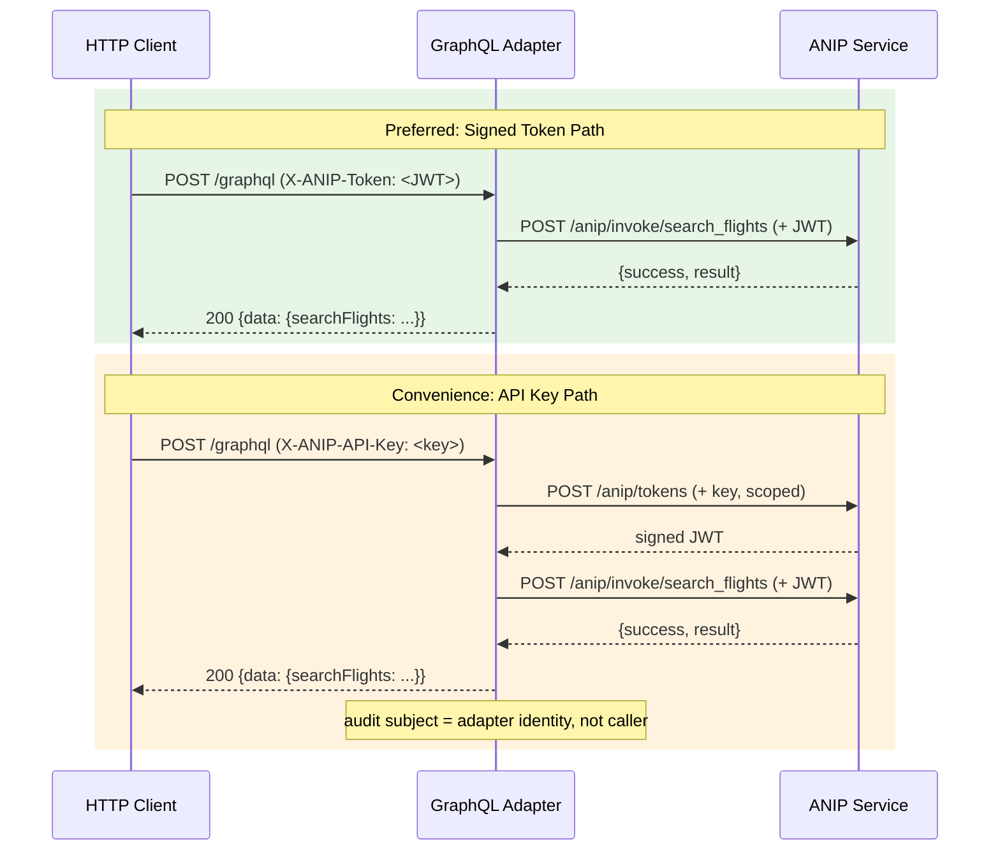

# ANIP GraphQL Adapter (TypeScript)

A **reference adapter** that discovers any ANIP-compliant service and exposes its capabilities as a GraphQL endpoint with custom `@anip*` directives and an auto-generated schema.

> **Reference adapter, not production architecture.** This adapter runs as a separate proxy process for demonstration. The same translation logic can be embedded as middleware directly in the ANIP service, eliminating the second process. The adapter proves interoperability; the SDK/middleware approach is the production deployment path.

## Quick Start

```bash
# Install
cd adapters/graphql-ts
npm install

# Run against an ANIP service
npx tsx src/index.ts --url http://localhost:8000

# Or use environment variable
ANIP_SERVICE_URL=http://localhost:8000 npx tsx src/index.ts

# Or use a config file
cp adapter.example.yaml adapter.yaml
npx tsx src/index.ts
```

The adapter will:
1. Discover the ANIP service via `/.well-known/anip`
2. Fetch the full manifest and capabilities
3. Generate a GraphQL schema with custom directives
4. Start a Hono server on port 3002

## Endpoints

| Endpoint | Description |
|---|---|
| `POST /graphql` | GraphQL endpoint (queries and mutations) |
| `GET /graphql` | Simple GraphQL playground |
| `GET /schema.graphql` | Auto-generated GraphQL SDL schema |

## Schema Mapping

### Capability to Query/Mutation

| ANIP Side Effect | GraphQL Type | Naming |
|---|---|---|
| `read` | Query | `search_flights` -> `searchFlights` |
| `write` / `irreversible` | Mutation | `book_flight` -> `bookFlight` |

### Custom Directives

The schema includes ANIP-specific directives on each field:

```graphql
directive @anipSideEffect(type: String!, rollbackWindow: String) on FIELD_DEFINITION
directive @anipCost(certainty: String!, currency: String, rangeMin: Float, rangeMax: Float) on FIELD_DEFINITION
directive @anipRequires(capabilities: [String!]!) on FIELD_DEFINITION
directive @anipScope(scopes: [String!]!) on FIELD_DEFINITION
```

### Result Types

Each capability gets a dedicated result type:

```graphql
type BookFlightResult {
  success: Boolean!
  result: JSON
  costActual: CostActual
  failure: ANIPFailure
}
```

## Authentication

The adapter is a **stateless credential bridge** — it holds no tokens of its own. Callers must provide credentials via HTTP headers on every GraphQL request:

| Header | Description |
|---|---|
| `X-ANIP-Token: <token>` | Signed ANIP delegation token (preferred). Forwarded directly to the ANIP service. |
| `X-ANIP-API-Key: <key>` | ANIP API key (convenience). The adapter requests a short-lived, per-request capability token from the ANIP service, then invokes with it. |

If `X-ANIP-Token` is present, it takes precedence. If neither header is provided, the resolver returns a GraphQL response with `success: false` and a `missing_credentials` failure.

Authentication is always via HTTP headers, never via GraphQL arguments.



## Configuration

### Environment Variables

| Variable | Default | Description |
|---|---|---|
| `ANIP_SERVICE_URL` | `http://localhost:8000` | ANIP service base URL |
| `ANIP_ADAPTER_PORT` | `3002` | GraphQL adapter port |
| `ANIP_ADAPTER_CONFIG` | -- | Path to adapter.yaml |

### Config File

See `adapter.example.yaml` for a full example. Config priority:

1. Explicit `--config` path
2. `ANIP_ADAPTER_CONFIG` env var
3. `./adapter.yaml` (if present)
4. Environment variables / defaults

## Testing

```bash
# Start the ANIP reference server first (port 9100)
cd examples/anip && python -m anip_server

# Run integration tests
cd adapters/graphql-ts
npx tsx test-adapter.ts http://localhost:9100
```

## Translation Loss

| ANIP Primitive | GraphQL Adapter | What's Lost |
|---|---|---|
| Capability Declaration | Full — field + result type + directives | Nothing |
| Side-effect Typing | `@anipSideEffect` directive | Standard clients don't read directives |
| Delegation Chain | Pass-through — caller provides token | Adapter can't inspect or constrain the chain |
| Permission Discovery | Absent | Can't query before calling |
| Failure Semantics | `ANIPFailure` type in result | No HTTP status differentiation |
| Cost Signaling | `@anipCost` + `costActual` field | Standard clients don't read directives |
| Capability Graph | `@anipRequires` directive | Not queryable at runtime |
| State & Session | Absent | No continuity |
| Invocation Lineage | Partial — `invocation_id` and `client_reference_id` included in result type | Callers must extract and correlate manually |
| Streaming | Absent | SSE progress events not supported; GraphQL returns final result only |
| Observability | Absent | No audit access |

**When to use native ANIP instead:** These adapters translate the protocol surface but lose visibility into the delegation chain, cost signaling, and capability graph. For read and write capabilities this is sufficient. For irreversible financial operations, native ANIP is strongly recommended — it provides purpose-bound authority, multi-hop delegation, and the ability for the service to verify *why* an action is being invoked and on whose behalf.
