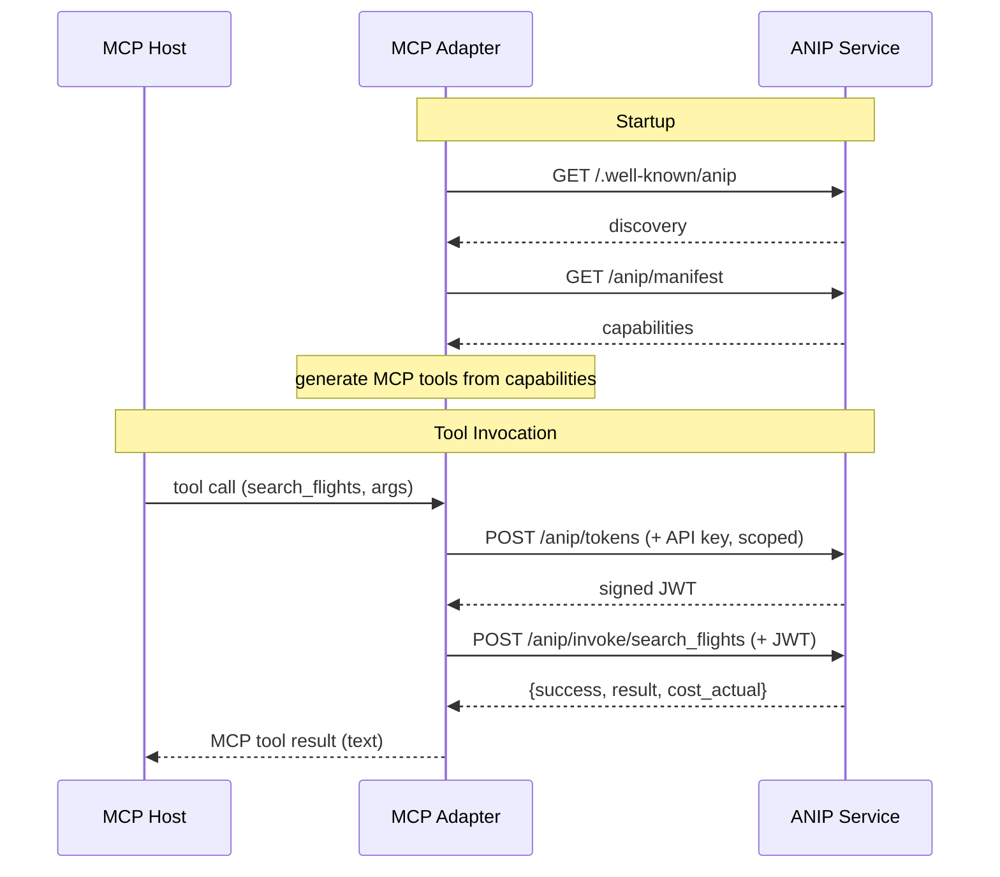

# ANIP-MCP Adapter

> Point it at any ANIP service. It discovers capabilities automatically and exposes them as MCP tools. Zero per-service code.

```
Agent (MCP-native)
       |
Generic ANIP-MCP Adapter
       |  (reads /.well-known/anip at startup)
Any ANIP service
```

## Why This Exists

The AI tooling ecosystem has converged on MCP as the de facto agent-tool interface. ANIP complements MCP with richer primitives — delegation chains, side-effect typing, cost signaling, observability contracts — but asking everyone to replace their MCP infrastructure is a non-starter.

This adapter lets you use ANIP today with your existing MCP tooling. It's an upgrade path, not a replacement.

## Quick Start

```bash
cd adapters/mcp-py

# Install
uv venv && source .venv/bin/activate
uv pip install -e .

# Start the ANIP reference server (in another terminal)
cd ../../examples/anip
uv pip install -e .
uvicorn anip_server.main:app --port 8000

# Run the adapter
anip-mcp-bridge --url http://localhost:8000 --verbose
```

### With Claude Code

Add to your MCP config (`.claude/mcp.json` or Claude Desktop settings):

```json
{
  "mcpServers": {
    "flights": {
      "command": "anip-mcp-bridge",
      "args": ["--url", "http://localhost:8000", "--config", "/path/to/bridge.yaml"]
    }
  }
}
```

Claude Code will see the ANIP capabilities as native MCP tools.

## Configuration

Copy `bridge.example.yaml` to `bridge.yaml`:

```yaml
anip_service_url: "http://localhost:8000"

api_key: "demo-human-key"
scope:
  - "travel.search"
  - "travel.book:max_$500"

enrich_descriptions: true
transport: "stdio"
```

Or use environment variables:

```bash
ANIP_SERVICE_URL=http://localhost:8000 \
ANIP_SCOPE=travel.search,travel.book:max_\$500 \
anip-mcp-bridge
```

### Credential Configuration

The adapter requests signed capability tokens from the ANIP service using the configured API key. Each tool invocation gets its own server-issued token with:

- **Purpose binding** — scoped to the specific capability being invoked
- **Scope narrowing** — only the scopes needed for each capability
- **Server-issued** — the ANIP service signs and verifies all tokens

This is more secure than a single shared token but less granular than native ANIP delegation chains. The adapter operates as a single agent identity — it cannot represent per-user or per-agent delegation.

## How It Works

1. **Discovery** — fetches `/.well-known/anip` from the ANIP service
2. **Manifest** — fetches full capability declarations
3. **Token setup** — none needed (issues per-request tokens)
4. **Tool generation** — converts each ANIP capability into an MCP tool
5. **Invocation** — for each tool call, requests a signed token from the ANIP service and invokes the capability
6. **Translation** — converts ANIP responses (success/failure, cost actuals) into MCP result strings



### Description Enrichment

When `enrich_descriptions: true` (default), the adapter encodes ANIP metadata into MCP tool descriptions:

**Without enrichment:**
```
Book a confirmed flight reservation
```

**With enrichment:**
```
Book a confirmed flight reservation. WARNING: IRREVERSIBLE action — cannot
be undone. No rollback window. Estimated cost: USD 280-500. Requires calling
first: search_flights. Delegation scope: travel.book.
```

This is lossy — the agent can't programmatically branch on `side_effect == "irreversible"` — but it gives MCP-native agents safety hints they would otherwise lack entirely.

## What Gets Lost in Translation

This table is the honest accounting of what ANIP adds over MCP and what survives the adapter:

| ANIP Primitive | MCP Adapter Behavior | What's Lost |
|----------------|---------------------|-------------|
| **Capability Declaration** | Full — maps to MCP tool | Nothing |
| **Side-effect Typing** | Partial — encoded in description | Programmatic branching on side-effect type |
| **Delegation Chain** | Degraded — adapter uses a single API key, per-tool scope narrowing via server-issued tokens | Per-agent chains, multi-hop delegation, concurrent branch control |
| **Permission Discovery** | Absent | Agent can't query its permission surface before invoking |
| **Failure Semantics** | Partial — ANIP failures converted to readable text | Structured recovery (resolution actions, grantable_by) |
| **Cost Signaling** | Partial — encoded in description | Programmatic budget checking, cost certainty levels |
| **Capability Graph** | Partial — prerequisites encoded in description | Programmatic prerequisite traversal |
| **State & Session** | Absent | Session continuity between invocations |
| **Invocation Lineage** | Partial — `invocation_id` and `client_reference_id` passed through in result | Programmatic correlation; MCP clients treat these as opaque text |
| **Streaming** | Absent | SSE progress events not supported by MCP transport |
| **Observability Contract** | Absent | Audit access, retention guarantees |

Every "Absent" or "Degraded" row is a reason to go ANIP native. The adapter gets you started; the full protocol is where the value lives.

## Architecture

```
adapters/mcp-py/
├── anip_mcp_bridge/
│   ├── __init__.py
│   ├── server.py          # MCP server + CLI entry point
│   ├── discovery.py       # ANIP service auto-discovery
│   ├── translation.py     # ANIP capability → MCP tool schema + descriptions
│   ├── invocation.py      # Token request + ANIP invocation
│   └── config.py          # YAML/env configuration loading
├── bridge.example.yaml    # Example configuration
├── pyproject.toml
└── README.md
```

### Key Design Decisions

**Generic, not per-service.** The adapter reads the ANIP discovery document and manifest at startup. It generates MCP tools dynamically. No code changes needed when pointing at a different ANIP service.

**Per-invocation tokens.** Each tool call requests a fresh signed token from the ANIP service with purpose binding for that specific capability. This is more secure than reusing a single token but means every invocation involves two HTTP calls (token request + capability invocation).

**Scope narrowing per tool.** The adapter filters the configured scope list to include only the scopes each capability needs. A tool for `search_flights` (requiring `travel.search`) won't carry `travel.book` scope, limiting blast radius if the invocation is intercepted.

**Enriched descriptions as safety hints, not guarantees.** The adapter encodes ANIP's safety signals (irreversibility, cost, prerequisites) into description strings. An LLM reading these will behave more cautiously. But there's no mechanism to *enforce* this — an MCP-native agent might still invoke an irreversible capability without checking. This is an inherent limitation of the MCP model, not an adapter bug.

## Limitations

- **Single identity.** The adapter operates as one agent. It cannot represent multi-user or multi-agent delegation chains. All invocations use the same configured API key and scope.
- **No permission discovery.** MCP has no equivalent of ANIP's permission query. The adapter exposes all capabilities as tools regardless of whether the configured scope can actually invoke them. Failures surface at invocation time, not discovery time.
- **No session state.** MCP tools are stateless. ANIP capabilities with `session.type: "continuation"` or `"workflow"` will lose session context between invocations.
- **Description-based safety only.** Side-effect warnings, cost signals, and prerequisite declarations are encoded as text in tool descriptions. They inform but cannot enforce.

## The Bigger Picture

This adapter validates two things simultaneously:

1. **ANIP's machine-readability.** If the adapter can auto-discover any ANIP service and generate tools with zero per-service code, the discovery document and manifest are sufficiently machine-readable. The adapter is a conformance test for the spec.

2. **What MCP is missing.** The translation loss table above is a concrete, field-by-field accounting of what ANIP adds. It's not an argument — it's a measurement. Every row marked "Absent" or "Degraded" is a capability gap that agents using MCP alone cannot address.

The adapter is both a migration tool and a demonstration. Use it to try ANIP today. Read the translation loss table to understand why going native matters.
