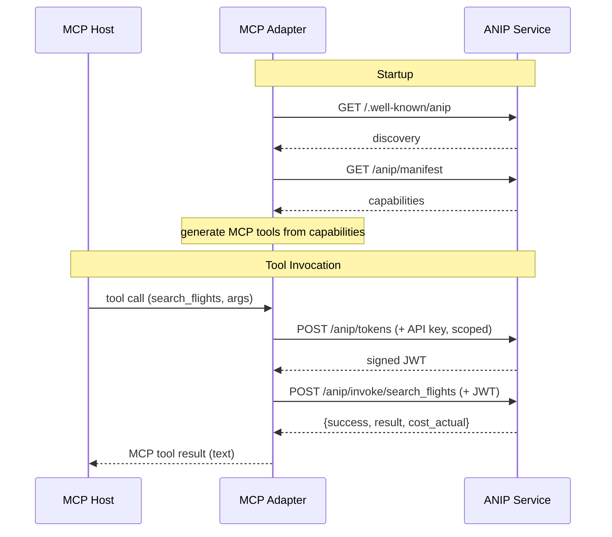

# ANIP-MCP Adapter (TypeScript)

> Point it at any ANIP service. It discovers capabilities automatically and exposes them as MCP tools. Zero per-service code.

```
Agent (MCP-native)
       |
Generic ANIP-MCP Adapter
       |  (reads /.well-known/anip at startup)
Any ANIP service
```

This is the TypeScript implementation of the ANIP-MCP adapter. For full documentation on architecture, translation loss, and design decisions, see the [Python adapter README](../mcp-py/README.md) — both implementations share the same design.

## Quick Start

```bash
cd adapters/mcp-ts

# Install
npm install

# Start the ANIP reference server (in another terminal)
cd ../../examples/anip
uvicorn anip_server.main:app --port 8000

# Run the adapter
npx tsx src/index.ts --url http://localhost:8000
```

### With Claude Code

Add to your MCP config (`.claude/mcp.json` or Claude Desktop settings):

```json
{
  "mcpServers": {
    "flights": {
      "command": "npx",
      "args": ["tsx", "src/index.ts", "--url", "http://localhost:8000"]
    }
  }
}
```

## Architecture

```
adapters/mcp-ts/
├── src/
│   ├── index.ts          # MCP server + CLI entry point
│   ├── discovery.ts      # ANIP service auto-discovery
│   ├── translation.ts    # ANIP capability → MCP tool schema + descriptions
│   ├── invocation.ts     # Token request + ANIP invocation
│   └── config.ts         # Configuration loading
├── test-bridge.ts        # Integration tests
├── package.json
├── tsconfig.json
└── README.md
```



## What Gets Lost in Translation

Both implementations have the same trade-offs — ANIP's delegation chains, permission discovery, and structured failure recovery degrade when projected onto MCP's simpler tool model. See the [Python adapter README](../mcp-py/README.md#what-gets-lost-in-translation) for full design discussion.

| ANIP Primitive | MCP Adapter Behavior | What's Lost |
|----------------|---------------------|-------------|
| **Capability Declaration** | Full — maps to MCP tool | Nothing |
| **Side-effect Typing** | Partial — encoded in description | Programmatic branching on side-effect type |
| **Delegation Chain** | Degraded — adapter uses a single API key, per-tool scope narrowing via server-issued tokens | Per-agent chains, multi-hop delegation, concurrent branch control |
| **Permission Discovery** | Absent | Agent can't query its permission surface before invoking |
| **Failure Semantics** | Partial — ANIP failures converted to readable text | Structured recovery (resolution actions, grantable_by) |
| **Cost Signaling** | Partial — encoded in description | Programmatic budget checking, cost certainty levels |
| **Capability Graph** | Partial — prerequisites encoded in description | Programmatic prerequisite traversal |
| **State & Session** | Absent | Session continuity between invocations |
| **Invocation Lineage** | Partial — `invocation_id` and `client_reference_id` passed through in result | Programmatic correlation; MCP clients treat these as opaque text |
| **Streaming** | Absent | SSE progress events not supported by MCP transport |
| **Observability Contract** | Absent | Audit access, retention guarantees |
