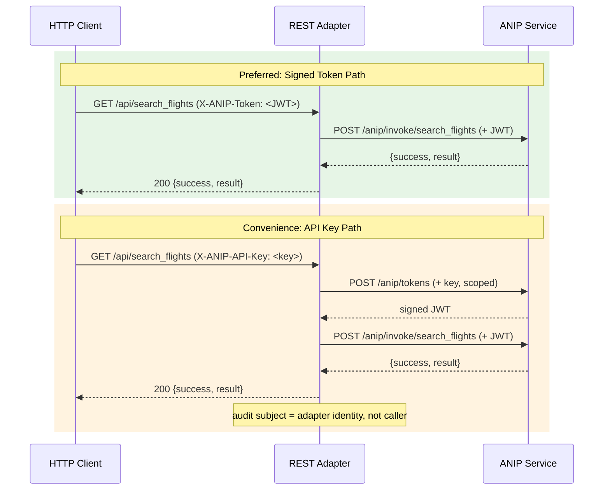

# ANIP REST Adapter (TypeScript)

A **reference adapter** that discovers any ANIP-compliant service and exposes its capabilities as REST endpoints with an auto-generated OpenAPI 3.1 specification.

> **Reference adapter, not production architecture.** This adapter runs as a separate proxy process for demonstration. The same translation logic can be embedded as middleware directly in the ANIP service, eliminating the second process. The adapter proves interoperability; the SDK/middleware approach is the production deployment path.

## Quick Start

```bash
# Install
cd adapters/rest-ts
npm install

# Run against an ANIP service
npx tsx src/index.ts --url http://localhost:8000

# Or use environment variable
ANIP_SERVICE_URL=http://localhost:8000 npx tsx src/index.ts

# Or use a config file
cp adapter.example.yaml adapter.yaml
npx tsx src/index.ts
```

The adapter will:
1. Discover the ANIP service via `/.well-known/anip`
2. Fetch the full manifest and capabilities
3. Generate REST routes and an OpenAPI specification
4. Start a Hono server on port 3001

## Endpoints

### Default Routes

Capabilities are mapped to REST routes automatically:

| ANIP Side Effect | HTTP Method | Path |
|---|---|---|
| `read` | GET | `/api/{capability_name}` |
| `write` / `irreversible` | POST | `/api/{capability_name}` |

### Special Endpoints

| Endpoint | Description |
|---|---|
| `GET /openapi.json` | Auto-generated OpenAPI 3.1 specification |
| `GET /docs` | Swagger UI (interactive documentation) |

### Route Overrides

Override default routes in `adapter.yaml`:

```yaml
routes:
  search_flights:
    path: "/api/flights/search"
    method: "GET"
  book_flight:
    path: "/api/flights/book"
    method: "POST"
```

## ANIP Metadata (x-anip-* Extensions)

The OpenAPI spec preserves ANIP metadata as vendor extensions on each operation:

| Extension | Type | Description |
|---|---|---|
| `x-anip-side-effect` | string | `read`, `write`, or `irreversible` |
| `x-anip-minimum-scope` | array | Required delegation scopes |
| `x-anip-financial` | boolean | Whether the operation involves financial cost |
| `x-anip-cost` | object | Cost estimate details |
| `x-anip-requires` | array | Prerequisite capabilities |
| `x-anip-rollback-window` | string | Time window for reversal |
| `x-anip-contract-version` | string | ANIP contract version |

Successful responses include a `warnings` array in the JSON body for irreversible or financial operations.

## Authentication

The adapter is a **stateless credential bridge** — it holds no tokens of its own. Callers must provide credentials via HTTP headers on every request:

| Header | Description |
|---|---|
| `X-ANIP-Token: <token>` | Signed ANIP delegation token (preferred). Forwarded directly to the ANIP service. |
| `X-ANIP-API-Key: <key>` | ANIP API key (convenience). The adapter requests a short-lived, per-request capability token from the ANIP service, then invokes with it. |

If `X-ANIP-Token` is present, it takes precedence. If neither header is provided, the adapter returns 401.



## Configuration

### Environment Variables

| Variable | Default | Description |
|---|---|---|
| `ANIP_SERVICE_URL` | `http://localhost:8000` | ANIP service base URL |
| `ANIP_ADAPTER_PORT` | `3001` | REST adapter port |
| `ANIP_ADAPTER_CONFIG` | -- | Path to adapter.yaml |

### Config File

See `adapter.example.yaml` for a full example. Config priority:

1. Explicit `--config` path
2. `ANIP_ADAPTER_CONFIG` env var
3. `./adapter.yaml` (if present)
4. Environment variables / defaults

## Testing

```bash
# Start the ANIP reference server first (port 9100)
cd examples/anip && python -m anip_server

# Run integration tests
cd adapters/rest-ts
npx tsx test-adapter.ts http://localhost:9100
```

## Translation Loss

| ANIP Primitive | REST Adapter | What's Lost |
|---|---|---|
| Capability Declaration | Full — endpoint + OpenAPI | Nothing |
| Side-effect Typing | `x-anip-side-effect` extension | Standard clients don't read extensions |
| Delegation Chain | Pass-through — caller provides token | Adapter can't inspect or constrain the chain |
| Permission Discovery | Absent | Can't query before calling |
| Failure Semantics | HTTP status + ANIPFailure body | Status codes conflate failure types |
| Cost Signaling | `x-anip-cost` + `cost_actual` | Standard clients don't read extensions |
| Capability Graph | Absent | Not discoverable from spec |
| State & Session | Absent | No continuity |
| Observability | Absent | No audit access |

**When to use native ANIP instead:** These adapters translate the protocol surface but lose visibility into the delegation chain, cost signaling, and capability graph. For read and write capabilities this is sufficient. For irreversible financial operations, native ANIP is strongly recommended — it provides purpose-bound authority, multi-hop delegation, and the ability for the service to verify *why* an action is being invoked and on whose behalf.
