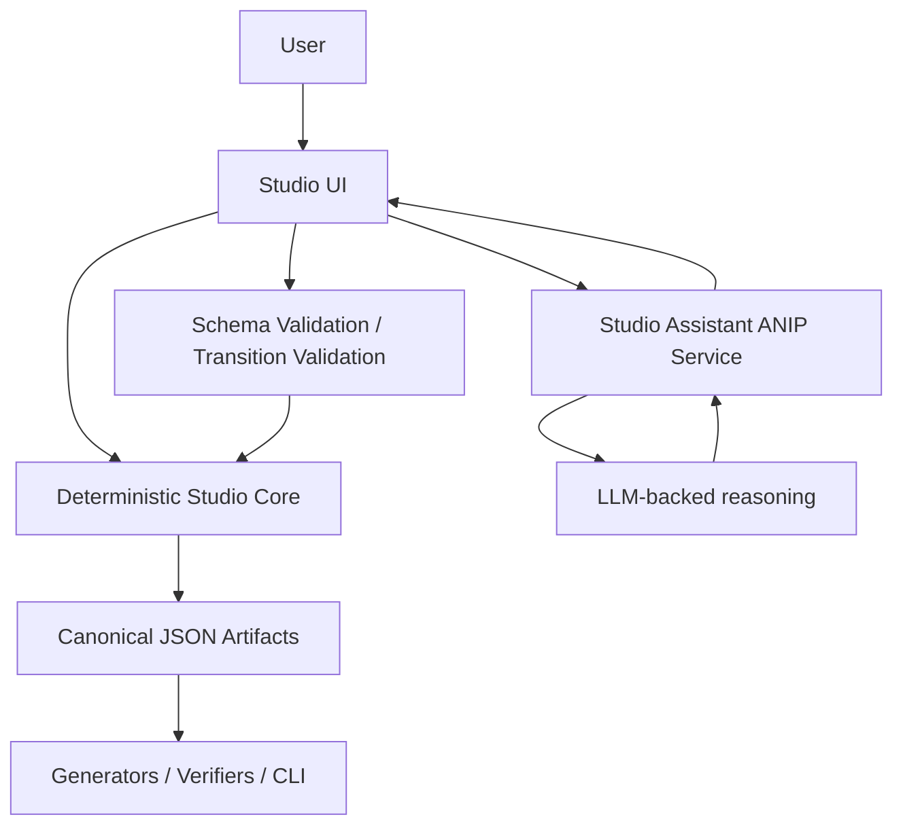

# Studio Assistant Architecture

Date: 2026-04-19

## Decision

Studio should use:

- one shared optional `Studio Assistant` system
- one deterministic Studio core
- one canonical JSON project model

Studio should not use:

- two separate PM and Dev assistants with separate logic stacks
- skill-style prompt logic as the workflow engine
- an LLM as the source of truth for project state
- a mandatory assistant path

## Why One Assistant System

The PM and Developer flows operate on the same project.

They share:

- source documents
- product intent
- scenarios
- service boundaries
- coverage mapping
- handoff context
- revision history

If PM and Dev assistance are implemented as separate assistant systems, they will drift in:

- wording
- proposal shape
- assumptions about state
- clarification strategy
- auditability

That drift would reintroduce the same hidden-behavior problem that ANIP is supposed to reduce.

The better structure is:

- one shared assistant backend
- bounded capability sets
- PM-oriented entry points
- Dev-oriented entry points
- one proposal model
- one patch model

## Product Boundary

### Deterministic Studio Core

The deterministic Studio core owns:

- workspace/project CRUD
- source document storage
- Product Design artifact storage
- Developer Design artifact storage
- canonical Developer Definition export
- lock and baseline rules
- revisioning and drift state
- validation and linting
- generation orchestration
- verification orchestration
- audit trail
- access control

The deterministic core is the delivery truth layer.

It must not depend on an LLM to know:

- what project state exists
- whether a transition is allowed
- whether a field is required
- whether a patch is valid
- whether a baseline is locked

### Assistant Layer

The assistant owns:

- interpretation of free-form business input
- proposal of missing structured fields
- proposal of starter scenarios
- proposal of service boundaries
- proposal of capability formalization
- explanation of gaps, drift, and next actions
- clarification question generation

The assistant may be ANIP-backed and LLM-backed.

The assistant must remain optional.

## Non-Negotiable Rule

The assistant never writes final truth directly.

The flow is:

1. assistant produces a structured proposal
2. Studio shows the proposal explicitly as a proposal
3. the user accepts, rejects, or edits it
4. the deterministic backend validates it
5. only validated accepted content becomes persisted project state

That means the assistant output contract should be:

- proposal blocks
- structured suggestions
- JSON patch candidates
- explicit missing-information prompts

Not:

- arbitrary free-form database writes
- hidden prompt-driven mutation behavior
- implicit project transitions

## Why Not Skills As The Core Architecture

Prompt skills are useful as local execution aids.

They are the wrong place to encode:

- workflow rules
- persistence rules
- artifact semantics
- transition policy
- generation semantics

If Studio assistance is implemented as prompt-skill choreography, the product becomes:

- harder to reason about
- harder to audit
- harder to test
- harder to explain to customers

The assistant may use prompts internally.

But the system architecture must remain:

- model-driven
- state-aware
- schema-first
- proposal-based

## Why Not Convert The Whole Studio Backend To ANIP

That would over-rotate.

ANIP is a strong fit for bounded assistant capabilities.

It is not the right shape for every low-level Studio backend function.

Studio backend concerns like:

- persistence
- revisions
- locking
- state transitions
- generation orchestration
- verification orchestration

should remain ordinary deterministic application/backend logic.

The right split is:

- Studio core: normal deterministic application
- assistant surface: bounded ANIP service

## Shared Assistant, Two Modes

The right UI/product split is:

- `PM Assist`
- `Dev Assist`

These are not two different assistant systems.

They are two bounded capability groups over the same assistant backend and the same project state.

### PM Assist

PM Assist should help with:

- extract candidate requirements from business specs
- extract scenarios from source docs
- propose actors and approval expectations
- propose non-goals and success criteria
- identify missing business decisions
- explain what the PM should clarify next

### Dev Assist

Dev Assist should help with:

- propose service boundaries
- propose capability ownership
- propose scenario formalization
- propose capability input contracts
- propose runtime policy bindings
- explain coverage gaps
- explain PM-to-Dev drift
- suggest next formalization steps

## Canonical Contract Rule

Manual and assisted flows must write to the same model.

The generator and verifier should never care whether a field came from:

- direct manual authoring
- assisted proposal acceptance
- import

They should only care that the persisted contract is:

- valid
- versioned
- deterministic

## Interaction Pattern

The assistant should follow:

- `propose`
- `review`
- `accept`

or

- `propose`
- `edit`
- `accept`

The assistant should not follow:

- `ask` -> `auto-persist`

## Architecture Sketch

## Design Constraint For Implementation

If a behavior is important for repeatability, generation, or verification, it must become:

- canonical project state
- canonical contract data
- deterministic backend logic

It must not remain trapped inside the assistant prompt.
