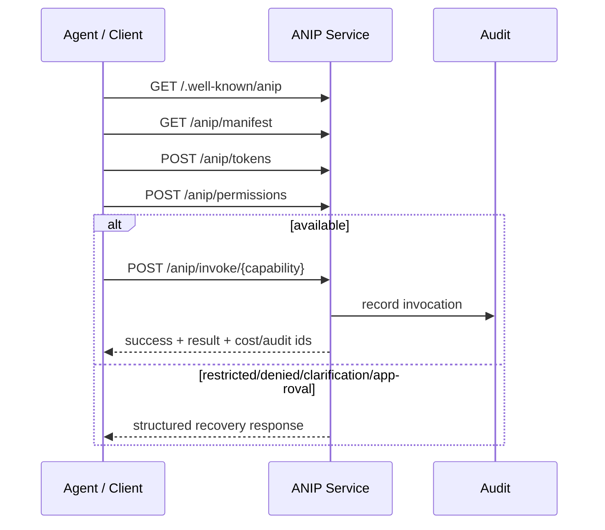

# ANIP for Developers

ANIP is a protocol layer for making agent actions governable, inspectable, and auditable before and after they execute.

If MCP is mostly about letting a model discover and call tools, ANIP is about giving agent-operated systems a stronger execution contract: authority, permissions, side effects, cost, recovery, lineage, and audit evidence become part of the interface instead of being scattered across prompts and custom glue code.

## The problem ANIP solves

Most APIs were designed for deterministic software written by humans. A developer reads documentation, writes code, handles errors, and deploys a stable integration.

Agents behave differently. They often decide what to do at runtime, operate under delegated authority, cross service boundaries, and take actions with real side effects.

That creates questions a plain tool call usually cannot answer well:

- Is the agent allowed to do this?
- Who delegated that authority?
- What side effects might happen?
- Is this action reversible?
- What will it cost?
- What should happen if permission is missing?
- How do we audit what happened later?
- How do we preserve lineage across services?

Without a protocol-level answer, teams end up encoding those rules in prompts, wrapper code, policy middleware, tool descriptions, logs, and manual review processes.

ANIP moves those concerns into the service contract itself.

## The UI and workflow boundary problem

In many real products, the API was never the full agent-facing interface. The UI carried workflow semantics: required fields, allowed transitions, safe defaults, confirmation steps, visibility rules, warnings, and recovery paths.

When agents bypass the UI and receive raw API or MCP tool access, those semantics have to be recreated somewhere. Agent frameworks often compensate with workflow graphs, tool routers, skills, recipes, policy hooks, and guardrails. Those are useful, but they are still consumer-side logic:

- They are not owned by the service.
- They are not portable across every client.
- They can drift from the provider's intended behavior.
- They increase prompt/context size and planning complexity.
- They make the model reason through policy that should have been encoded in the service contract.

ANIP changes the boundary. The service exposes governed capabilities directly, and framework workflows compose those capabilities instead of reconstructing product semantics from raw tools.

That can change the cost profile as well. Less hidden workflow policy in the prompt means a smaller action space for the model. In the GTM Agent showcase, the agent layer runs against generated ANIP services with `gpt-5.4-mini` because the contract and services carry much of the execution structure.

## Core mental model

Think of ANIP as an agent-facing execution contract.

It does not only say:

```text
Here is a function you can call.
```

It says:

- what capabilities exist
- what inputs they accept
- what authority they require
- what side effects they may produce
- whether they are reversible
- what costs or risk posture are declared
- how failures should be interpreted
- what audit record should exist afterward
- how this action relates to a larger task or chain of actions

That makes the interface useful not just for execution, but also for planning, permission discovery, policy enforcement, recovery, and audit.

## Key concepts

### Capability

A capability is an action exposed by a service.

Examples:

- `search_flights`
- `book_flight`
- `restart_service`
- `query_customer_records`
- `jira.incident_bug.prepare`
- `slack.announcement.request`

The important part is that a capability is not just a method name. It carries semantics that help an agent decide whether and how it should call it.

### Manifest

The manifest is the service's machine-readable declaration of what it exposes. It describes capabilities, inputs, side-effect posture, permission requirements, trust information, and related metadata.

For a developer, the manifest is the source of truth that lets tooling generate clients, service scaffolds, tests, or agent-facing surfaces.

### Delegation

Delegation is how authority moves from a human, organization, service, or agent to another actor.

ANIP treats delegation as structured and narrowable rather than as a flat token with vague permission.

For example, a user might delegate authority to book one flight up to $300 for a specific trip. That is different from giving an agent broad access to a travel account.

### Permission discovery

Before invoking a capability, an agent can ask whether current authority is enough.

The response separates:

- `available`
- `restricted`
- `denied`

This avoids blind "call and fail" behavior and lets agents reason before taking action.

### Structured failure

ANIP failures should be machine-actionable. A failed invocation should not only say `403 forbidden` or `error`.

It should explain whether the issue is missing scope, exceeded budget, required approval, invalid state, retryable failure, or something else.

Good structured failures help agents recover, escalate, ask for approval, or stop cleanly.

### Audit and lineage

ANIP assumes important agent actions need a durable record.

Audit answers what happened.

Lineage answers where the action came from and how it connects to a broader workflow.

That can include invocation IDs, task IDs, parent invocation IDs, client references, actor identity, delegated authority, outcome, cost, approval grant, and checkpoint evidence.

## Minimal ANIP flow



The important shift is that governance happens before, during, and after invocation, not only in external logs or application-specific policy code.

## Relationship to MCP, REST, GraphQL, and gRPC

ANIP is not mainly a transport choice.

REST, GraphQL, and gRPC are ways to expose or call services. MCP is a tool-interoperability layer that helps models discover and call tools.

ANIP is focused on governed execution semantics:

- authority
- side effects
- cost
- recovery
- approvals
- audit
- lineage

A service can expose native ANIP over HTTP or stdio, and also derive REST, GraphQL, or MCP surfaces from the same capability declarations.

Some generated surfaces may lose fidelity. The ANIP contract remains the richer source of truth.

For the detailed comparison, see [ANIP vs MCP](/docs/concepts/anip-vs-mcp).

## Fronting existing systems

ANIP can also sit in front of existing systems.

The backend may be:

- native REST API
- GraphQL API
- SaaS SDK
- database or semantic layer
- MCP server
- internal gateway

The key rule:

```text
Backend APIs are implementation material.
ANIP capabilities are the agent-facing behavior contract.
```

For example, a Slack Web API backend may expose `chat.postMessage`, but the ANIP service should expose governed behavior such as:

```text
slack.announcement.request
```

That capability can require preview, approval, channel policy, actor scope, and audit before anything is posted.

## What developers build

An ANIP implementation usually needs:

- manifest generation
- capability registration
- delegation issuance and verification
- permission discovery
- invocation validation
- structured success and failure envelopes
- approval request/grant handling
- audit persistence
- lineage/correlation identifiers
- optional trust artifacts such as signatures, JWKS, checkpoints, or attestations
- implementation seams for backend clients and domain logic

Those pieces can live in one service for a small deployment or be split across policy services, execution workers, audit services, and gateways in a larger system.

## Studio, Registry, and CLI

The protocol is the core, but the tooling makes it practical:

- **Studio** helps teams move from source material to Product Design, Developer Design, Developer Definition, and package publication.
- **Registry** stores signed packages and templates so consumers can inspect and verify what they generate from.
- **CLI** generates service code, validates definitions, verifies packages, creates fronting scaffolds, and records implementation-material metadata.

The exported Developer Definition and Registry package are the behavior authority. Studio is the authoring environment. Generated code is the implementation output.

## Why this matters in real systems

ANIP becomes more valuable as actions become more consequential.

For a read-only weather lookup, a normal tool call may be enough.

For booking travel, deploying software, accessing customer data, moving money, approving invoices, rotating credentials, or coordinating multiple agents, the system needs stronger semantics.

The goal is not to make every action heavy. The goal is to make serious actions explicit enough that agents can reason about them and organizations can govern them.

## Simple example

Imagine a travel service exposes two capabilities:

- `search_flights`: read-only, no special authority, no financial side effect
- `book_flight`: irreversible, costs money, requires delegated booking authority, may require a budget limit

Without ANIP, both might look like ordinary tools. The model might learn the difference only from prose in a tool description.

With ANIP, the service declares the difference structurally. An agent can inspect `book_flight`, see that it is irreversible, check whether it has `travel.book` authority, compare the expected price with the delegated budget, and either proceed or ask for approval.

Afterward, the audit record can show which agent booked the flight, on whose authority, for which task, at what cost, and with what outcome.

## Practical pitch

ANIP is useful when "the agent called a function" is not enough information.

It gives developers a way to build agent-facing services where capability semantics, authority boundaries, side effects, recovery behavior, audit, and lineage are first-class parts of the interface.

That makes agent systems less dependent on prompts and bespoke glue, and more dependent on explicit contracts that software can inspect and enforce.

## Next steps

- [First 10 Minutes](/docs/getting-started/first-10-minutes)
- [Architecture](/docs/concepts/architecture)
- [ANIP vs MCP](/docs/concepts/anip-vs-mcp)
- [Protocol Reference](/docs/protocol/reference)
- [ANIP CLI](/docs/tooling/cli)
- [Governed Fronting](/docs/patterns/fronting)
