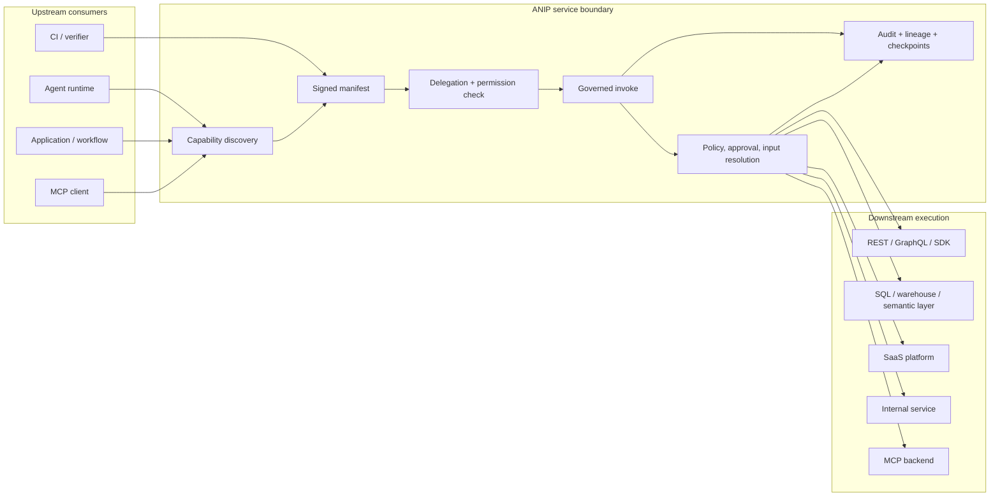
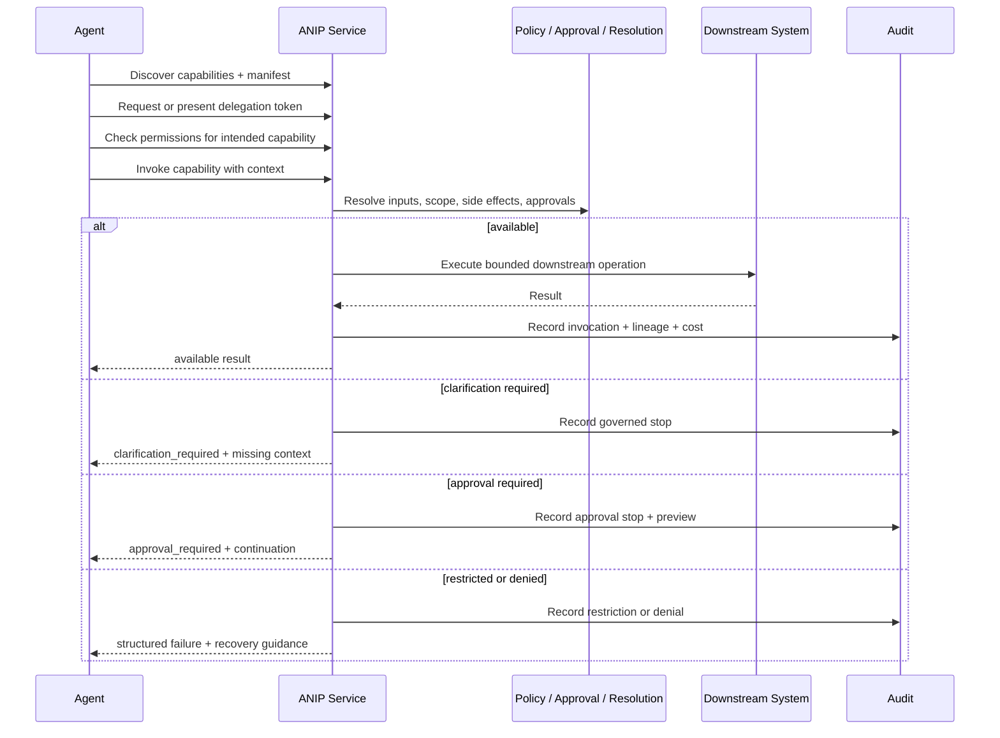

# Architecture

ANIP is an agent-facing service architecture.

It sits between consumers that want to act and downstream systems that can perform real work. The core architectural boundary is the ANIP service: agents discover governed capabilities, request authority, check availability, invoke work, and receive structured outcomes. The service owns the behavior contract and decides how to execute safely downstream.

## Runtime Shape



## Upstream Side

Upstream consumers are not expected to reverse-engineer product behavior from raw APIs.

They need to discover:

- Which governed capabilities exist.
- Which actor and scope can use them.
- Which inputs are required, defaulted, backend-resolved, app-selected, or clarification-required.
- Which capability is read-only, write, transactional, or irreversible.
- Which action is available, restricted, denied, approval-required, or clarification-required before execution.
- Which recovery path exists when execution cannot proceed.
- Which package, manifest, and contract produced the capability surface.

ANIP exposes that through service discovery, manifests, permission checks, structured invocation, structured failures, audit, lineage, and package trust.

## Service Boundary

The ANIP service is the authority boundary.

It owns:

- Capability declarations and side-effect posture.
- Input-resolution behavior.
- Delegation and permission checks.
- Approval grants and continuations.
- Denial, restriction, clarification, and recovery behavior.
- Cross-service lineage and task identity.
- Audit records and optional checkpoints.
- Manifest and package truth.
- Runtime implementation seams.

The service may be generated from a package, hand-written against ANIP runtimes, or generated with reviewed custom bundles. That implementation choice must not change the public contract exposed to agents.

## Downstream Side

Downstream systems are implementation details.

An ANIP service can call:

- Native REST APIs.
- GraphQL APIs.
- SaaS SDKs.
- SQL databases or warehouses.
- Semantic layers such as dbt, Cube, or Superset datasets.
- Internal service gateways.
- MCP servers when they are the practical backend adapter.

The downstream shape should not leak as the agent-facing product contract. For example, a Slack backend may expose `chat.postMessage`, but the ANIP capability should be closer to `slack.channel_announcement.request` or `slack.approved_message.send` so preview, approval, allowed channels, denial, and audit are first-class.

## Transport And Interface Surfaces

ANIP services can expose the same governed capability contract through multiple surfaces:

| Surface | Role |
|---------|------|
| Native ANIP over HTTP | Default network service interface. |
| Native ANIP over stdio | Local subprocess interface for agent clients and developer tools. |
| Native ANIP over gRPC | High-performance internal platform interface where supported. |
| Generated REST / GraphQL / MCP interfaces | Compatibility surfaces derived from the same capability declarations. |

Generated REST, GraphQL, and MCP interfaces are client-facing surfaces. They are not backend adapters. Backend integration belongs in service implementation seams or custom bundles.

## Invocation Flow



## Trust Boundary

The public ANIP contract includes:

- Capability IDs, descriptions, and side-effect posture.
- Inputs, allowed values, input resolution, and clarification behavior.
- Required scopes and delegation posture.
- Approval, denial, restriction, and recovery behavior.
- Composition and cross-service handoff hints.
- Audit and lineage expectations.
- Manifest, package, lock, and receipt metadata.
- Optional immutable implementation-material references.

The public contract should not include:

- Secret values.
- Local filesystem paths.
- Machine-local Studio links.
- Raw backend tokens.
- Private source documents.
- Hidden prompt instructions.
- Generated implementation shortcuts that mutate manifest shape.

## What Changes And What Does Not

The downstream backend can change without changing the agent-facing capability contract.

```text
slack.channel_announcement.request
```

can be implemented with Slack Web API, an internal messaging gateway, or a future MCP backend. The behavior contract remains: prepare, preview, require approval, send only with a valid grant, and audit the result.

That is the core ANIP architecture:

- Consumers discover and invoke governed capabilities.
- ANIP services own the execution contract.
- Downstream systems perform bounded implementation work.
- Tooling packages, generates, verifies, and distributes the contract, but it is not required at runtime.
