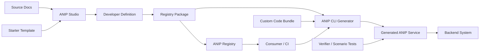
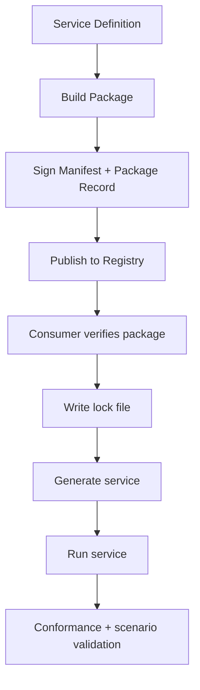

# Ecosystem

ANIP runtime architecture is about consumers, governed services, and downstream systems. The ANIP ecosystem is the surrounding toolchain that helps teams author, package, distribute, generate, and verify those services.

## Ecosystem Map

## Roles

| Component | Role | Not responsible for |
|-----------|------|---------------------|
| ANIP protocol | Defines the service interaction contract. | Authoring product requirements. |
| Studio | Helps teams produce reviewed ANIP definitions, packages, and templates. | Being the hidden authority after export. |
| Registry | Signs, stores, displays, and verifies packages/templates. | Executing service logic. |
| CLI generator | Generates service code from a package or definition. | Inventing new behavior outside the contract. |
| Custom bundle | Supplies implementation logic at declared extension seams. | Rewriting public manifest semantics. |
| Verifier/scenario tests | Prove protocol and behavior claims. | Replacing human design review. |
| Backend system | Executes real work: SaaS API, database, semantic layer, internal service. | Defining agent-facing governance by itself. |

## Package Trust Loop

Trust depends on stable artifacts:

- Package ID and version.
- Manifest digest.
- Definition digest.
- Registry receipt.
- Contract signature.
- Optional lock file.
- Optional immutable custom bundle ref and digest.

## Studio And Registry Are Not Runtime Dependencies

A running ANIP service does not need Studio. A consumer can inspect the service directly through `/.well-known/anip`, `/anip/manifest`, `/anip/permissions`, `/anip/invoke`, audit, and checkpoints.

Studio and Registry matter before and around runtime:

- Studio improves authoring and review.
- Registry improves sharing and trust.
- CLI generation improves repeatability.
- Verifiers improve confidence.

The runtime contract remains ANIP.

## Where To Go Next

- For runtime architecture, see [Architecture](/docs/concepts/architecture).
- For project lifecycle and revision flow, see [Lifecycle and Revisions](/docs/concepts/lifecycle-and-revisions).
- For package verification and locks, see [Package Trust Loop](/docs/getting-started/package-trust-loop).
