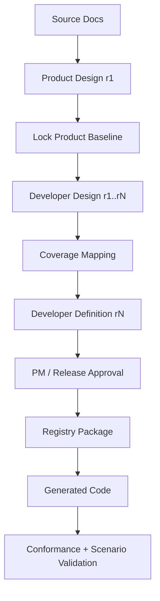
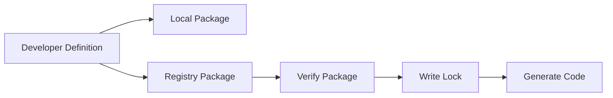
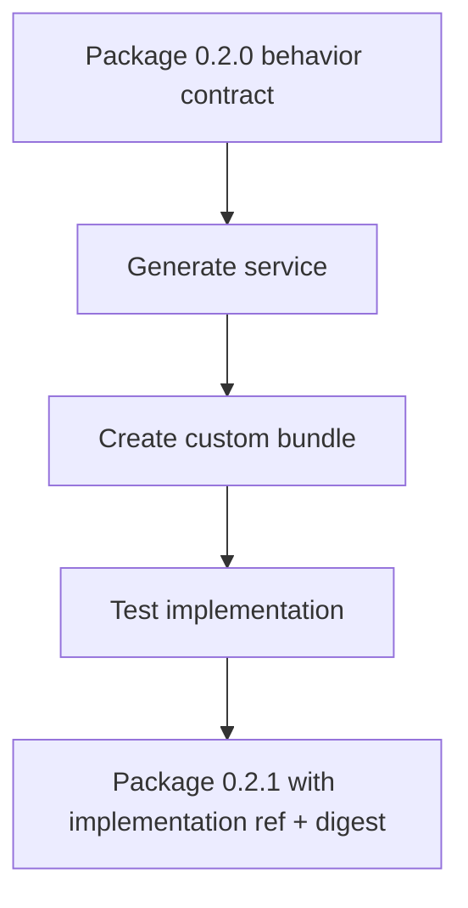
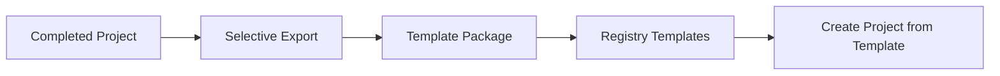
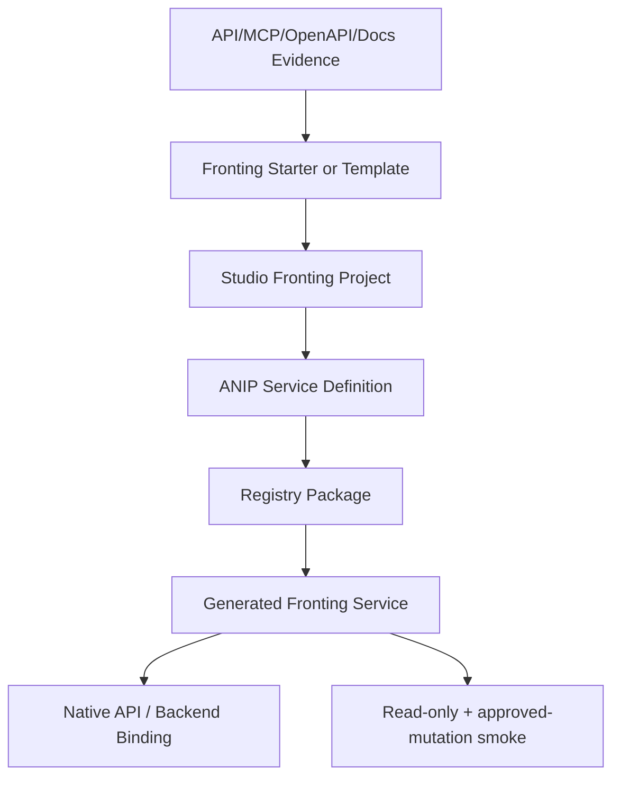

# Lifecycle and Revisions

ANIP has several artifacts that look similar but serve different purposes. The lifecycle is designed so teams can review intent, publish a signed contract, generate code, and later attach implementation material without mutating history.

## Artifact authority

| Artifact | Who uses it | Authority level |
|----------|-------------|-----------------|
| Source documents | Product/developer reviewers | Evidence, not final authority |
| Product Design revision | Product/security/business reviewers | Human-reviewed baseline |
| Developer Design revision | Developers/security reviewers | Technical design draft |
| Developer Definition | Generators/verifiers | Machine-readable contract authority |
| Registry package | Consumers/CI/generators | Signed distribution authority |
| Lock file | Consumer CI | Reproducibility authority |
| Generated code | Service implementers | Implementation output |
| Custom bundle | Service implementers/consumers | Implementation material, if attached and signed |
| Runtime evidence | Operators/verifiers | Observed behavior evidence |

The Developer Definition and Registry package are the key contract artifacts. Generated code should not silently change their public behavior.

## Standard Studio lifecycle



Typical flow:

1. Create workspace and project.
2. Load source documents.
3. Draft Product Design.
4. Lock Product Design baseline.
5. Draft Developer Design.
6. Map Product Design items to Developer Definition sections.
7. Resolve diagnostics.
8. Save Developer Definition revision.
9. Review and approve release lineage.
10. Publish package.
11. Generate code from package.
12. Verify runtime behavior.

## Product and developer revisions

Product revisions capture business intent. Developer revisions capture technical contract intent.

Example lineage:

```text
product-design-revision-1@r1 -> developer-definition-revision-5
```

Meaning:

- Product baseline revision 1 is the locked business baseline.
- Developer revision 5 is the technical definition selected for release.
- Package publication should record that lineage.

If Product Design changes materially, create a new Product revision and re-review coverage. Do not silently reuse the old baseline.

If implementation details change without behavior changes, the Product revision may stay the same while Developer Definition or package implementation metadata changes.

## PM/release approval

Studio package publication should require approved release lineage:

- Product revision selected.
- Developer Definition revision selected.
- Coverage complete.
- Diagnostics resolved or accepted by policy.
- PM/release review approved.

Publication should be blocked when approval is pending or lineage does not match the approved review.

## Package lifecycle



Package stages:

| Stage | Purpose |
|-------|---------|
| Local package | Deterministic example/smoke artifact signed by local development key |
| Registry package | Signed artifact with Registry authority and receipt |
| Lock | Consumer-side reproducibility record |
| Generated code | Language/framework implementation output |

Local packages are useful for examples. Public trust should come from a real Registry package and receipt.

## Implementation bundle revision flow

Custom implementation material usually cannot be known at initial Studio publication time. The normal flow is:

1. Publish behavior-only package.
2. Generate service code.
3. Implement custom logic in a bundle.
4. Run tests and live smokes.
5. Publish a new package revision that attaches immutable implementation material metadata.



The implementation ref must be immutable and digest-pinned. Adding it after publication changes signed package metadata, so it requires a new package revision.

## Template lifecycle

Templates are not packages. They help authors start projects.



Template export should be selective:

- Include only safe Markdown source documents.
- Let users choose sensitive source sections.
- Include ANIP spec version.
- Include project type, industry/domain labels, and starter metadata.
- Reject templates targeting a newer ANIP spec than Studio supports.

Template import creates a new project starting point. It does not import a signed service contract for consumers.

## Fronting lifecycle

Fronting projects start from an existing system: Jira, Slack, GitHub, Linear, Notion, Superset, internal API, GraphQL API, MCP server, or semantic layer.



The fronting contract should expose governed business capabilities, not raw backend methods.

Backend mappings are implementation metadata. They help developers wire the service, but they are not the agent-facing behavior contract.

## When to create a new revision

Create a new Product revision when:

- Business behavior changes.
- User-facing scenarios change.
- Risk, approval, denial, or restriction posture changes.
- New source documents change the intent.

Create a new Developer Definition/package revision when:

- Capabilities change.
- Inputs/outputs change.
- Side-effect posture changes.
- Approval or input-resolution rules change.
- Composition changes.
- Implementation material refs are attached or updated.

Do not create a new contract revision only because:

- Generated code was formatted.
- Internal helper functions changed without contract impact.
- Deployment environment variables changed.
- Tests were reorganized.

## Release-ready checklist

Before publishing:

- Product baseline locked.
- Developer Definition matches Product coverage.
- `anip/0.24` validation passes.
- Package metadata is portable and safe.
- README is package-specific.
- Source links are HTTP(S), bounded, and non-secret.
- Custom bundle refs are immutable and digest-pinned if present.
- Generated code preserves public manifest.
- Conformance and scenario validation pass.

Lifecycle discipline is what keeps ANIP from becoming another prompt-and-glue system. The signed package should tell consumers what they are trusting.
