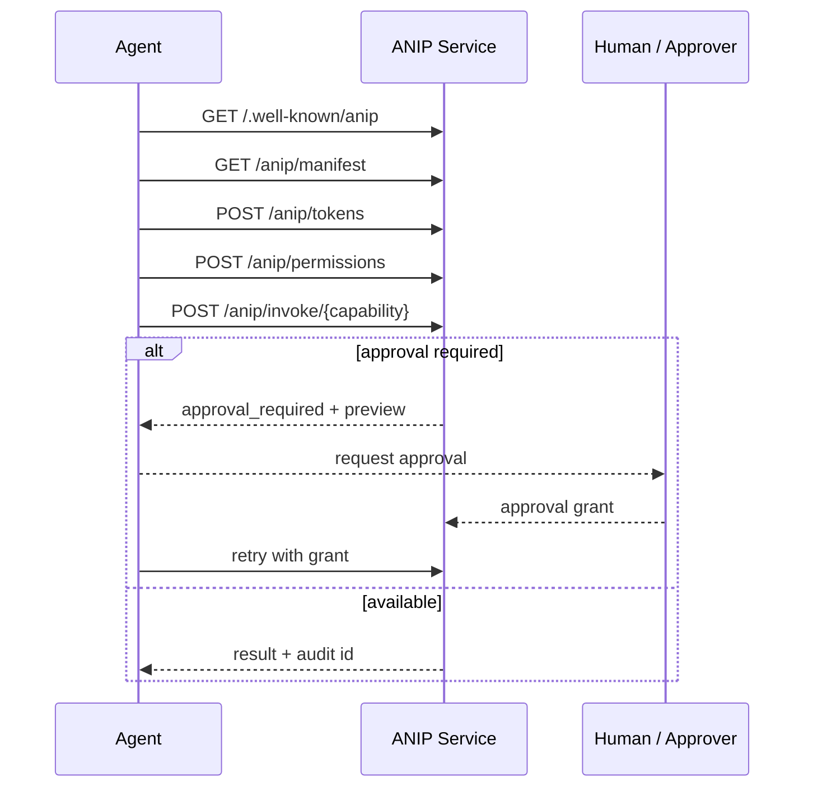

# First 10 Minutes

Use this path when you are evaluating ANIP for the first time. It shows the idea, the trust loop, and the generator path without requiring cloud credentials or a local Studio deployment.

If you want the lowest-friction prototype path before using Studio or Registry, see [Agent-Authored Contract Quickstart](/docs/getting-started/agent-authored-contract). That path lets a coding agent draft a local definition, then uses `anip validate` and `anip generate` to keep the experiment grounded.

## What you are proving

By the end, you should understand four things:

- **ANIP is a governed service contract**, not a prompt pattern.
- **Agents inspect authority before execution**, instead of discovering failures after raw tool calls.
- **Registry packages are the consumable trust artifact**, not screenshots or copied JSON.
- **Generated services come from signed packages**, so consumers can verify what they build.

## 1. Read the shape

Start with the protocol entry point:

```text
/.well-known/anip
```

An ANIP service tells agents:

- What capabilities exist.
- What side effects they have.
- What scopes are required.
- Where to fetch the signed manifest.
- Where to ask for permissions.
- Where to invoke.
- Where to inspect audit and checkpoints.

This is the minimum mental model:



## 2. Inspect a real package

Open the hosted Registry package list:

```text
https://registry.anip.dev/registry/packages
```

Open the GTM Agent package:

```text
https://registry.anip.dev/registry/packages/gtm-pipeline-q2-review/0.4.3
```

Look for:

- Capability summary.
- ANIP spec version.
- Contract signature.
- Recommended lock.
- Package README.
- Generator command.
- Agent readiness notes.

The point is to see that ANIP packages are inspectable artifacts. The browser UI helps humans review them; generators and verifiers should use the Registry API.

## 3. Verify the package

If you already installed the CLI, verify the package from Registry:

```bash
anip verify \
  --registry-url https://registry.anip.dev/registry-api/v1 \
  --package gtm-pipeline-q2-review@0.4.3 \
  --require-registry-mode production \
  --trusted-registry-key-id anip-protocol-registry-root-2026-q2
```

If you do not have the CLI yet, start with [Install](/docs/getting-started/install), then come back.

Verification should answer:

- Is this the package/version I asked for?
- Was it signed by the expected Registry key?
- Do the manifest and service-definition digests match?
- Does the contract signature match the package record?

## 4. Generate from the package

Generate a local service project from the same package:

```bash
anip generate \
  --registry-url https://registry.anip.dev/registry-api/v1 \
  --package gtm-pipeline-q2-review@0.4.3 \
  --target python \
  --transport http,stdio \
  --dependency-source registry \
  --write-lock /tmp/anip-gtm-package-lock.json \
  --output /tmp/anip-gtm-generated \
  --force
```

Then inspect what was generated:

```bash
find /tmp/anip-gtm-generated -maxdepth 2 -type f | sort | head -40
```

The generated project is not the trust source. The package and lock are.

Regenerating later with the lock should fail if the package digest changes:

```bash
anip generate \
  --registry-url https://registry.anip.dev/registry-api/v1 \
  --package gtm-pipeline-q2-review@0.4.3 \
  --lock-file /tmp/anip-gtm-package-lock.json \
  --target python \
  --output /tmp/anip-gtm-generated \
  --force
```

## 5. Understand where Studio fits

Studio is the authoring and review environment. Registry is the distribution and verification environment. Generated services are the execution environment.

The platform loop is:

```text
source docs -> Studio project -> Developer Definition -> Registry package -> generated service
```

For first evaluation, you do not need to run Studio locally. You only need to know where it fits:

- Studio helps authors design, review, and publish packages.
- Registry helps consumers inspect, verify, lock, and generate from packages.
- Services enforce the generated contract at runtime.

If you want to run both locally after this page, use [Run the Local Platform](/docs/getting-started/local-platform).

## 6. Compare one fronting package

Open a fronting package, such as Jira or Slack, and compare it to raw API/MCP access.

The important distinction is:

```text
Raw API/MCP surface: create issue, post message, run query.
ANIP surface: prepare issue, request announcement, create chart preview.
```

ANIP fronting is valuable only when it exposes a governed behavior surface that is smaller and safer than the raw backend.

## 7. Try a local service next

After the first 10 minutes, choose one deeper path:

- [Quickstart](/docs/getting-started/quickstart): build and call a tiny local ANIP service.
- [Start With Registry](/docs/getting-started/registry): browse packages/templates and generate from trusted artifacts.
- [Run the Local Platform](/docs/getting-started/local-platform): run Registry and Studio locally with Docker.
- [GTM Agent Showcase](/docs/showcases/gtm-agent/overview): inspect the generated five-language showcase.

## 8. Know where to go next

| Goal | Next page |
|------|-----------|
| Install the CLI | [Install](/docs/getting-started/install) |
| Generate service code | [Generate a Service](/docs/getting-started/generate-service) |
| Understand the architecture | [Architecture](/docs/concepts/architecture) |
| Understand the Studio/Registry ecosystem | [Ecosystem](/docs/concepts/ecosystem) |
| Browse packages or templates | [Start With Registry](/docs/getting-started/registry) |
| Design a governed service | [Scenario-Driven Execution Design](/docs/concepts/scenario-driven-execution) |
| Validate behavior | [Execution Scenario Validation](/docs/concepts/execution-scenario-validation) |
| Use Studio | [Studio Overview](/docs/studio/overview) |
| Publish or consume packages | [ANIP Registry](/docs/tooling/registry) |
| Front an existing API | [Governed Fronting](/docs/patterns/fronting) |

If this first path is not clear, the rest of the docs will feel harder than they should. Start here before going deep into the protocol reference.
