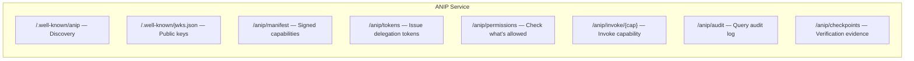

# ANIP — Agent-Native Interface Protocol

ANIP is an open protocol for AI agent interaction with services. It makes execution boundaries — permissions, side effects, costs, recovery, audit — explicit parts of the interface contract, so agents can reason before acting rather than learning by failing.

## What problem does ANIP solve?

Today's APIs were designed for human developers who read documentation, write deterministic code, and ship programs. When AI agents use these APIs directly, they face a fundamental mismatch:

- **Auth**: Agent discovers it needs authentication by getting a `401`
- **Permissions**: Agent discovers it lacks permission by getting a `403`
- **Cost**: Agent discovers the real cost after being charged
- **Irreversibility**: Agent discovers an action can't be undone after it's already happened
- **Recovery**: When something fails, the agent gets an opaque error with no guidance on how to fix it

MCP (Model Context Protocol) improves tool discovery and standardizes transport, but it does not make authority, cost, rollback posture, or recovery first-class protocol primitives. An agent using MCP still can't ask "what am I allowed to do?" or "what will this cost?" before acting.

ANIP fills that gap.

## How ANIP works

An ANIP service exposes a standard set of endpoints that agents interact with in a predictable sequence:



**The agent workflow:**

1. **Discover** — Fetch the manifest to learn what capabilities exist, their side effects, costs, and required scopes
2. **Evaluate** — Call permissions to see what the current token can do (available / restricted / denied) before attempting anything
3. **Invoke** — Execute a capability with a scoped delegation token. The response is structured — success with result and cost, or failure with type, detail, resolution guidance, and retry hints
4. **Verify** — Every invocation is audit-logged. Signed Merkle checkpoints provide tamper-evident verification of what happened

## A concrete example

Here's what happens when an agent interacts with an ANIP travel service:

```json
// 1. Agent fetches manifest and sees:
{
  "capabilities": {
    "search_flights": {
      "side_effect": { "type": "read" },
      "minimum_scope": ["travel.search"],
      "cost": { "certainty": "fixed", "financial": null }
    },
    "book_flight": {
      "side_effect": { "type": "irreversible" },
      "minimum_scope": ["travel.book"],
      "cost": {
        "certainty": "estimated",
        "financial": { "currency": "USD", "range_min": 200, "range_max": 800 }
      }
    }
  }
}
```

```json
// 2. Agent checks permissions:
{
  "available": [
    { "capability": "search_flights", "scope_match": "travel.search" }
  ],
  "restricted": [
    { "capability": "book_flight", "reason": "missing scope", "grantable_by": "human:admin@company.com" }
  ]
}
```

The agent now knows: it can search flights freely, but booking requires additional authority from a specific human. It can report this to its user and request the scope — rather than trying to book and failing with an opaque 403.

## What ANIP is not

- **Not a replacement for HTTP, gRPC, or MCP.** ANIP runs over HTTP, stdio, and gRPC. It adds the execution context layer those transports don't provide.
- **Not a wrapper around GUI automation.** ANIP is for programmatic service interfaces, not screen scraping.
- **Not just another API spec format.** OpenAPI describes endpoints. ANIP defines the rules for governed, auditable agent execution.

## What ships today

ANIP is not a spec waiting for implementations. It ships:

| Category | What's available |
|----------|-----------------|
| **Runtimes** | TypeScript, Python, Java, Go, C# |
| **Transports** | HTTP (all), stdio/JSON-RPC (all), gRPC (Python + Go) |
| **Interface adapters** | REST, GraphQL, MCP — auto-generated from the same capabilities |
| **Studio** | Inspection + invocation UI, embedded or standalone Docker |
| **Testing** | Conformance suite (protocol compliance) + contract testing (behavioral verification) |
| **Showcase apps** | Travel booking, financial ops, DevOps infrastructure |

## Next steps

- **[Quickstart](/docs/getting-started/quickstart)** — Build and run an ANIP service in 5 minutes
- **[Why ANIP](/docs/why-anip)** — The deeper framing on why agents need a different interface paradigm
- **[Install](/docs/getting-started/install)** — Package install commands for all five runtimes
- **[Protocol: Capabilities](/docs/protocol/capabilities)** — How capability declarations work
