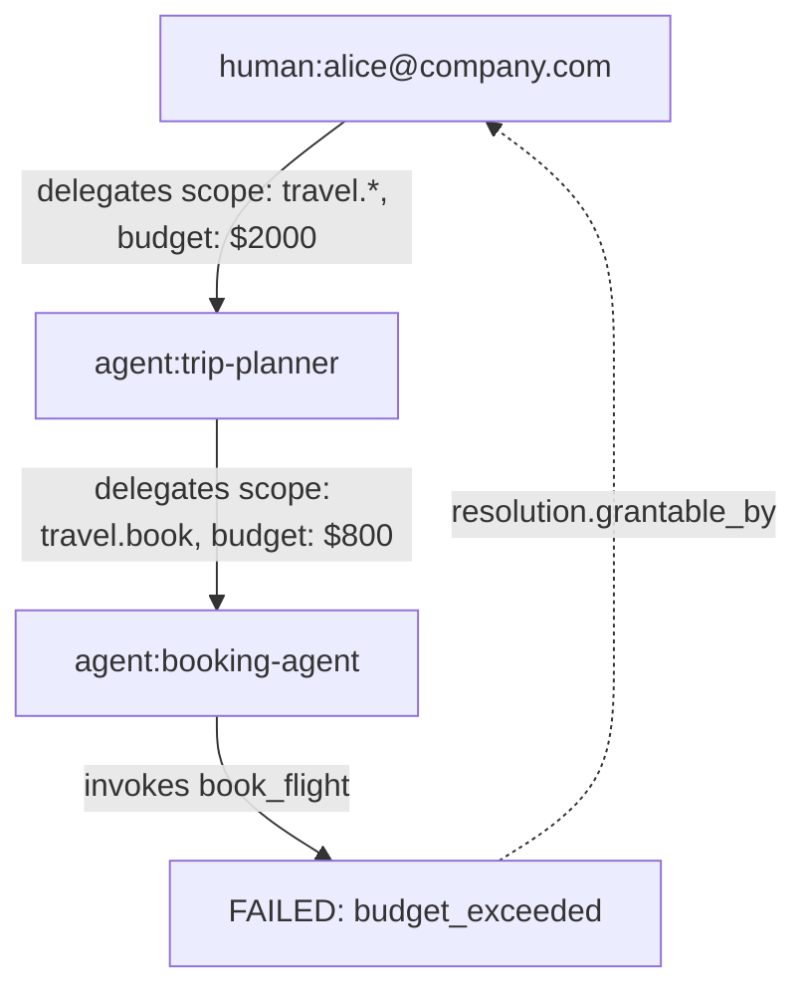
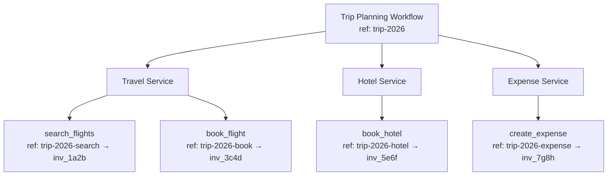

# Lineage

Lineage answers the question: where did this action come from, on whose authority, and what happened as a result?

In systems where agents delegate to other agents, or where a single workflow spans multiple services, being able to trace the chain of causation is critical — for debugging, compliance, and trust.

## Why lineage matters

Consider a multi-agent workflow:

1. A human asks an agent to plan a business trip
2. The planning agent delegates to a booking agent
3. The booking agent invokes `book_flight` on a travel service
4. The booking fails due to insufficient budget

Without lineage, the audit log shows: "booking agent called book_flight and it failed." But who authorized the booking agent? What was the original task? Who can fix the budget issue?

With ANIP lineage, the full chain is traceable:



## How lineage works in ANIP

### Invocation identifiers

Every ANIP invocation returns two identifiers:

```json
{
  "success": true,
  "invocation_id": "inv_7f3a2b",
  "client_reference_id": "trip-planning-2026-booking-1",
  "result": { "booking_id": "BK-7291" }
}
```

| Field | Purpose |
|-------|---------|
| `invocation_id` | Service-assigned, globally unique identifier for this invocation |
| `client_reference_id` | Client-provided identifier linking this invocation to a broader workflow |

### Client reference IDs

The caller provides a `client_reference_id` in the invocation request:

```json
{
  "parameters": { "flight_number": "AA100" },
  "client_reference_id": "trip-planning-2026-booking-1"
}
```

This lets the calling agent connect the invocation to its own workflow context. When auditing later, you can query by `client_reference_id` to find all invocations belonging to a specific task.

### Delegation chain in audit

Every audit entry records the full delegation context:

```json
{
  "invocation_id": "inv_7f3a2b",
  "capability": "book_flight",
  "actor_key": "agent:booking-agent",
  "root_principal": "human:alice@company.com",
  "event_class": "high_risk_failure",
  "client_reference_id": "trip-planning-2026-booking-1",
  "timestamp": "2026-03-28T10:30:00Z"
}
```

The `actor_key` shows who directly invoked. The `root_principal` shows who originally delegated authority. The `client_reference_id` ties the invocation back to the broader workflow.

## Lineage across services

When agents interact with multiple ANIP services as part of a single workflow, `client_reference_id` provides cross-service correlation:



Each service has its own audit log with its own `invocation_id`, but the shared `client_reference_id` prefix lets an operator reconstruct the full workflow across services.

## Lineage and trust

Lineage connects to ANIP's trust model:

- **Signed manifests** prove the service's capability declarations are authentic
- **Delegation tokens** prove the chain of authority from human to agent
- **Audit logs** prove what was invoked, when, and by whom
- **Merkle checkpoints** prove the audit log hasn't been tampered with

Together, these create a verifiable chain: a human authorized a specific scope → an agent used that scope to invoke a specific capability → the invocation was logged → the log was checkpointed. Each link in the chain is cryptographically verifiable.

## What lineage enables

| Use case | How lineage helps |
|----------|------------------|
| **Debugging** | Trace a failed operation back through the delegation chain to find the root cause |
| **Compliance** | Prove that every agent action was authorized by a human with the right authority |
| **Cost attribution** | Track which workflow and which human principal incurred each cost |
| **Incident response** | When an agent does something unexpected, trace who delegated the authority and what scope was granted |
| **Cross-service auditing** | Correlate actions across multiple services using `client_reference_id` |

## Next steps

- **[Authentication](/docs/protocol/authentication)** — How principals are identified and tokens issued
- **[Delegation & Permissions](/docs/protocol/delegation-permissions)** — How authority flows through delegation chains
- **[Checkpoints & Trust](/docs/protocol/checkpoints-trust)** — How audit evidence is verified
