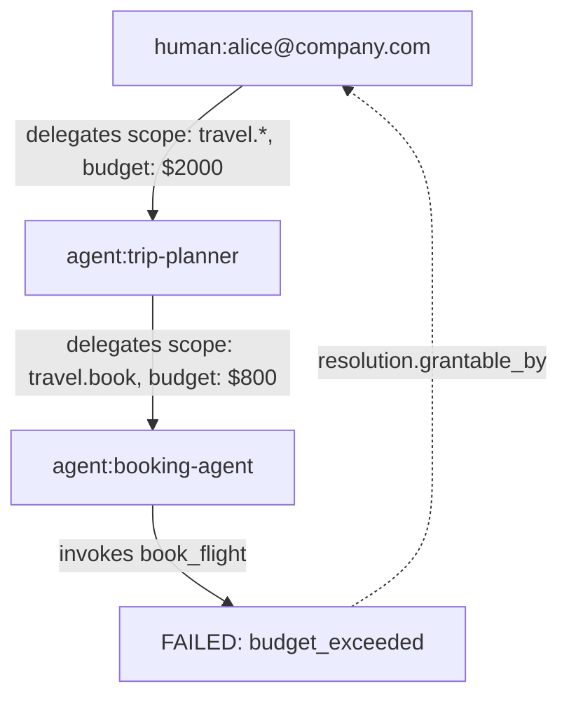
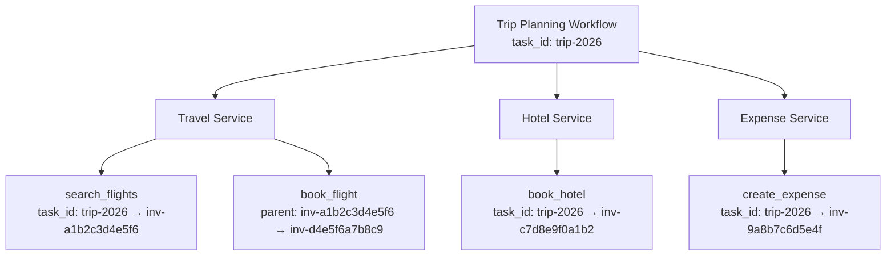
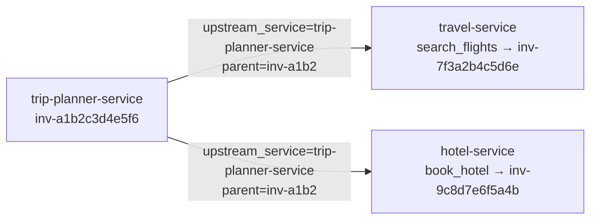

# Lineage

Lineage answers the question: where did this action come from, on whose authority, and what happened as a result?

In systems where agents delegate to other agents, or where a single workflow spans multiple services, being able to trace the chain of causation is critical — for debugging, compliance, and trust.

## Why lineage matters

Consider a multi-agent workflow:

1. A human asks an agent to plan a business trip
2. The planning agent delegates to a booking agent
3. The booking agent invokes `book_flight` on a travel service
4. The booking fails due to insufficient budget

Without lineage, the audit log shows: "booking agent called book_flight and it failed." But who authorized the booking agent? What was the original task? Who can fix the budget issue?

With ANIP lineage, the full chain is traceable:



## How lineage works in ANIP

### Invocation identifiers

Every ANIP invocation returns identifiers for correlation and lineage:

```json
{
  "success": true,
  "invocation_id": "inv-7f3a2b4c5d6e",
  "client_reference_id": "trip-planning-2026-booking-1",
  "task_id": "trip-2026",
  "parent_invocation_id": "inv-a1b2c3d4e5f6",
  "result": { "booking_id": "BK-7291" }
}
```

| Field | Purpose |
|-------|---------|
| `invocation_id` | Service-assigned, globally unique identifier for this invocation |
| `client_reference_id` | Client-provided identifier for caller-side correlation |
| `task_id` | Groups related invocations under a single task or workflow (v0.12) |
| `parent_invocation_id` | Reference to the invocation that triggered this one (v0.12) |

Lineage begins at the service `invoke()` boundary. Transport-level bearer failures, such as a missing or invalid token rejected with HTTP 401 before invocation handling starts, do not receive invocation lineage fields.

### Task identity (`task_id`)

`task_id` groups multiple invocations under a single task, workflow, or agent objective. It can be set two ways:

1. **In the delegation token** — when issuing a token, include `task_id` in `purpose_parameters`. The token's `purpose.task_id` is then authoritative for all invocations using that token.
2. **In the invocation request** — if the token has no `purpose.task_id`, the caller can provide `task_id` per invocation.

If both are present, they must match — a mismatch returns a `purpose_mismatch` failure. This prevents a token issued for one task from being used to attribute actions to a different task.

```json
{
  "parameters": { "origin": "SEA", "destination": "SFO" },
  "task_id": "trip-2026",
  "parent_invocation_id": "inv-a1b2c3d4e5f6"
}
```

### Parent invocation (`parent_invocation_id`)

`parent_invocation_id` references the invocation that caused this one. It forms an invocation tree:

```
1. search_flights → inv-a1b2c3d4e5f6 (no parent)
2. check_availability → inv-d4e5f6a7b8c9 (parent: inv-a1b2c3d4e5f6)
3. book_flight → inv-c7d8e9f0a1b2 (parent: inv-d4e5f6a7b8c9)
```

The field is syntactically validated (must match `inv-{hex12}` format) but not referentially validated — the service records it without checking that the parent actually exists.

### Querying by lineage

Both fields are queryable in the audit API:

```bash
# Find all invocations for a task
curl -X POST "https://service.example/anip/audit?task_id=trip-2026" \
  -H "Authorization: Bearer <token>" -d '{}'

# Find all invocations triggered by a specific parent
curl -X POST "https://service.example/anip/audit?parent_invocation_id=inv-a1b2c3d4e5f6" \
  -H "Authorization: Bearer <token>" -d '{}'
```

This replaces the custom trace-stitching code teams previously built in orchestration layers.

### Client reference IDs

`client_reference_id` is separate from `task_id` — it's the caller's own correlation identifier for a single invocation, not a grouping mechanism:

| Field | Scope | Purpose |
|-------|-------|---------|
| `task_id` | Groups multiple invocations | "All of these belong to the same task" |
| `client_reference_id` | Single invocation | "This specific call is step 3 of the search phase" |
| `parent_invocation_id` | Single invocation | "This call was triggered by that call" |

### Delegation chain in audit

Every audit entry records the full delegation context:

```json
{
  "invocation_id": "inv-c7d8e9f0a1b2",
  "capability": "book_flight",
  "actor_key": "agent:booking-agent",
  "root_principal": "human:alice@company.com",
  "event_class": "high_risk_failure",
  "task_id": "trip-2026",
  "client_reference_id": "trip-planning-2026-booking-1",
  "parent_invocation_id": "inv-d4e5f6a7b8c9",
  "timestamp": "2026-06-28T10:30:00Z"
}
```

The `actor_key` shows who directly invoked. The `root_principal` shows who originally delegated authority. The `task_id` groups this invocation with all other invocations for the same task. The `parent_invocation_id` shows which prior invocation triggered this one.

## Lineage across services

When agents interact with multiple ANIP services as part of a single workflow, lineage is reconstructed from `task_id`, `parent_invocation_id`, and `upstream_service`. `client_reference_id` remains useful for caller-side correlation, but it is not the protocol's cross-service grouping primitive.



Each service has its own audit log and service-local `invocation_id` values. Operators reconstruct the workflow by querying each relevant service by `task_id`, following `parent_invocation_id` links, and using `upstream_service` hints to understand which service initiated downstream work.

## Cross-service continuity (v0.18)

When one ANIP service calls another as part of a workflow, the caller can include `upstream_service` in the invoke request to identify itself. This propagates the originating service identity into the downstream audit log.

### Propagation rules

- `upstream_service` is an optional string field on the invoke request.
- Services MUST echo it in the invoke response unchanged.
- Services MUST record it in the audit entry.
- Services MUST NOT reject any syntactically valid `parent_invocation_id` solely because it was not issued by the receiving service. Cross-service invocation trees are explicitly supported — referential validation of `parent_invocation_id` is prohibited.
- Services MUST NOT reject any `task_id` that was not originated locally. `task_id` is a logical grouping key, not a service-local reference.

### upstream_service field

```json
{
  "parameters": { "origin": "SEA", "destination": "SFO" },
  "task_id": "trip-2026",
  "parent_invocation_id": "inv-a1b2c3d4e5f6",
  "upstream_service": "trip-planner-service"
}
```

The response echoes it back:

```json
{
  "success": true,
  "invocation_id": "inv-7f3a2b4c5d6e",
  "task_id": "trip-2026",
  "parent_invocation_id": "inv-a1b2c3d4e5f6",
  "upstream_service": "trip-planner-service",
  "result": { "flights": [] }
}
```

And the audit entry records it:

```json
{
  "invocation_id": "inv-7f3a2b4c5d6e",
  "capability": "search_flights",
  "task_id": "trip-2026",
  "parent_invocation_id": "inv-a1b2c3d4e5f6",
  "upstream_service": "trip-planner-service",
  "timestamp": "2026-06-30T10:30:00Z"
}
```

### Reconstructing a cross-service workflow

With `upstream_service`, `task_id`, and `parent_invocation_id` all propagated, an operator can attempt to reconstruct the full call graph across services:

1. Query each service's audit log by `task_id` to find all invocations in the workflow.
2. Use `parent_invocation_id` to link invocations into a causal tree.
3. Use `upstream_service` on each audit entry to identify which service initiated each call.



This replaces ad-hoc service identity headers for ANIP-level causality. It is still best-effort across independently operated services because each service owns its own audit log and retention policy.

For agents that need to discover which capabilities to invoke on other services as part of a workflow, see [Cross-service handoff hints (v0.19)](/docs/protocol/capabilities#cross-service-handoff-hints-v019) — capability declarations can now carry advisory `cross_service` hints that name the target service and capability for handoff, refresh, verification, and follow-up steps.

## Composition lineage

Starting in v0.23, ANIP also makes service-side composition visible to audit readers and verifiers.

A composed capability is invoked by the agent as one business capability. Internally, the service may execute declared child steps. The composition declaration controls whether child invocations are recorded and whether they share the parent task identity:

```json
{
  "kind": "composed",
  "composition": {
    "audit_policy": {
      "record_child_invocations": true,
      "parent_task_lineage": true
    }
  }
}
```

When `record_child_invocations` is true, each child step generates its own audit entry linked to the parent invocation. When `parent_task_lineage` is true, child invocations inherit the parent `task_id`, so audit reconstruction can walk from the business-level capability into the internal steps without asking the agent to orchestrate those steps itself.

This distinction matters:

| Layer | Who owns it | What lineage shows |
|-------|-------------|--------------------|
| Agent invocation | Agent/client | The single governed business capability the agent selected |
| Composition steps | Service/runtime | Internal child capabilities used to fulfill that business capability |
| Audit reader | Operator/verifier | Parent invocation, child invocations, shared task identity, and failure propagation |

## Approval lineage

Approval flows have their own required lineage chain. If a capability stops at `approval_required`, the service must persist an approval request before returning that failure. After approval, the grant and continuation must be reconstructible from audit evidence.

```text
parent_invocation_id
    -> approval_request_id
    -> grant_id
    -> continuation_invocation_id
    -> child_invocation_ids when composed
```

The audit trail provides the links:

- `approval_request_created` links the original invocation to the approval request.
- `approval_grant_issued` links the approval request to the grant and approver.
- The continuation invocation references the supplied `approval_grant`.
- Composed child invocations inherit the parent task lineage when declared by composition audit policy.

If an implementation cannot reconstruct this approval and composition chain, it does not satisfy the approval lineage requirements.

## Runtime lineage vs package lineage

This page describes runtime lineage: invocations, tasks, delegation, approvals, child steps, and audit evidence.

Registry package lineage is different. Package lineage records where a published package came from, such as Studio project revision, product revision, developer revision, manifest digest, and recommended lock. Runtime lineage explains what happened during execution. Package lineage explains what contract and generated artifact were published.

## Lineage and trust

Lineage connects to ANIP's trust model:

- **Signed manifests** prove the service's capability declarations are authentic
- **Delegation tokens** prove the chain of authority from human to agent
- **Audit logs** prove what was invoked, when, and by whom
- **Merkle checkpoints** prove the audit log hasn't been tampered with

Together, these create a verifiable chain: a human authorized a specific scope → an agent used that scope to invoke a specific capability → the invocation was logged → the log was checkpointed. Each link in the chain is cryptographically verifiable.

## What lineage enables

| Use case | How lineage helps |
|----------|------------------|
| **Debugging** | Trace a failed operation back through the delegation chain to find the root cause |
| **Compliance** | Prove that every agent action was authorized by a human with the right authority |
| **Cost attribution** | Track which workflow and which human principal incurred each cost |
| **Incident response** | When an agent does something unexpected, trace who delegated the authority and what scope was granted |
| **Cross-service auditing** | Correlate actions across multiple services using `task_id`, `parent_invocation_id`, and `upstream_service` |
| **Approval review** | Reconstruct request, grant, continuation, and side-effect lineage |
| **Composition verification** | Confirm which child steps ran under a composed business capability |

## Next steps

- [Authentication](/docs/protocol/authentication) — How principals are identified and tokens issued.
- [Delegation & Permissions](/docs/protocol/delegation-permissions) — How authority flows through delegation chains.
- [Checkpoints & Trust](/docs/protocol/checkpoints-trust) — How audit evidence is verified.
