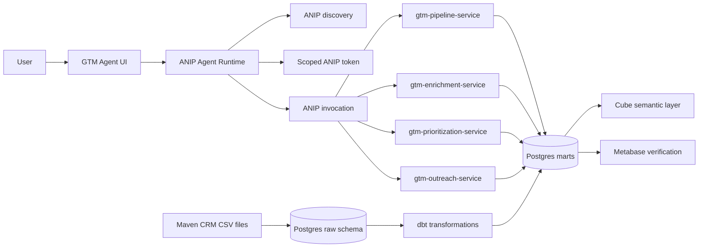

# Architecture

The GTM Agent showcase has three layers:

- agent-facing experience,
- governed ANIP services,
- data and verification substrate.

## High-level map



The agent runtime does not ask the user to pick a service. It discovers the capability catalog, selects a bounded capability, requests a scoped token, invokes the selected service, and renders the result.

The dbt edge in the diagram is a transformation flow, not a separate dbt datastore. Raw CRM data is loaded into Postgres, dbt materializes governed marts in Postgres, and both the ANIP service adapters and BI tools read those modeled tables.

## Service topology

| Service | Responsibility | Example capabilities |
| --- | --- | --- |
| `gtm-pipeline-service` | Pipeline, forecast, bottleneck, product, team, risk, and write-adjacent preparation previews. | `gtm.pipeline_summary`, `gtm.account_risk_summary`, `gtm.prepare_reassignment_plan` |
| `gtm-enrichment-service` | Account enrichment and lookalike account context. | `gtm.account_enrichment_summary`, `gtm.lookalike_accounts` |
| `gtm-prioritization-service` | Lead/account scoring, prioritization, and routing previews. | `gtm.score_leads`, `gtm.route_leads` |
| `gtm-outreach-service` | Draft-only outreach content and response variants. | `gtm.draft_outreach_message`, `gtm.prioritized_outreach_draft` |

The four-service topology is intentional. It proves ANIP can represent multi-service domains without hiding all behavior behind one generic tool.

## Data substrate

The data path is:

```text
Maven CRM CSV files
  -> Postgres raw schema
  -> dbt staging and mart models materialized in Postgres
  -> ANIP service adapters, Cube, and Metabase verification
```

The dbt models provide repeatable GTM slices such as pipeline stage summary, forecast summary, risk accounts, product pipeline, sales team performance, and account enrichment.

Cube is included as a semantic layer for aggregate GTM concepts. Metabase is included as a human-verifiable BI surface over the same modeled data.

## Runtime boundary

The generated services own:

- capability discovery,
- scoped token validation,
- input resolution behavior,
- approval-required outcomes,
- denial and restriction outcomes,
- audit shape,
- generated runtime substrate.

The custom bundles own:

- backend adapter logic,
- GTM-specific data access,
- language-specific integration seams,
- actor and approval helper implementations.

The bundles must not mutate the public ANIP contract.

## Why Metabase is present

Metabase is not the agent interface. It is a verification surface.

It lets users inspect the same governed GTM slices the agent sees, without trusting the agent output blindly and without writing SQL joins by hand.
